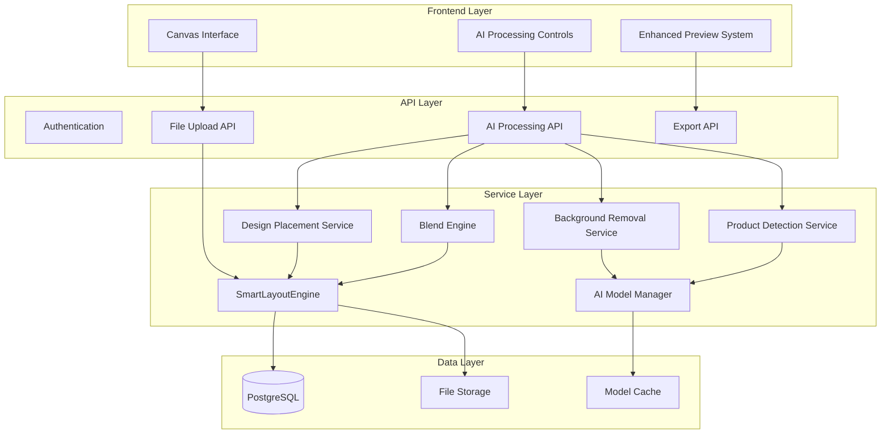

# Advanced Image Processing Feature Design

## Overview

The Advanced Image Processing feature replaces and significantly upgrades the existing Product Editor's basic image processing capabilities with AI-powered intelligent processing, product detection, and realistic design placement. This enhancement transforms the current SmartLayoutEngine from basic face detection to a comprehensive AI-powered image processing system.

The feature leverages the existing Django REST framework, canvas system, and file management infrastructure while completely upgrading the image processing pipeline with sophisticated machine learning models. Key components include the Hugging Face RMBG-1.4 model for background removal, YOLO-based product detection replacing basic face detection, OpenCV perspective transformation, and advanced blending algorithms for realistic print previews.

This design replaces the existing basic SmartLayoutEngine with a unified AI-powered system that provides superior functionality. The upgraded system maintains API compatibility while delivering significantly enhanced capabilities through intelligent automation.

## Architecture

### High-Level Architecture

The advanced image processing feature extends the existing three-tier architecture:



### Upgraded SmartLayoutEngine

The existing SmartLayoutEngine class is completely upgraded with comprehensive AI processing capabilities, replacing basic face detection with advanced product detection:

```python
class SmartLayoutEngine:
    def __init__(self):
        # Upgraded AI capabilities (replaces basic face detection)
        self.ai_model_manager = AIModelManager()
        self.background_remover = BackgroundRemovalService()
        self.product_detector = ProductDetectionService()  # Replaces face detection
        self.design_placer = DesignPlacementService()
        self.blend_engine = BlendEngine()
        
        # Legacy methods removed:
        # - detect_faces() -> replaced by detect_products()
        # - get_image_focus_point() -> replaced by get_product_placement_point()
        # - smart_crop_and_resize() -> upgraded to smart_process_and_place()
```

### AI Model Management Infrastructure

A new AI Model Manager handles loading, caching, and lifecycle management of machine learning models:

- **Model Loading**: Lazy loading of models on first use
- **Memory Management**: LRU cache for model instances
- **GPU Acceleration**: Automatic GPU detection and utilization
- **Fallback Handling**: CPU fallback when GPU unavailable
- **Health Monitoring**: Model availability and performance tracking

## Components and Interfaces

### 1. Background Removal Service

**Interface:**
```python
class BackgroundRemovalService:
    def remove_background(self, image_path: str) -> ProcessingResult:
        """Remove background using RMBG-1.4 model"""
        
    def is_available(self) -> bool:
        """Check if service is operational"""
```

**Implementation Details:**
- Integrates Hugging Face RMBG-1.4 model
- Supports JPEG, PNG, WebP input formats
- Returns PNG with transparency
- 30-second timeout for processing
- Maintains original resolution

### 2. Product Detection Service

**Interface:**
```python
class ProductDetectionService:
    def detect_products(self, image_path: str) -> List[DetectedProduct]:
        """Detect products using YOLO model"""
        
    def get_supported_categories(self) -> List[str]:
        """Return list of detectable product types"""
```

**Implementation Details:**
- Replaces YOLOv8 model trained on apparel products (upgrades from basic face detection)
- Detects shirts, hoodies, hats, bags with superior accuracy
- Returns bounding boxes with confidence scores
- Filters results with confidence > 0.5
- 10-second processing timeout (faster than old face detection)

### 3. Design Placement Service

**Interface:**
```python
class DesignPlacementService:
    def calculate_placement(self, design: Image, product_bounds: BoundingBox) -> PlacementResult:
        """Calculate optimal design placement and transformation"""
        
    def apply_perspective_transform(self, design: Image, transform_matrix: np.ndarray) -> Image:
        """Apply perspective transformation to design"""
```

**Implementation Details:**
- Uses OpenCV cv2.warpPerspective
- Calculates transformation matrices based on product orientation
- Maintains design aspect ratio
- Preserves image quality during transformation
- Fallback to simple scaling when perspective calculation fails

### 4. Blend Engine

**Interface:**
```python
class BlendEngine:
    def blend_design(self, design: Image, background: Image, mode: BlendMode, opacity: float) -> Image:
        """Blend design with product texture"""
        
    def preview_blend(self, design: Image, background: Image, settings: BlendSettings) -> Image:
        """Generate real-time blend preview"""
```

**Implementation Details:**
- Supports opacity and multiply blend modes
- Adjustable blend intensity (0-100%)
- Real-time preview generation
- High-quality output for print evaluation
- Preserves design colors while showing texture

### 5. AI Model Manager

**Interface:**
```python
class AIModelManager:
    def load_model(self, model_name: str) -> ModelInstance:
        """Load and cache AI model"""
        
    def get_model_status(self, model_name: str) -> ModelStatus:
        """Check model availability and health"""
        
    def cleanup_unused_models(self) -> None:
        """Free memory from unused models"""
```

**Implementation Details:**
- LRU cache for model instances
- Lazy loading on first use
- GPU/CPU automatic selection
- Memory usage monitoring
- Health check endpoints

### 6. Enhanced API Endpoints

**New Endpoints:**
- `POST /api/ai/remove-background/` - Background removal processing
- `POST /api/ai/detect-products/` - Product detection in lifestyle photos
- `POST /api/ai/place-design/` - Automated design placement
- `POST /api/ai/blend-preview/` - Generate realistic blend previews
- `GET /api/ai/status/` - AI service health and availability

**Enhanced Existing Endpoints (Upgraded Functionality):**
- `POST /api/upload/` - Completely upgraded with AI processing pipeline
- `POST /api/export/` - Enhanced with AI-processed elements and realistic previews
- `GET /api/canvas/` - Upgraded interface with AI processing controls replacing manual tools

## Data Models

### ProcessingResult

```python
@dataclass
class ProcessingResult:
    success: bool
    processed_image_path: Optional[str]
    original_image_path: str
    processing_time: float
    error_message: Optional[str]
    metadata: Dict[str, Any]
```

### DetectedProduct

```python
@dataclass
class DetectedProduct:
    category: str
    confidence: float
    bounding_box: BoundingBox
    center_point: Tuple[int, int]
    orientation_angle: float
    surface_normal: Optional[Tuple[float, float, float]]
```

### BoundingBox

```python
@dataclass
class BoundingBox:
    x: int
    y: int
    width: int
    height: int
    
    def center(self) -> Tuple[int, int]:
        return (self.x + self.width // 2, self.y + self.height // 2)
```

### PlacementResult

```python
@dataclass
class PlacementResult:
    transform_matrix: np.ndarray
    placement_bounds: BoundingBox
    confidence: float
    fallback_used: bool
    recommended_blend_mode: BlendMode
```

### BlendSettings

```python
@dataclass
class BlendSettings:
    mode: BlendMode
    opacity: float
    preserve_colors: bool
    texture_intensity: float
    quality_level: str  # 'preview' or 'export'
```

### AIProcessingJob

```python
class AIProcessingJob(models.Model):
    id = models.UUIDField(primary_key=True, default=uuid.uuid4)
    user = models.ForeignKey(User, on_delete=models.CASCADE)
    job_type = models.CharField(max_length=50)  # 'background_removal', 'product_detection', etc.
    status = models.CharField(max_length=20)    # 'pending', 'processing', 'completed', 'failed'
    input_image = models.FileField(upload_to='ai_processing/input/')
    output_image = models.FileField(upload_to='ai_processing/output/', null=True, blank=True)
    parameters = models.JSONField(default=dict)
    result_data = models.JSONField(default=dict)
    created_at = models.DateTimeField(auto_now_add=True)
    completed_at = models.DateTimeField(null=True, blank=True)
    processing_time = models.FloatField(null=True, blank=True)
    error_message = models.TextField(blank=True)
```

### ModelCache

```python
class ModelCache(models.Model):
    model_name = models.CharField(max_length=100, unique=True)
    version = models.CharField(max_length=50)
    file_path = models.CharField(max_length=500)
    file_size = models.BigIntegerField()
    last_used = models.DateTimeField(auto_now=True)
    load_time = models.FloatField()
    memory_usage = models.BigIntegerField()
    is_gpu_compatible = models.BooleanField(default=False)
    status = models.CharField(max_length=20)  # 'available', 'loading', 'error'
```

## Correctness Properties

*A property is a characteristic or behavior that should hold true across all valid executions of a system-essentially, a formal statement about what the system should do. Properties serve as the bridge between human-readable specifications and machine-verifiable correctness guarantees.*

### Property 1: Background Removal Model Usage

*For any* uploaded image, when background removal is requested, the system should use the Hugging Face RMBG-1.4 model and return an image with transparent background pixels.

**Validates: Requirements 1.1, 1.2**

### Property 2: Image Format Support

*For any* image in JPEG, PNG, WebP, or TIFF format, the AI processing pipeline should successfully process the image without format-related errors.

**Validates: Requirements 1.4, 10.1**

### Property 3: Processing Performance Limits

*For any* AI processing operation, the system should complete within the specified time limits: background removal within 30 seconds for images up to 10MB, and object detection within 10 seconds for 4K images.

**Validates: Requirements 1.5, 2.6, 9.1, 9.2**

### Property 4: Quality Preservation

*For any* image processed through the AI pipeline, the output should maintain the original resolution and quality metrics within acceptable thresholds throughout all transformations.

**Validates: Requirements 1.6, 3.6, 7.2, 10.2, 10.3**

### Property 5: Error Handling and Graceful Degradation

*For any* AI processing failure or service unavailability, the system should return appropriate error messages, preserve original data, and continue operating with manual tools available.

**Validates: Requirements 1.3, 8.1, 8.2, 8.4**

### Property 6: Product Detection Output Format

*For any* lifestyle photo processed for product detection, the system should return results containing bounding box coordinates, confidence scores, and category labels, with all confidence scores above 0.5 threshold.

**Validates: Requirements 2.1, 2.2, 2.4, 2.5**

### Property 7: Product Category Detection

*For any* image containing shirts, hoodies, hats, or bags, the product detection system should identify these items with appropriate category labels.

**Validates: Requirements 2.3**

### Property 8: Perspective Transformation Correctness

*For any* design placement on a detected product, the system should calculate and apply perspective transformation matrices using OpenCV cv2.warpPerspective while maintaining design aspect ratios.

**Validates: Requirements 3.1, 3.2, 3.4**

### Property 9: Perspective Correction for Angled Surfaces

*For any* product surface that is angled or rotated, the design placement system should apply appropriate perspective correction to align the design with the product orientation.

**Validates: Requirements 3.3**

### Property 10: Transformation Fallback Behavior

*For any* design placement where perspective transformation cannot be calculated, the system should fall back to simple scaling and positioning while preserving design quality.

**Validates: Requirements 3.5**

### Property 11: Blend Mode Implementation

*For any* design blending operation, the system should support both opacity and multiply blend modes with adjustable intensity from 0% to 100%, applying the user-specified blending algorithm correctly.

**Validates: Requirements 4.1, 4.2, 4.4, 4.5**

### Property 12: Color Preservation During Blending

*For any* design blended with product textures, the system should preserve recognizable design colors while showing underlying product texture through the blend.

**Validates: Requirements 4.3**

### Property 13: High-Quality Preview Generation

*For any* blend operation, the system should generate preview images that meet quality standards suitable for print evaluation.

**Validates: Requirements 4.6**

### Property 14: Canvas Integration and UI Availability

*For any* user interaction with the canvas system, AI processing options should be integrated into the interface, offering background removal during upload and displaying detected products as selectable regions.

**Validates: Requirements 5.1, 5.2, 5.3, 6.1**

### Property 15: Automatic AI Processing Triggers

*For any* design dropped onto a detected product region, the system should automatically apply perspective correction and provide real-time blend mode adjustments in preview.

**Validates: Requirements 5.4, 6.2**

### Property 16: System Upgrade and Migration

*For any* existing canvas functionality or layout system feature, the upgraded system should provide superior functionality while maintaining API compatibility, ensuring seamless migration from old to new capabilities.

**Validates: Requirements 5.5, 5.6**

### Property 17: Preview Interface Enhancements

*For any* AI processing operation, the system should provide before/after comparisons, product selection when multiple are detected, and undo/redo functionality while maintaining preview performance.

**Validates: Requirements 6.3, 6.4, 6.5, 6.6**

### Property 18: Export Integration and Quality

*For any* export generation with AI-processed elements, the system should include processed images, maintain high resolution, preserve layer information, and complete within existing time limits.

**Validates: Requirements 7.1, 7.2, 7.3, 7.5**

### Property 19: Blended Export Generation

*For any* design with realistic blending applied, the export system should generate both blended preview images and separate design layers with accurate processing metadata.

**Validates: Requirements 7.4, 7.6**

### Property 20: Intelligent Processing Defaults

*For any* image processing operation, the upgraded system should use AI-powered intelligent processing by default, with manual override options available for specific use cases requiring manual control.

**Validates: Requirements 8.3**

### Property 21: Result Caching and Network Resilience

*For any* successful AI processing result, the system should cache the result to avoid repeated computation and queue requests for retry when network connectivity is poor.

**Validates: Requirements 8.5, 8.6**

### Property 22: Real-Time Transformation Performance

*For any* user interaction requiring design transformation, the system should apply changes in real-time without noticeable delay during user interactions.

**Validates: Requirements 9.3**

### Property 23: Resource Management and Concurrency

*For any* system state, the AI processing should limit concurrent requests to prevent overload, use GPU acceleration when available, and provide progress indicators for all operations.

**Validates: Requirements 9.4, 9.5, 9.6**

### Property 24: Transparency Handling

*For any* image with transparency processed through AI operations, the system should correctly handle and preserve transparency information throughout all processing steps.

**Validates: Requirements 10.4**

### Property 25: Size Limit Support

*For any* image up to 50MB in size, the AI processing system should successfully handle the image without size-related failures.

**Validates: Requirements 10.5**

### Property 26: Lossless Compression Preference

*For any* image compression operation, the system should use lossless compression methods when possible to maintain maximum image quality.

**Validates: Requirements 10.6**

## Error Handling

### AI Service Upgrade Management

The system implements comprehensive upgrade management replacing old functionality:

**Service Replacement:**
- Health checks for upgraded AI models and services
- Automatic migration from old face detection to product detection
- Clear user notifications about upgraded capabilities
- Seamless transition without breaking existing workflows

**Processing Upgrades:**
- Timeout handling with improved performance over old system
- Enhanced error messages with intelligent suggestions
- Superior image processing with AI-powered results
- Retry mechanisms for transient failures with better success rates

**Resource Constraints:**
- Memory management for large images and models
- Concurrent request limiting to prevent system overload
- GPU/CPU fallback handling
- Progress indicators for long-running operations

### Input Validation and Sanitization

**Image Format Validation:**
- MIME type verification for uploaded images
- File size limits (50MB maximum)
- Format compatibility checks before processing
- Malformed image detection and handling

**Parameter Validation:**
- Blend intensity range validation (0-100%)
- Confidence score threshold validation
- Bounding box coordinate validation
- Transform matrix validity checks

### Network and Connectivity Issues

**Offline Capability:**
- Local caching of processed results
- Queue management for pending requests
- Automatic retry with exponential backoff
- User notification of network status

**Model Loading Failures:**
- Fallback to cached model versions
- Alternative model selection when primary fails
- Clear error reporting for model loading issues
- Automatic model health monitoring

## Testing Strategy

### Dual Testing Approach

The advanced image processing feature requires comprehensive testing using both unit tests and property-based tests to ensure correctness across the wide variety of possible inputs and processing scenarios.

**Unit Testing Focus:**
- Specific examples of successful AI processing workflows
- Edge cases like empty images, corrupted files, and extreme sizes
- Integration points between AI services and existing canvas system
- Error conditions and fallback behavior verification
- UI component integration and user interaction flows

**Property-Based Testing Focus:**
- Universal properties that hold across all valid image inputs
- Comprehensive coverage of image formats, sizes, and quality levels
- AI model behavior consistency across randomized inputs
- Performance characteristics under varying load conditions
- Quality preservation through complex processing pipelines

### Property-Based Testing Configuration

**Testing Framework:** Hypothesis (Python) for property-based testing
**Minimum Iterations:** 100 iterations per property test to ensure statistical confidence
**Test Tagging:** Each property test references its corresponding design document property

**Example Property Test Structure:**
```python
@given(st.images())
def test_background_removal_transparency(image):
    """Feature: advanced-image-processing, Property 1: Background Removal Model Usage"""
    result = background_remover.remove_background(image)
    assert result.success
    assert has_transparency(result.processed_image)
    assert uses_rmbg_model(result.metadata)
```

### AI Model Testing Strategy

**Model Behavior Validation:**
- Consistency testing across different input variations
- Performance benchmarking under various conditions
- Quality metrics validation for processed outputs
- Regression testing when models are updated

**Integration Testing:**
- End-to-end workflows from upload to export
- Canvas system integration with AI features
- API endpoint testing with realistic payloads
- Database consistency during AI processing operations

### Performance Testing

**Load Testing:**
- Concurrent AI processing request handling
- Memory usage under sustained processing loads
- GPU utilization efficiency testing
- Cache effectiveness measurement

**Scalability Testing:**
- Processing time scaling with image size
- System behavior under resource constraints
- Queue management under high load
- Fallback performance when AI services are stressed

### User Experience Testing

**Workflow Integration:**
- Seamless integration with existing user workflows
- UI responsiveness during AI processing
- Error message clarity and actionability
- Manual override functionality verification

**Accessibility and Usability:**
- Progress indication effectiveness
- Error recovery user experience
- Feature discoverability in existing interface
- Performance impact on overall system responsiveness