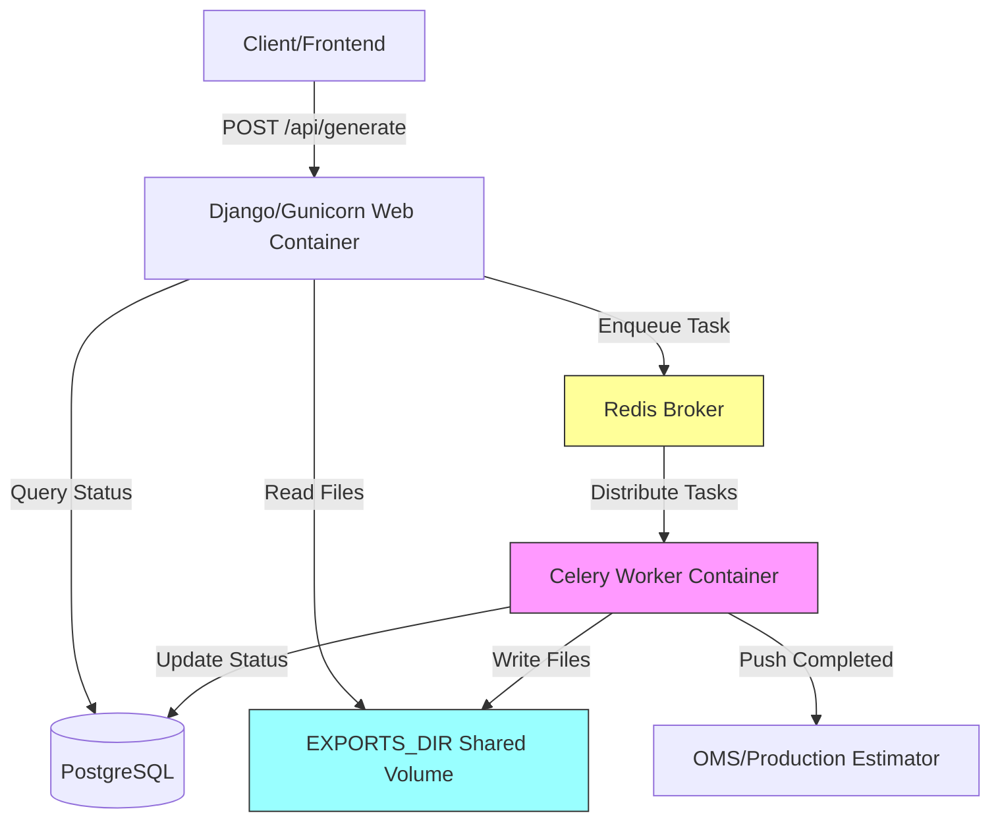
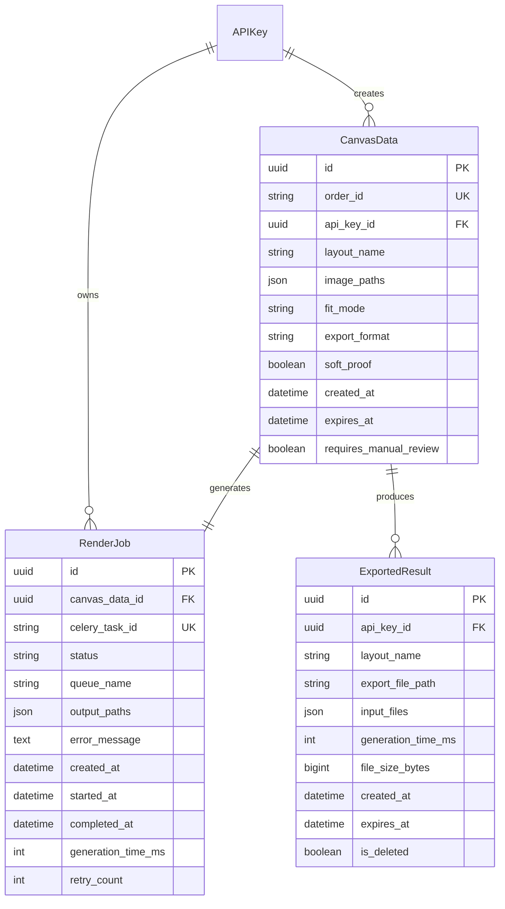

# Design Document: Async Image Generation

## Overview

This design implements asynchronous image generation for the Product Editor using Celery with Redis as the message broker. The current synchronous implementation blocks Gunicorn worker threads during rendering operations, causing request timeouts under sustained load (>50 concurrent orders). The async architecture decouples HTTP request handling from compute-intensive rendering tasks, enabling horizontal scalability and reliable operation during peak periods.

The system maintains backward compatibility with existing integrations while introducing a new async-first workflow. Clients can opt into async mode by providing a callback URL, or continue using synchronous mode with a 300-second timeout for immediate results.

### Key Design Goals

- Non-blocking HTTP responses: Return job identifiers within 200ms
- Horizontal scalability: Support 50+ concurrent render jobs without timeouts
- Priority queue management: Real-time previews complete within 30 seconds
- Atomic file writes: Prevent partial/corrupted files in EXPORTS_DIR
- Resource isolation: Prevent rendering tasks from starving database connections
- Production integration: Automatic push to Production_Estimator on completion

## Architecture

### System Components




### Request Flow

**Async Mode (with callback URL):**
1. Client POSTs to /api/generate with Canvas_Data and callback_url
2. Django persists Canvas_Data to database with transaction.on_commit()
3. Django enqueues Render_Job to Celery via Redis (Priority_Queue or Standard_Queue)
4. Django returns job_id and status_url within 200ms
5. Celery worker picks up task from queue
6. Worker renders images, writes to EXPORTS_DIR using atomic .tmp → final rename
7. Worker updates Job_Status in database
8. Worker pushes output to Production_Estimator via OMS API
9. Client polls status_url or receives callback notification

**Sync Mode (backward compatible):**
1. Client POSTs to /api/generate without callback_url
2. Django executes rendering synchronously with 300-second timeout
3. Django returns output file paths directly in response
4. Existing integrations continue working unchanged

### Queue Architecture

Two separate Celery queues with dedicated worker allocation:

- **Priority_Queue**: Soft-proof CMYK previews, real-time customer interactions
  - 2 dedicated workers
  - Target latency: 30 seconds (95th percentile)
  - Auto-scales by borrowing from Standard_Queue when depth > 50

- **Standard_Queue**: Bulk production orders from Checkout_Flow
  - Remaining workers (configurable, default 2)
  - Target latency: 5 minutes under normal load, 10 minutes under peak

## Components and Interfaces

### 1. Canvas Data Persistence Layer

**Purpose**: Store customer-approved canvas designs for asynchronous rendering

**Database Model** (extends existing api/models.py):

```python
class CanvasData(models.Model):
    """Persisted canvas design for async rendering."""
    id = models.UUIDField(primary_key=True, default=uuid.uuid4)
    order_id = models.CharField(max_length=100, db_index=True, unique=True)
    api_key = models.ForeignKey(APIKey, on_delete=models.CASCADE)
    
    # Canvas configuration
    layout_name = models.CharField(max_length=255)
    image_paths = models.JSONField()  # List of uploaded file paths
    fit_mode = models.CharField(max_length=20, default='cover')
    export_format = models.CharField(max_length=20, default='png')
    soft_proof = models.BooleanField(default=False)
    
    # Metadata
    created_at = models.DateTimeField(auto_now_add=True, db_index=True)
    expires_at = models.DateTimeField()  # 30 days retention
    
    class Meta:
        db_table = 'canvas_data'
        indexes = [
            models.Index(fields=['order_id']),
            models.Index(fields=['created_at']),
        ]
```


### 2. Render Job Model

**Purpose**: Track async rendering task status and results

**Database Model**:

```python
class RenderJob(models.Model):
    """Async rendering job status and results."""
    id = models.UUIDField(primary_key=True, default=uuid.uuid4)
    canvas_data = models.ForeignKey(CanvasData, on_delete=models.CASCADE)
    celery_task_id = models.CharField(max_length=255, unique=True, db_index=True)
    
    # Status tracking
    status = models.CharField(
        max_length=20,
        choices=[
            ('queued', 'Queued'),
            ('processing', 'Processing'),
            ('completed', 'Completed'),
            ('failed', 'Failed'),
        ],
        default='queued',
        db_index=True
    )
    
    # Queue assignment
    queue_name = models.CharField(max_length=50)  # 'priority' or 'standard'
    
    # Results
    output_paths = models.JSONField(null=True, blank=True)  # List of generated file paths
    error_message = models.TextField(null=True, blank=True)
    
    # Timing
    created_at = models.DateTimeField(auto_now_add=True, db_index=True)
    started_at = models.DateTimeField(null=True, blank=True)
    completed_at = models.DateTimeField(null=True, blank=True)
    generation_time_ms = models.IntegerField(null=True, blank=True)
    
    # Retry tracking
    retry_count = models.IntegerField(default=0)
    
    class Meta:
        db_table = 'render_jobs'
        indexes = [
            models.Index(fields=['celery_task_id']),
            models.Index(fields=['status', 'created_at']),
        ]
```

### 3. Celery Task Implementation

**File**: `backend/django/api/tasks.py` (new file)

**Purpose**: Execute rendering operations asynchronously

```python
from celery import shared_task
from django.utils import timezone
from django.conf import settings
import os
import time
import logging

logger = logging.getLogger(__name__)

@shared_task(
    bind=True,
    max_retries=3,
    default_retry_delay=2,  # Exponential: 2s, 4s, 8s
    autoretry_for=(Exception,),
    retry_backoff=True,
    retry_backoff_max=8,
    time_limit=600,  # 10 minutes hard timeout
    soft_time_limit=570,  # 9.5 minutes soft timeout
)
def render_canvas_task(self, canvas_data_id: str, job_id: str):
    """
    Asynchronous canvas rendering task.
    
    Args:
        canvas_data_id: UUID of CanvasData record
        job_id: UUID of RenderJob record
    """
    from api.models import CanvasData, RenderJob
    from layout_engine.engine import LayoutEngine
    from services.storage import get_storage
    
    job = RenderJob.objects.get(id=job_id)
    job.status = 'processing'
    job.started_at = timezone.now()
    job.save(update_fields=['status', 'started_at'])
    
    try:
        canvas = CanvasData.objects.get(id=canvas_data_id)
        storage = get_storage()
        engine = LayoutEngine(storage.layouts_dir(), settings.EXPORTS_DIR)
        
        start_time = time.time()
        
        if canvas.soft_proof:
            # Priority queue: CMYK soft-proof pipeline
            outputs = engine.generate_soft_proof(
                canvas.layout_name,
                canvas.image_paths,
                fit_mode=canvas.fit_mode
            )
            # Store all three outputs per canvas
            output_paths = []
            for result in outputs:
                output_paths.extend([
                    result['png'],
                    result['tiff_cmyk'],
                    result['cmyk_preview']
                ])
        else:
            # Standard queue: PNG or TIFF export
            outputs = engine.generate(
                canvas.layout_name,
                canvas.image_paths,
                fit_mode=canvas.fit_mode,
                export_format=canvas.export_format
            )
            output_paths = outputs
        
        generation_time_ms = int((time.time() - start_time) * 1000)
        
        # Atomic file write verification
        for path in output_paths:
            if not os.path.exists(path):
                raise FileNotFoundError(f"Expected output file not found: {path}")
        
        job.status = 'completed'
        job.completed_at = timezone.now()
        job.generation_time_ms = generation_time_ms
        job.output_paths = output_paths
        job.save(update_fields=['status', 'completed_at', 'generation_time_ms', 'output_paths'])
        
        # Push to Production_Estimator
        push_to_production_estimator(canvas, output_paths)
        
        logger.info(f"Render job {job_id} completed in {generation_time_ms}ms")
        
    except Exception as exc:
        job.retry_count += 1
        job.error_message = str(exc)
        
        if job.retry_count >= 3:
            job.status = 'failed'
            job.completed_at = timezone.now()
            logger.error(f"Render job {job_id} failed after {job.retry_count} retries: {exc}")
        else:
            job.status = 'queued'
            logger.warning(f"Render job {job_id} retry {job.retry_count}: {exc}")
        
        job.save(update_fields=['status', 'retry_count', 'error_message', 'completed_at'])
        raise


def push_to_production_estimator(canvas: CanvasData, output_paths: list):
    """Push completed render to Production_Estimator via OMS API."""
    import requests
    from django.conf import settings
    
    payload = {
        'order_id': canvas.order_id,
        'output_files': output_paths,
        'layout_name': canvas.layout_name,
        'export_format': canvas.export_format,
    }
    
    max_retries = 5
    for attempt in range(max_retries):
        try:
            response = requests.post(
                settings.OMS_PRODUCTION_ESTIMATOR_URL,
                json=payload,
                timeout=10
            )
            response.raise_for_status()
            logger.info(f"Pushed order {canvas.order_id} to Production_Estimator")
            return
        except Exception as exc:
            if attempt == max_retries - 1:
                logger.error(f"Failed to push order {canvas.order_id} to Production_Estimator after {max_retries} attempts: {exc}")
                # Mark for manual review
                canvas.requires_manual_review = True
                canvas.save(update_fields=['requires_manual_review'])
            else:
                time.sleep(2 ** attempt)  # Exponential backoff
```


### 4. API Endpoints

**4.1 Async Generate Endpoint**

Extends existing `/api/generate` endpoint in `api/views.py`:

```python
class GenerateLayoutView(APIView):
    def post(self, request):
        callback_url = request.data.get('callback_url')
        
        if callback_url:
            # Async mode
            return self._handle_async(request, callback_url)
        else:
            # Sync mode (existing implementation)
            return self._handle_sync(request)
    
    def _handle_async(self, request, callback_url):
        from api.models import CanvasData, RenderJob
        from api.tasks import render_canvas_task
        from django.db import transaction
        
        # Parse request
        layout_name = request.data.get('layout')
        files = request.FILES.getlist('images')
        fit_mode = request.data.get('fit_mode', 'cover')
        export_format = request.data.get('export_format', 'png')
        soft_proof = request.data.get('soft_proof', False) in (True, 'true', '1')
        order_id = request.data.get('order_id')  # Required for async
        
        if not order_id:
            return Response(
                {'detail': 'order_id required for async mode'},
                status=status.HTTP_400_BAD_REQUEST
            )
        
        # Save uploaded files
        storage = get_storage()
        upload_paths = []
        for f in files:
            fname = get_random_string(8) + "_" + f.name
            path = storage.save_upload(fname, f.file)
            upload_paths.append(path)
        
        # Persist canvas data and enqueue task atomically
        with transaction.atomic():
            canvas = CanvasData.objects.create(
                order_id=order_id,
                api_key=request.user.api_key,
                layout_name=layout_name,
                image_paths=upload_paths,
                fit_mode=fit_mode,
                export_format=export_format,
                soft_proof=soft_proof,
                expires_at=timezone.now() + timedelta(days=30)
            )
            
            queue_name = 'priority' if soft_proof else 'standard'
            job = RenderJob.objects.create(
                canvas_data=canvas,
                celery_task_id='',  # Will be set after enqueue
                queue_name=queue_name
            )
            
            # Enqueue task after commit
            transaction.on_commit(lambda: self._enqueue_task(canvas.id, job.id, queue_name))
        
        return Response({
            'job_id': str(job.id),
            'status_url': f'/api/render-status/{job.id}',
            'queue': queue_name,
            'estimated_wait_seconds': self._estimate_wait_time(queue_name)
        }, status=status.HTTP_202_ACCEPTED)
    
    def _enqueue_task(self, canvas_id, job_id, queue_name):
        from api.tasks import render_canvas_task
        from api.models import RenderJob
        
        task = render_canvas_task.apply_async(
            args=[str(canvas_id), str(job_id)],
            queue=queue_name
        )
        
        # Update job with Celery task ID
        RenderJob.objects.filter(id=job_id).update(celery_task_id=task.id)
```

**4.2 Job Status Endpoint**

New endpoint in `api/views.py`:

```python
class RenderStatusView(APIView):
    permission_classes = [IsAuthenticatedWithAPIKey]
    
    def get(self, request, job_id):
        from api.models import RenderJob
        from django.core.cache import cache
        
        # Check cache first (50ms response target)
        cache_key = f'render_job_status:{job_id}'
        cached = cache.get(cache_key)
        if cached:
            return Response(cached)
        
        try:
            job = RenderJob.objects.select_related('canvas_data').get(id=job_id)
        except RenderJob.DoesNotExist:
            return Response(
                {'detail': 'Job not found'},
                status=status.HTTP_404_NOT_FOUND
            )
        
        response_data = {
            'job_id': str(job.id),
            'status': job.status,
            'queue': job.queue_name,
            'created_at': job.created_at.isoformat(),
        }
        
        if job.status == 'queued':
            response_data['estimated_wait_seconds'] = self._estimate_wait_time(job.queue_name)
        
        elif job.status == 'processing':
            response_data['started_at'] = job.started_at.isoformat()
            # Progress percentage not available for rendering tasks
        
        elif job.status == 'completed':
            response_data['completed_at'] = job.completed_at.isoformat()
            response_data['generation_time_ms'] = job.generation_time_ms
            response_data['output_files'] = [
                os.path.relpath(p, settings.EXPORTS_DIR) 
                for p in job.output_paths
            ]
        
        elif job.status == 'failed':
            response_data['error'] = job.error_message
            response_data['retry_count'] = job.retry_count
        
        # Cache for 5 seconds
        cache.set(cache_key, response_data, timeout=5)
        
        return Response(response_data)
```

**4.3 Monitoring Endpoint**

New endpoint for ops team:

```python
class CeleryMonitoringView(APIView):
    permission_classes = [IsAuthenticatedWithAPIKey, IsOpsTeam]
    
    def get(self, request):
        from celery import current_app
        
        inspect = current_app.control.inspect()
        
        # Queue depths
        active_tasks = inspect.active() or {}
        reserved_tasks = inspect.reserved() or {}
        
        priority_depth = sum(
            len([t for t in tasks if t.get('delivery_info', {}).get('routing_key') == 'priority'])
            for tasks in reserved_tasks.values()
        )
        standard_depth = sum(
            len([t for t in tasks if t.get('delivery_info', {}).get('routing_key') == 'standard'])
            for tasks in reserved_tasks.values()
        )
        
        # Worker stats
        stats = inspect.stats() or {}
        worker_count = len(stats)
        
        return Response({
            'workers': {
                'total': worker_count,
                'active': len(active_tasks),
            },
            'queues': {
                'priority': {
                    'depth': priority_depth,
                    'alert': priority_depth > 50
                },
                'standard': {
                    'depth': standard_depth,
                    'alert': standard_depth > 200
                }
            },
            'jobs': {
                'queued': RenderJob.objects.filter(status='queued').count(),
                'processing': RenderJob.objects.filter(status='processing').count(),
                'completed_24h': RenderJob.objects.filter(
                    status='completed',
                    completed_at__gte=timezone.now() - timedelta(hours=24)
                ).count(),
                'failed_24h': RenderJob.objects.filter(
                    status='failed',
                    completed_at__gte=timezone.now() - timedelta(hours=24)
                ).count(),
            }
        })
```


### 5. Garbage Collector Task

**Purpose**: Periodic cleanup of expired files from EXPORTS_DIR

```python
from celery import shared_task
from celery.schedules import crontab
from django.conf import settings
import os
import shutil
import logging

logger = logging.getLogger(__name__)

@shared_task
def garbage_collector_task():
    """
    Periodic task to clean up expired files from EXPORTS_DIR.
    Runs daily at 2 AM UTC.
    """
    from api.models import ExportedResult
    from django.utils import timezone
    
    now = timezone.now()
    retention_days = 14
    
    # Check disk usage
    disk_usage = shutil.disk_usage(settings.EXPORTS_DIR)
    usage_percent = (disk_usage.used / disk_usage.total) * 100
    
    if usage_percent > 80:
        logger.critical(f"EXPORTS_DIR disk usage at {usage_percent:.1f}% - reducing retention to 7 days")
        retention_days = 7
    
    cutoff_date = now - timedelta(days=retention_days)
    
    # Find expired files
    expired_exports = ExportedResult.objects.filter(
        created_at__lt=cutoff_date,
        is_deleted=False
    ).exclude(
        # Preserve files marked for manual review
        api_key__canvas_data__requires_manual_review=True
    )
    
    deleted_count = 0
    deleted_bytes = 0
    
    for export in expired_exports:
        try:
            if os.path.exists(export.export_file_path):
                file_size = os.path.getsize(export.export_file_path)
                os.remove(export.export_file_path)
                deleted_bytes += file_size
                deleted_count += 1
                
                export.is_deleted = True
                export.save(update_fields=['is_deleted'])
                
                logger.info(f"Deleted expired file: {export.export_file_path}")
        except Exception as exc:
            logger.error(f"Failed to delete {export.export_file_path}: {exc}")
    
    logger.info(f"Garbage collector: deleted {deleted_count} files ({deleted_bytes / 1024 / 1024:.2f} MB)")
    
    return {
        'deleted_count': deleted_count,
        'deleted_bytes': deleted_bytes,
        'disk_usage_percent': usage_percent
    }


# Celery beat schedule configuration
from celery.schedules import crontab

app.conf.beat_schedule = {
    'garbage-collector': {
        'task': 'api.tasks.garbage_collector_task',
        'schedule': crontab(hour=2, minute=0),  # Daily at 2 AM UTC
    },
}
```

### 6. Celery Configuration

**File**: `backend/django/product_editor/celery.py` (new file)

```python
import os
from celery import Celery

os.environ.setdefault('DJANGO_SETTINGS_MODULE', 'product_editor.settings')

app = Celery('product_editor')
app.config_from_object('django.conf:settings', namespace='CELERY')
app.autodiscover_tasks()

# Queue configuration
app.conf.task_routes = {
    'api.tasks.render_canvas_task': {
        'queue': 'standard',  # Default, overridden by apply_async
    },
}

# Worker configuration
app.conf.worker_prefetch_multiplier = 1  # One task per worker at a time
app.conf.worker_max_tasks_per_child = 10  # Recycle workers to prevent memory leaks
app.conf.task_acks_late = True  # Acknowledge after task completion
app.conf.task_reject_on_worker_lost = True  # Requeue if worker crashes

# Result backend
app.conf.result_backend = 'redis://redis:6379/0'
app.conf.result_expires = 86400  # 24 hours

# Monitoring
app.conf.worker_send_task_events = True
app.conf.task_send_sent_event = True
```

**Settings Addition** (`backend/django/product_editor/settings.py`):

```python
# Celery Configuration
CELERY_BROKER_URL = os.getenv('REDIS_URL', 'redis://redis:6379/0')
CELERY_RESULT_BACKEND = os.getenv('REDIS_URL', 'redis://redis:6379/0')
CELERY_ACCEPT_CONTENT = ['json']
CELERY_TASK_SERIALIZER = 'json'
CELERY_RESULT_SERIALIZER = 'json'
CELERY_TIMEZONE = 'UTC'

# Database connection pooling for Celery workers
DATABASES['default']['CONN_MAX_AGE'] = 60  # Persistent connections

# OMS Integration
OMS_PRODUCTION_ESTIMATOR_URL = os.getenv(
    'OMS_PRODUCTION_ESTIMATOR_URL',
    'http://oms-service:8080/api/production/estimate'
)
```


## Data Models

### Entity Relationship Diagram



### Database Indexes

Critical indexes for query performance:

```sql
-- CanvasData
CREATE INDEX idx_canvas_order_id ON canvas_data(order_id);
CREATE INDEX idx_canvas_created_at ON canvas_data(created_at);

-- RenderJob
CREATE INDEX idx_render_celery_task ON render_jobs(celery_task_id);
CREATE INDEX idx_render_status_created ON render_jobs(status, created_at);

-- ExportedResult (existing)
CREATE INDEX idx_export_api_key_created ON exported_results(api_key_id, created_at);
```

### Migration Strategy

1. Create CanvasData and RenderJob models via Django migration
2. Add requires_manual_review field to CanvasData
3. Existing ExportedResult model requires no changes
4. Run migrations before deploying Celery workers

## Docker Configuration

### docker-compose.yml Updates

```yaml
services:
  # Existing services: proxy, redis, db, backend, frontend
  
  celery-worker:
    build:
      context: .
      dockerfile: backend/django/Dockerfile
    command: celery -A product_editor worker --loglevel=info --concurrency=4 --max-tasks-per-child=10 -Q priority,standard
    env_file:
      - .env
    environment:
      - STORAGE_ROOT=/app/storage
      - POSTGRES_HOST=db
      - POSTGRES_PORT=5432
      - REDIS_URL=redis://redis:6379/0
      - C_FORCE_ROOT=true  # Allow Celery to run as root in container
    volumes:
      - ./storage:/app/storage
    depends_on:
      db:
        condition: service_healthy
      redis:
        condition: service_healthy
    networks:
      - web
    deploy:
      resources:
        limits:
          cpus: '1.0'
          memory: 512M
        reservations:
          memory: 256M
    restart: unless-stopped
    user: "1000:1000"  # Match appuser UID/GID
  
  celery-beat:
    build:
      context: .
      dockerfile: backend/django/Dockerfile
    command: celery -A product_editor beat --loglevel=info
    env_file:
      - .env
    environment:
      - POSTGRES_HOST=db
      - POSTGRES_PORT=5432
      - REDIS_URL=redis://redis:6379/0
    depends_on:
      db:
        condition: service_healthy
      redis:
        condition: service_healthy
    networks:
      - web
    restart: unless-stopped
    user: "1000:1000"
  
  # Update existing services with resource limits
  db:
    # ... existing config ...
    deploy:
      resources:
        reservations:
          memory: 256M
    environment:
      - POSTGRES_MAX_CONNECTIONS=100
  
  redis:
    # ... existing config ...
    deploy:
      resources:
        reservations:
          memory: 128M
```

### Dockerfile Updates

**backend/django/Dockerfile** - Add Celery to requirements.txt:

```txt
celery[redis]==5.3.4
django-celery-beat==2.5.0
django-celery-results==2.5.1
```

**Entrypoint Script** (`backend/django/entrypoint.sh`):

```bash
#!/bin/sh

# Ensure EXPORTS_DIR has correct permissions
if [ -d "$STORAGE_ROOT/exports" ]; then
    chmod 0775 "$STORAGE_ROOT/exports"
    echo "Set EXPORTS_DIR permissions to 0775"
fi

# Run migrations
python manage.py migrate --noinput

# Start service based on command
if [ "$1" = "celery-worker" ]; then
    exec celery -A product_editor worker --loglevel=info --concurrency=4 --max-tasks-per-child=10 -Q priority,standard
elif [ "$1" = "celery-beat" ]; then
    exec celery -A product_editor beat --loglevel=info
else
    # Default: Gunicorn web server
    exec gunicorn product_editor.wsgi:application --bind 0.0.0.0:8000 --workers 4 --timeout 300
fi
```


## Atomic File Write Strategy

### Implementation in LayoutEngine

**File**: `backend/django/layout_engine/engine.py`

Modify the file write logic to use atomic writes:

```python
import os
import tempfile
from pathlib import Path

class LayoutEngine:
    def _write_output_atomic(self, image_data, output_path: str) -> str:
        """
        Write image data to disk atomically using .tmp → rename pattern.
        
        Args:
            image_data: PIL Image object or bytes
            output_path: Final destination path
            
        Returns:
            Final output path after atomic move
        """
        output_dir = os.path.dirname(output_path)
        output_filename = os.path.basename(output_path)
        
        # Create temporary file in same directory (same filesystem)
        tmp_fd, tmp_path = tempfile.mkstemp(
            suffix='.tmp',
            prefix=f'.{output_filename}.',
            dir=output_dir
        )
        
        try:
            # Write to temporary file
            if hasattr(image_data, 'save'):
                # PIL Image
                image_data.save(tmp_path)
            else:
                # Raw bytes
                with os.fdopen(tmp_fd, 'wb') as f:
                    f.write(image_data)
            
            # Set group-writable permissions (0664)
            os.chmod(tmp_path, 0o664)
            
            # Atomic move (same filesystem guaranteed)
            os.replace(tmp_path, output_path)
            
            logger.info(f"Atomic write completed: {output_path} ({os.path.getsize(output_path)} bytes)")
            return output_path
            
        except Exception as exc:
            # Clean up temporary file on failure
            try:
                os.unlink(tmp_path)
            except:
                pass
            logger.error(f"Atomic write failed for {output_path}: {exc}")
            raise
    
    def generate(self, layout_name, image_paths, fit_mode='cover', export_format='png'):
        """Modified to use atomic writes."""
        # ... existing rendering logic ...
        
        # Replace direct file writes with atomic writes
        for canvas_idx, canvas_image in enumerate(rendered_canvases):
            output_path = os.path.join(
                self.exports_dir,
                f"{layout_name}_{canvas_idx}_{timestamp}.{export_format}"
            )
            self._write_output_atomic(canvas_image, output_path)
            outputs.append(output_path)
        
        return outputs
```

### Verification Strategy

The atomic write pattern ensures:

1. Temporary files use `.tmp` extension and hidden prefix (`.filename.tmp`)
2. Write operations complete fully before file becomes visible
3. `os.replace()` is atomic on POSIX systems (Linux/Docker)
4. Failed writes leave no partial files in EXPORTS_DIR
5. Group-writable permissions (0664) allow cross-container deletion

## Connection Pooling Strategy

### Django Database Configuration

**Settings Update**:

```python
DATABASES = {
    'default': {
        'ENGINE': 'django.db.backends.postgresql',
        'NAME': os.getenv('POSTGRES_DB'),
        'USER': os.getenv('POSTGRES_USER'),
        'PASSWORD': os.getenv('POSTGRES_PASSWORD'),
        'HOST': os.getenv('POSTGRES_HOST', 'localhost'),
        'PORT': os.getenv('POSTGRES_PORT', '5432'),
        'CONN_MAX_AGE': 60,  # Persistent connections for 60 seconds
        'OPTIONS': {
            'connect_timeout': 10,
        },
    }
}
```

### PostgreSQL Configuration

**docker-compose.yml postgres environment**:

```yaml
db:
  environment:
    - POSTGRES_MAX_CONNECTIONS=100
```

### Connection Budget

With 4 Gunicorn workers + 4 Celery workers:

- Gunicorn workers: 4 workers × 5 connections = 20 connections
- Celery workers: 4 workers × 5 connections = 20 connections
- Django admin/migrations: 5 connections
- Buffer: 55 connections
- Total: 100 connections (within PostgreSQL limit)

### Worker Recycling

Celery workers recycle after 10 tasks to prevent:
- Memory leaks from PIL/image processing
- Stale database connections
- File descriptor exhaustion

```python
# In celery.py
app.conf.worker_max_tasks_per_child = 10
```


## Correctness Properties

*A property is a characteristic or behavior that should hold true across all valid executions of a system—essentially, a formal statement about what the system should do. Properties serve as the bridge between human-readable specifications and machine-verifiable correctness guarantees.*

### Property Reflection

After analyzing all acceptance criteria, I identified the following redundancies and consolidations:

**Redundancy Group 1: Response Time Properties**
- 2.2 (200ms response time) and 3.6 (50ms status query) are both performance requirements but for different endpoints
- Keep both as they test different operations

**Redundancy Group 2: Retry Behavior**
- 2.5 (render job retry with exponential backoff) and 5.3 (OMS API retry with exponential backoff) test the same pattern
- Keep both as they apply to different failure scenarios

**Redundancy Group 3: File Output Verification**
- 2.4 (output files in EXPORTS_DIR) and 6.1 (soft-proof generates three outputs) both verify file creation
- Keep both as they test different output scenarios (standard vs soft-proof)

**Redundancy Group 4: Status Endpoint Properties**
- 3.2, 3.3, 3.4, 3.5 all test status endpoint responses for different job states
- Consolidate into a single comprehensive property: "Status endpoint returns correct state for any job"

**Redundancy Group 5: Queue Routing**
- 12.2 (soft-proof → priority) and 12.3 (non-soft-proof → standard) test queue routing
- Consolidate into single property: "Jobs are routed to correct queue based on soft_proof flag"

**Redundancy Group 6: Atomic Write Steps**
- 15.1, 15.2, 15.3, 15.4 all test different phases of atomic write
- Consolidate into single comprehensive property: "File writes are atomic and leave no partial files"

**Redundancy Group 7: Permission Properties**
- 16.5 (file created with 0664) and 16.6 (cross-container deletion succeeds) both test permission correctness
- Keep both as they test different aspects (creation vs deletion)

After reflection, reducing from 80+ testable criteria to 45 unique properties.


### Property 1: Redis Connection Retry with Exponential Backoff

*For any* task queue operation when Redis becomes unavailable, the system should retry with exponentially increasing delays and log connection errors

**Validates: Requirements 1.3**

### Property 2: Task State Persistence with TTL

*For any* enqueued render task, the task state should be persisted in Redis with a 24-hour TTL

**Validates: Requirements 1.4**

### Property 3: Non-Blocking Job Enqueue

*For any* generation request with callback_url, the HTTP response should return within 200ms with a job identifier

**Validates: Requirements 2.1, 2.2**

### Property 4: Successful Render Output Storage

*For any* successfully completed render job, all output files should exist in EXPORTS_DIR

**Validates: Requirements 2.4**

### Property 5: Render Job Retry with Exponential Backoff

*For any* failed render job, the system should retry up to 3 times with exponential backoff delays (2s, 4s, 8s)

**Validates: Requirements 2.5**

### Property 6: Final Failure State After Retries

*For any* render job that fails all retry attempts, the job status should be marked as "failed" and error details should be logged

**Validates: Requirements 2.6**

### Property 7: Job Status Endpoint Correctness

*For any* render job in any state (queued, processing, completed, failed), the status endpoint should return the correct status with appropriate metadata (wait time for queued, output paths for completed, error message for failed)

**Validates: Requirements 3.2, 3.3, 3.4, 3.5**

### Property 8: Status Query Response Time

*For any* job status query, the endpoint should respond within 50ms

**Validates: Requirements 3.6**

### Property 9: Concurrent Job Processing Without Timeouts

*For any* batch of 50+ concurrent render jobs, all jobs should complete without timeout errors

**Validates: Requirements 4.1**

### Property 10: Queue Depth Wait Time Estimation

*For any* generation request when queue depth exceeds 100 jobs, the API response should include an estimated wait time

**Validates: Requirements 4.2**

### Property 11: Health Check Responsiveness Under Load

*For any* system state including high load conditions, the health check endpoint should remain responsive

**Validates: Requirements 4.4**

### Property 12: Render Job Completion SLA (Normal Load)

*For any* batch of render jobs under normal load, 95% should complete within 5 minutes

**Validates: Requirements 4.5**

### Property 13: Render Job Completion SLA (Peak Load)

*For any* batch of render jobs under peak load (>50 concurrent), 95% should complete within 10 minutes

**Validates: Requirements 4.6**

### Property 14: Production Estimator Push on Completion

*For any* successfully completed render job, the system should push output file paths and order metadata to the Production_Estimator API

**Validates: Requirements 5.1, 5.2**

### Property 15: Production Estimator Retry with Exponential Backoff

*For any* failed Production_Estimator API call, the system should retry up to 5 times with exponential backoff

**Validates: Requirements 5.3**

### Property 16: Manual Review Marking After OMS Failure

*For any* render job where all Production_Estimator retry attempts fail, the job should be marked for manual review and the failure should be logged

**Validates: Requirements 5.4**

### Property 17: End-to-End Latency Tracking

*For any* render job, the system should track and record the end-to-end latency from checkout completion to Production_Estimator receipt

**Validates: Requirements 5.5**

### Property 18: Latency Warning Threshold

*For any* render job with end-to-end latency exceeding 5 minutes, the system should log a warning

**Validates: Requirements 5.6**

### Property 19: Soft-Proof Triple Output Generation

*For any* render job with soft_proof mode enabled, the system should generate exactly three output files: PNG, TIFF_CMYK, and CMYK_preview

**Validates: Requirements 6.1**

### Property 20: ICC Profile Application

*For any* soft-proof render job, the TIFF_CMYK output should be generated using the ISOcoated_v2 ICC profile

**Validates: Requirements 6.2**

### Property 21: Color Shift Metrics Calculation

*For any* soft-proof render job, the system should calculate and include color shift metrics (avg_diff, max_pixel_diff, significant flag) in the results

**Validates: Requirements 6.3**

### Property 22: Significant Color Shift Warning

*For any* soft-proof render job where avg_diff > 8/255, the job status response should include a color shift warning

**Validates: Requirements 6.4**

### Property 23: Soft-Proof File Naming Consistency

*For any* soft-proof render job, all three output files should follow a consistent naming pattern with the same base name

**Validates: Requirements 6.5**

### Property 24: Color Shift Metrics Persistence

*For any* soft-proof render job, the color shift metrics should be stored in the ExportedResult database record

**Validates: Requirements 6.6**

### Property 25: Failed Job Logging with Context

*For any* failed render job, the system should log the full error traceback along with job context (order_id, layout_name, input files)

**Validates: Requirements 7.1**

### Property 26: Critical Alert on High Queue Depth

*For any* system state where queue depth exceeds 200 jobs, the system should log a critical alert

**Validates: Requirements 7.3**

### Property 27: Worker Crash Recovery

*For any* worker process crash, the system should automatically restart the worker and log the crash details

**Validates: Requirements 7.4**

### Property 28: Generation Time Warning

*For any* render job with generation_time_ms exceeding 300 seconds, the system should log a warning

**Validates: Requirements 7.5**

### Property 29: Dead Letter Queue for Exhausted Retries

*For any* render job that fails after all retry attempts, the job should be moved to a dead letter queue

**Validates: Requirements 7.6**

### Property 30: I/O Throttling Limit

*For any* worker process when EXPORTS_DIR is a shared network volume, concurrent disk write operations should be limited to 10 per worker

**Validates: Requirements 7.7**

### Property 31: Synchronous Mode Backward Compatibility

*For any* generation request without a callback_url parameter, the system should execute synchronously with a 300-second timeout and return output paths directly

**Validates: Requirements 8.2**

### Property 32: Async Mode Activation

*For any* generation request with a callback_url parameter, the system should enqueue the job asynchronously and return immediately with a job identifier

**Validates: Requirements 8.3**

### Property 33: Request Mode Logging

*For any* generation request, the system should log whether sync or async mode was used

**Validates: Requirements 8.5**

### Property 34: Worker Graceful Restart on Memory Limit

*For any* worker process that exceeds its memory limit, the system should gracefully restart the worker after completing the current task

**Validates: Requirements 9.2**

### Property 35: Single Task Concurrency Per Worker

*For any* worker process at any time, the worker should be processing at most one task

**Validates: Requirements 9.3**

### Property 36: Task Timeout Enforcement

*For any* render job, if execution time exceeds 600 seconds, the task should be terminated and marked as failed

**Validates: Requirements 9.5, 9.6**

### Property 37: Canvas Data Persistence on Approval

*For any* canvas design approval, the system should persist Canvas_Data to the database with all required fields (layout_name, image_paths, fit_mode, export_format, overlays)

**Validates: Requirements 10.1, 10.2**

### Property 38: Canvas Data Order Association

*For any* persisted Canvas_Data record, it should be associated with a valid order_id from OMS

**Validates: Requirements 10.3**

### Property 39: Canvas Data Retrieval by Order ID

*For any* checkout completion, the system should successfully retrieve Canvas_Data by order_id to enqueue the render job

**Validates: Requirements 10.4**

### Property 40: Canvas Data Retention Period

*For any* Canvas_Data record, it should remain stored for at least 30 days after order completion

**Validates: Requirements 10.5**

### Property 41: Checkout Blocking on Missing Canvas Data

*For any* checkout attempt where Canvas_Data retrieval fails, the system should return an error and prevent checkout completion

**Validates: Requirements 10.6**

### Property 42: Transaction Commit Before Task Enqueue

*For any* render job enqueue operation, the Canvas_Data database transaction should be committed before the Celery task is enqueued

**Validates: Requirements 10.7**

### Property 43: Canvas Data Race Condition Retry

*For any* render job execution where Canvas_Data is not found, the task should retry after a 2-second delay to handle payment gateway webhook race conditions

**Validates: Requirements 10.8**

### Property 44: Garbage Collection File Age Detection

*For any* garbage collection run, only files older than the configured retention period (14 days default, 7 days under disk pressure) should be identified for deletion

**Validates: Requirements 11.2**

### Property 45: Confirmed File Accelerated Deletion

*For any* file where Production_Estimator has confirmed receipt, the retention period should be reduced to 7 days instead of 14 days

**Validates: Requirements 11.3**

### Property 46: File Deletion with Logging

*For any* eligible file during garbage collection, the file should be deleted from EXPORTS_DIR and the deletion should be logged with file path and timestamp

**Validates: Requirements 11.4**

### Property 47: Disk Pressure Retention Reduction

*For any* garbage collection run when EXPORTS_DIR disk usage exceeds 80%, the system should log a critical alert and reduce retention to 7 days for all files

**Validates: Requirements 11.5**

### Property 48: Manual Review File Preservation

*For any* file associated with an order marked for manual review, the file should be preserved regardless of age during garbage collection

**Validates: Requirements 11.6**

### Property 49: Garbage Collection Metrics Tracking

*For any* garbage collection execution, the system should track and expose the total bytes deleted via the monitoring endpoint

**Validates: Requirements 11.7**

### Property 50: Queue Routing Based on Soft-Proof Flag

*For any* render job, if soft_proof mode is enabled it should be routed to Priority_Queue, otherwise to Standard_Queue

**Validates: Requirements 12.2, 12.3**

### Property 51: Priority Queue Latency SLA

*For any* batch of jobs in Priority_Queue, 95% should complete within 30 seconds

**Validates: Requirements 12.6**

### Property 52: Priority Queue Depth Warning and Worker Reallocation

*For any* system state where Priority_Queue depth exceeds 50 jobs, the system should log a warning and temporarily allocate additional workers from Standard_Queue

**Validates: Requirements 12.7**

### Property 53: Worker Memory Warning Threshold

*For any* worker process, when memory usage exceeds 400MB (80% of 512MB limit), the system should log a warning

**Validates: Requirements 13.6**

### Property 54: Large Render Graceful Failure

*For any* TIFF render operation that requires more than 512MB RAM, the system should fail the job with a descriptive error message rather than causing container termination

**Validates: Requirements 13.7**

### Property 55: Worker Recycling After Task Limit

*For any* Celery worker, after completing 10 tasks, the worker process should gracefully restart

**Validates: Requirements 14.4**

### Property 56: Connection Pool Exhaustion Logging

*For any* system state where the database connection pool is exhausted, the system should log a critical error with connection count metrics

**Validates: Requirements 14.6**

### Property 57: Connection Cleanup Before Restart

*For any* worker process restart, all database connections should be closed before the restart occurs

**Validates: Requirements 14.7**

### Property 58: Atomic File Write Pattern

*For any* rendered image write to EXPORTS_DIR, the system should write to a temporary .tmp file first, then atomically move it to the final filename using os.replace(), and delete the .tmp file if the render fails

**Validates: Requirements 15.1, 15.2, 15.3, 15.4**

### Property 59: Final Files Only Visibility

*For any* read operation on EXPORTS_DIR by downstream services, only complete files without .tmp extension should be visible

**Validates: Requirements 15.6**

### Property 60: Atomic Write Operation Logging

*For any* file write operation, the system should log both the temporary write and the final atomic move with file path and size

**Validates: Requirements 15.7**

### Property 61: File Creation with Group-Writable Permissions

*For any* file created by a Celery worker in EXPORTS_DIR, the file should have group-writable permissions (0664)

**Validates: Requirements 16.5**

### Property 62: Cross-Container File Deletion

*For any* file created by a Celery worker, the Garbage_Collector running in the Web container should be able to delete it without permission errors

**Validates: Requirements 16.6**

### Property 63: Permission Validation and Auto-Fix

*For any* system startup, if EXPORTS_DIR permissions are incorrect, the system should log a warning and attempt to fix them automatically

**Validates: Requirements 16.7**


## Error Handling

### Error Categories and Responses

**1. Client Errors (4xx)**

- **400 Bad Request**: Missing required fields (order_id, layout_name, images)
  - Response: `{"detail": "order_id required for async mode"}`
  - Action: Return immediately, do not enqueue task

- **404 Not Found**: Job ID not found in status query
  - Response: `{"detail": "Job not found"}`
  - Action: Check if job_id is valid UUID, suggest recent jobs

- **408 Request Timeout**: Synchronous mode timeout (300s)
  - Response: `{"detail": "Layout generation timed out. Try async mode."}`
  - Action: Suggest switching to async mode with callback_url

**2. Server Errors (5xx)**

- **500 Internal Server Error**: Unexpected rendering failure
  - Response: `{"detail": "Failed to generate layout", "job_id": "..."}`
  - Action: Log full traceback, mark job as failed, move to DLQ

- **503 Service Unavailable**: Redis broker unavailable
  - Response: `{"detail": "Task queue temporarily unavailable"}`
  - Action: Retry with exponential backoff, fall back to sync mode if persistent

**3. Task Execution Errors**

- **FileNotFoundError**: Input image missing during render
  - Action: Retry once (may be race condition), then fail with descriptive error
  - Logging: Include canvas_data_id and missing file path

- **MemoryError**: Render exceeds 512MB worker limit
  - Action: Fail immediately with error message, do not retry
  - Logging: Log image dimensions and layout complexity

- **TimeoutError**: Task exceeds 600-second limit
  - Action: Terminate task, mark as failed, log timeout
  - Logging: Include partial progress if available

- **IOError**: Disk write failure (EXPORTS_DIR full or permissions)
  - Action: Retry up to 3 times, check disk space, log critical alert
  - Logging: Include disk usage percentage and file size

**4. Integration Errors**

- **OMS API Failure**: Production_Estimator unreachable
  - Action: Retry up to 5 times with exponential backoff
  - Fallback: Mark job for manual review, notify ops team
  - Logging: Include HTTP status code and response body

- **Database Connection Exhaustion**: Connection pool full
  - Action: Log critical error with connection metrics
  - Mitigation: Worker recycling after 10 tasks prevents leaks
  - Monitoring: Alert if sustained for >5 minutes

### Error Recovery Strategies

**Retry with Exponential Backoff**:
```python
retry_delays = [2, 4, 8]  # seconds
for attempt, delay in enumerate(retry_delays):
    try:
        execute_task()
        break
    except RetryableError as e:
        if attempt == len(retry_delays) - 1:
            mark_failed()
        else:
            time.sleep(delay)
```

**Graceful Degradation**:
- If Redis unavailable: Fall back to synchronous mode
- If disk space low: Trigger emergency garbage collection
- If OMS unreachable: Queue for manual processing

**Circuit Breaker Pattern** (for OMS integration):
- After 5 consecutive failures, open circuit for 60 seconds
- During open circuit, immediately mark jobs for manual review
- After 60 seconds, attempt half-open state with single request

### Monitoring and Alerting

**Critical Alerts** (page ops team):
- Queue depth > 200 jobs for >10 minutes
- Worker crash rate > 10% in 5 minutes
- Disk usage > 80%
- Database connection pool exhausted for >5 minutes
- OMS circuit breaker open for >5 minutes

**Warning Alerts** (log for review):
- Individual job latency > 5 minutes
- Worker memory > 400MB
- Priority queue depth > 50 jobs
- Retry rate > 20% of jobs


## Testing Strategy

### Dual Testing Approach

This feature requires both unit tests and property-based tests to ensure comprehensive coverage:

- **Unit tests**: Verify specific examples, edge cases, error conditions, and integration points
- **Property tests**: Verify universal properties across all inputs through randomization

Together, these approaches provide comprehensive coverage where unit tests catch concrete bugs and property tests verify general correctness across the input space.

### Property-Based Testing Framework

**Library**: `hypothesis` for Python (industry-standard PBT library)

**Configuration**:
```python
from hypothesis import given, settings, strategies as st

@settings(max_examples=100, deadline=None)
@given(
    canvas_data=st.builds(CanvasData, ...),
    soft_proof=st.booleans()
)
def test_property_queue_routing(canvas_data, soft_proof):
    """
    Feature: async-image-generation, Property 50: Queue Routing Based on Soft-Proof Flag
    
    For any render job, if soft_proof mode is enabled it should be routed to 
    Priority_Queue, otherwise to Standard_Queue
    """
    job = enqueue_render_job(canvas_data, soft_proof)
    expected_queue = 'priority' if soft_proof else 'standard'
    assert job.queue_name == expected_queue
```

**Test Tagging Convention**:
Every property test must include a comment with:
- Feature name: `async-image-generation`
- Property number and text from design document
- Format: `Feature: {feature_name}, Property {number}: {property_text}`

### Property Test Implementation Plan

**High-Priority Properties** (implement first):

1. **Property 3**: Non-blocking job enqueue (critical for async behavior)
2. **Property 7**: Job status endpoint correctness (core API contract)
3. **Property 50**: Queue routing (ensures priority queue works)
4. **Property 58**: Atomic file writes (prevents data corruption)
5. **Property 42**: Transaction commit before enqueue (prevents race conditions)

**Medium-Priority Properties**:

6. **Property 5**: Render job retry with exponential backoff
7. **Property 14**: Production estimator push on completion
8. **Property 19**: Soft-proof triple output generation
9. **Property 44**: Garbage collection file age detection
10. **Property 62**: Cross-container file deletion

**Load Testing Properties**:

11. **Property 9**: Concurrent job processing (50+ jobs)
12. **Property 12**: Render job completion SLA (normal load)
13. **Property 13**: Render job completion SLA (peak load)
14. **Property 51**: Priority queue latency SLA

### Unit Test Coverage

**API Endpoint Tests** (`tests/test_api_async.py`):
```python
def test_async_generate_returns_job_id():
    """Verify async mode returns job_id and status_url."""
    response = client.post('/api/generate', {
        'layout': 'test_layout',
        'images': [test_image],
        'callback_url': 'https://example.com/callback',
        'order_id': 'ORDER123'
    })
    assert response.status_code == 202
    assert 'job_id' in response.json()
    assert 'status_url' in response.json()

def test_sync_generate_backward_compatible():
    """Verify sync mode still works without callback_url."""
    response = client.post('/api/generate', {
        'layout': 'test_layout',
        'images': [test_image]
    })
    assert response.status_code == 200
    assert 'canvases' in response.json()

def test_status_endpoint_queued_state():
    """Verify status endpoint for queued job."""
    job = create_test_job(status='queued')
    response = client.get(f'/api/render-status/{job.id}')
    assert response.json()['status'] == 'queued'
    assert 'estimated_wait_seconds' in response.json()
```

**Celery Task Tests** (`tests/test_tasks.py`):
```python
@pytest.mark.celery
def test_render_canvas_task_success():
    """Verify successful render task execution."""
    canvas = create_test_canvas()
    job = create_test_job(canvas_data=canvas)
    
    result = render_canvas_task(str(canvas.id), str(job.id))
    
    job.refresh_from_db()
    assert job.status == 'completed'
    assert len(job.output_paths) > 0
    assert all(os.path.exists(p) for p in job.output_paths)

@pytest.mark.celery
def test_render_canvas_task_retry_on_failure():
    """Verify task retries on failure."""
    canvas = create_test_canvas()
    job = create_test_job(canvas_data=canvas)
    
    with mock.patch('layout_engine.engine.LayoutEngine.generate', side_effect=Exception('Test error')):
        with pytest.raises(Exception):
            render_canvas_task(str(canvas.id), str(job.id))
    
    job.refresh_from_db()
    assert job.retry_count > 0
```

**Atomic Write Tests** (`tests/test_atomic_writes.py`):
```python
def test_atomic_write_no_partial_files():
    """Verify no .tmp files remain after successful write."""
    engine = LayoutEngine(layouts_dir, exports_dir)
    image = create_test_image()
    
    output_path = engine._write_output_atomic(image, '/tmp/test.png')
    
    assert os.path.exists(output_path)
    assert not any(f.endswith('.tmp') for f in os.listdir(os.path.dirname(output_path)))

def test_atomic_write_cleanup_on_failure():
    """Verify .tmp files are cleaned up on failure."""
    engine = LayoutEngine(layouts_dir, exports_dir)
    
    with mock.patch('PIL.Image.Image.save', side_effect=IOError('Disk full')):
        with pytest.raises(IOError):
            engine._write_output_atomic(test_image, '/tmp/test.png')
    
    assert not any(f.endswith('.tmp') for f in os.listdir('/tmp'))
```

**Garbage Collector Tests** (`tests/test_garbage_collector.py`):
```python
def test_garbage_collector_deletes_old_files():
    """Verify files older than retention period are deleted."""
    old_file = create_test_export(created_at=timezone.now() - timedelta(days=15))
    recent_file = create_test_export(created_at=timezone.now() - timedelta(days=5))
    
    garbage_collector_task()
    
    assert not os.path.exists(old_file.export_file_path)
    assert os.path.exists(recent_file.export_file_path)

def test_garbage_collector_preserves_manual_review():
    """Verify files marked for manual review are preserved."""
    old_file = create_test_export(
        created_at=timezone.now() - timedelta(days=20),
        requires_manual_review=True
    )
    
    garbage_collector_task()
    
    assert os.path.exists(old_file.export_file_path)
```

### Integration Tests

**End-to-End Workflow** (`tests/test_e2e_async.py`):
```python
@pytest.mark.integration
def test_complete_async_workflow():
    """Test complete async workflow from enqueue to completion."""
    # 1. Enqueue job
    response = client.post('/api/generate', {
        'layout': 'test_layout',
        'images': [test_image],
        'callback_url': 'https://example.com/callback',
        'order_id': 'ORDER123'
    })
    job_id = response.json()['job_id']
    
    # 2. Verify job is queued
    status = client.get(f'/api/render-status/{job_id}').json()
    assert status['status'] == 'queued'
    
    # 3. Wait for completion (with timeout)
    for _ in range(30):
        status = client.get(f'/api/render-status/{job_id}').json()
        if status['status'] == 'completed':
            break
        time.sleep(1)
    
    # 4. Verify outputs exist
    assert status['status'] == 'completed'
    assert len(status['output_files']) > 0
    for file_path in status['output_files']:
        full_path = os.path.join(settings.EXPORTS_DIR, file_path)
        assert os.path.exists(full_path)
```

### Performance Testing

**Load Test Configuration** (using `locust`):
```python
from locust import HttpUser, task, between

class AsyncGenerateUser(HttpUser):
    wait_time = between(1, 3)
    
    @task
    def generate_async(self):
        self.client.post('/api/generate', {
            'layout': 'test_layout',
            'images': [test_image],
            'callback_url': 'https://example.com/callback',
            'order_id': f'ORDER{random.randint(1000, 9999)}'
        })
    
    @task(3)
    def check_status(self):
        job_id = random.choice(self.job_ids)
        self.client.get(f'/api/render-status/{job_id}')
```

**Load Test Scenarios**:
1. **Normal Load**: 10 concurrent users, 5 requests/second, 10 minutes
2. **Peak Load**: 50 concurrent users, 25 requests/second, 10 minutes
3. **Stress Test**: 100 concurrent users, 50 requests/second, 5 minutes

**Success Criteria**:
- 95% of requests complete within SLA (5 min normal, 10 min peak)
- Error rate < 1%
- No worker crashes
- Queue depth stays below 200

### Test Execution Strategy

**Development**:
```bash
# Run unit tests
pytest tests/ -v

# Run property tests with 100 examples
pytest tests/test_properties.py -v --hypothesis-show-statistics

# Run integration tests
pytest tests/ -m integration -v
```

**CI/CD Pipeline**:
1. Unit tests (every commit)
2. Property tests with 100 examples (every commit)
3. Integration tests (every PR)
4. Load tests (nightly, staging environment)

**Pre-Production**:
- Full property test suite with 1000 examples
- Extended load test (1 hour at peak load)
- Chaos engineering (kill workers, fill disk, disconnect Redis)


## Implementation Sequencing Strategy

Follow this specific sequence to ensure the foundation is solid before logic is built:

### Phase 1: Infrastructure First (Week 1)

**Goal**: Set up Docker services and resource limits

1. **Update docker-compose.yml** (Req 16, 13, 14)
   - Add celery-worker service with memory/CPU limits
   - Add celery-beat service for periodic tasks
   - Configure db service with max_connections=100
   - Configure redis service with memory reservation
   - Set user: "1000:1000" for all services

2. **Update Dockerfile** (Req 16)
   - Create appuser with UID 1000, GID 1000
   - Add Celery dependencies to requirements.txt
   - Update entrypoint.sh to handle celery-worker and celery-beat commands

3. **Configure Celery** (Req 1)
   - Create product_editor/celery.py
   - Add Celery settings to settings.py
   - Configure Redis broker URL
   - Set up worker prefetch and recycling

**Validation**:
```bash
docker-compose up -d
docker-compose ps  # Verify all services running
docker-compose logs celery-worker  # Verify worker started
```

### Phase 2: Persistence Layer (Week 2)

**Goal**: Implement database models and migrations

4. **Create Database Models** (Req 10)
   - Add CanvasData model to api/models.py
   - Add RenderJob model to api/models.py
   - Add requires_manual_review field to CanvasData
   - Create and run Django migrations

5. **Implement transaction.on_commit Logic** (Req 10.7)
   - Modify GenerateLayoutView._handle_async()
   - Wrap Canvas_Data creation and job enqueue in transaction.atomic()
   - Use transaction.on_commit() for task enqueue

**Validation**:
```bash
python manage.py makemigrations
python manage.py migrate
python manage.py shell
>>> from api.models import CanvasData, RenderJob
>>> CanvasData.objects.create(...)  # Test model creation
```

### Phase 3: Rendering Task (Week 3)

**Goal**: Implement core async rendering logic

6. **Create Celery Task** (Req 2, 6)
   - Create api/tasks.py
   - Implement render_canvas_task with retry logic
   - Implement push_to_production_estimator function
   - Add error handling and logging

7. **Implement Atomic Write Logic** (Req 15)
   - Add _write_output_atomic method to LayoutEngine
   - Modify generate() and generate_soft_proof() to use atomic writes
   - Implement .tmp file cleanup on failure

8. **Implement CMYK Pipeline** (Req 6)
   - Verify ISOcoated_v2 ICC profile is bundled
   - Test soft-proof generation with color shift metrics
   - Ensure all three outputs (PNG, TIFF_CMYK, CMYK_preview) are created

**Validation**:
```bash
# Test task execution
python manage.py shell
>>> from api.tasks import render_canvas_task
>>> result = render_canvas_task.delay(canvas_id, job_id)
>>> result.get(timeout=60)  # Wait for completion
```

### Phase 4: API Endpoints (Week 4)

**Goal**: Expose async functionality via REST API

9. **Extend Generate Endpoint** (Req 2, 8)
   - Add _handle_async method to GenerateLayoutView
   - Implement callback_url parameter handling
   - Maintain backward compatibility with sync mode

10. **Create Status Endpoint** (Req 3)
    - Implement RenderStatusView
    - Add Redis caching for 50ms response time
    - Return appropriate metadata for each job state

11. **Create Monitoring Endpoint** (Req 7)
    - Implement CeleryMonitoringView (ops team only)
    - Expose queue depths, worker stats, job counts
    - Add alert flags for high queue depth

**Validation**:
```bash
# Test async endpoint
curl -X POST http://localhost:8000/api/generate \
  -F "layout=test_layout" \
  -F "images=@test.jpg" \
  -F "callback_url=https://example.com/callback" \
  -F "order_id=ORDER123"

# Test status endpoint
curl http://localhost:8000/api/render-status/{job_id}
```

### Phase 5: Monitoring and Cleanup (Week 5)

**Goal**: Implement garbage collection and monitoring

12. **Implement Garbage Collector** (Req 11)
    - Create garbage_collector_task in api/tasks.py
    - Configure Celery beat schedule for daily execution
    - Implement disk usage monitoring and retention adjustment
    - Preserve files marked for manual review

13. **Add Priority Queue Logic** (Req 12)
    - Implement queue routing based on soft_proof flag
    - Configure worker allocation (2 priority, 2 standard)
    - Add queue depth monitoring and worker reallocation

14. **Implement I/O Throttling** (Req 7.7)
    - Add semaphore-based throttling for disk writes
    - Limit to 10 concurrent writes per worker
    - Log throttling events

**Validation**:
```bash
# Test garbage collector
python manage.py shell
>>> from api.tasks import garbage_collector_task
>>> result = garbage_collector_task.delay()
>>> result.get()  # Check deleted count

# Test monitoring endpoint
curl http://localhost:8000/api/celery/monitor \
  -H "Authorization: Bearer {ops_api_key}"
```

### Phase 6: Testing and Optimization (Week 6)

**Goal**: Comprehensive testing and performance tuning

15. **Write Property Tests**
    - Implement high-priority properties (1-5)
    - Configure hypothesis with 100 examples
    - Add test tagging for traceability

16. **Write Unit Tests**
    - API endpoint tests
    - Celery task tests
    - Atomic write tests
    - Garbage collector tests

17. **Load Testing**
    - Configure locust for load testing
    - Run normal load scenario (10 users)
    - Run peak load scenario (50 users)
    - Verify SLA compliance (95% within 5/10 minutes)

18. **Performance Tuning**
    - Optimize database queries (add indexes)
    - Tune Redis cache TTLs
    - Adjust worker concurrency based on load tests
    - Optimize file I/O patterns

**Validation**:
```bash
# Run all tests
pytest tests/ -v --hypothesis-show-statistics

# Run load test
locust -f tests/load_test.py --host=http://localhost:8000
```

### Critical Pro-Tips

**Database I/O Separation**:
Since PostgreSQL runs in a container (Req 13), ensure the Docker volume for the database is on a different physical drive than EXPORTS_DIR if possible. If they share a single SSD, massive I/O from TIFF rendering (Req 15) might cause "Database Disk Wait" alerts. If only one drive is available, Requirement 7.7 (I/O Throttling) becomes critical.

**Connection Pool Monitoring**:
With 4 Gunicorn workers + 4 Celery workers, you're using ~40 database connections. Monitor connection usage closely during load testing. If you see connection exhaustion, reduce worker count or increase PostgreSQL max_connections.

**Memory Pressure**:
512MB per worker is tight for TIFF rendering. Monitor worker memory usage closely. If you see frequent OOM kills, consider:
- Reducing worker concurrency to 2-3
- Increasing memory limit to 768MB
- Implementing image downsampling for very large inputs

**Redis Eviction**:
With 256MB Redis and allkeys-lru eviction, task state may be evicted under heavy load. Monitor Redis memory usage. If task state is lost, increase Redis memory to 512MB or implement database-backed result storage.

## Summary

This design implements asynchronous image generation using Celery with Redis, enabling the Product Editor to handle 50+ concurrent orders without blocking Gunicorn workers. The architecture maintains backward compatibility while introducing async-first workflows with priority queue management, atomic file writes, and comprehensive error handling.

Key technical decisions:
- **Celery + Redis**: Industry-standard async task queue with proven scalability
- **Dual queue system**: Priority queue for real-time previews, standard queue for bulk orders
- **Atomic writes**: .tmp → rename pattern prevents partial files in EXPORTS_DIR
- **Connection pooling**: CONN_MAX_AGE + worker recycling prevents connection exhaustion
- **Resource isolation**: Docker limits prevent rendering tasks from starving database
- **Transaction safety**: on_commit() ensures Canvas_Data is persisted before task enqueue

The implementation follows a phased approach: infrastructure → persistence → rendering → API → monitoring, ensuring each layer is solid before building the next. Property-based testing with hypothesis provides comprehensive correctness validation across the input space.

