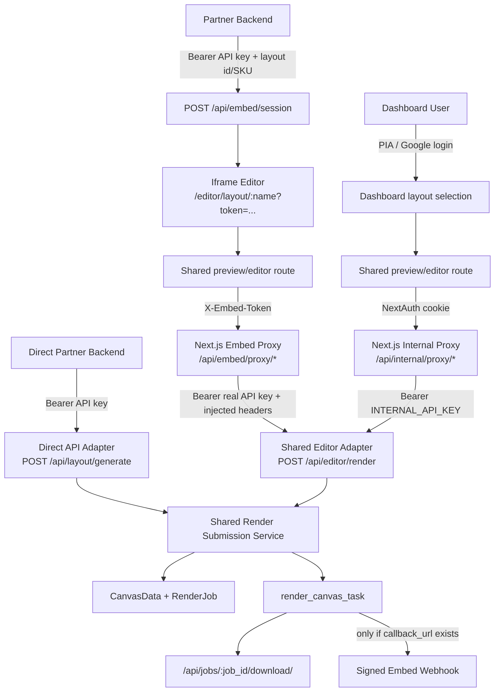

# CLAUDE.md

This file provides guidance to Claude Code (claude.ai/code) when working with code in this repository.

## What This Project Does

Product Editor is a full-stack print-file generator for Printo.in. Customers upload and compose photos on an interactive canvas editor; the system asynchronously renders 300-DPI print files (PNG, with PDF as an alternate format) and delivers them either via direct download (dashboard users fetch the ZIP) or via a signed webhook to the embed caller's `callback_url` (printo.in's storefront then pulls the same download URL from its backend). The app does NOT push files to any internal OMS — it's a standalone generator.

## Docs — and which of them to trust

**This file is the current-state reference.** `docs/` is mostly *not*: of the ten files there, four describe present behaviour and the rest are shipped-feature design records, unstarted plans, or an audit of other systems. Index with per-file status: [docs/README.md](docs/README.md). Reading a shipped PRD as documentation is the main way to get a wrong answer from that folder — **where a doc and the code disagree, the code wins**, and where a doc and this file disagree, this file was more recently verified.

The four to actually rely on:

| Doc | Use it for |
|---|---|
| [docs/INTEGRATION.md](docs/INTEGRATION.md) | The only doc with an **external** audience — printo.in's storefront team. Webhook payload, HMAC verification, the four download URLs, drop-in Node/Python handlers. Changing `notify_caller_webhook_task` means updating this. |
| [docs/DATA_LIFECYCLE.md](docs/DATA_LIFECYCLE.md) | Any retention or DPDP question. One clock (`EXPORT_RETENTION_DAYS`, default 7, **prod runs 3**), what the purge deletes, the two gaps still open. |
| [docs/AI_GUARDRAILS.md](docs/AI_GUARDRAILS.md) | Condensed rules that exist because breaking them already cost something. Overlaps this file deliberately. |
| [docs/LOAD_BASELINE.md](docs/LOAD_BASELINE.md) | Load numbers. Append runs, never edit old ones. |

Nothing in `docs/` is checked by CI, so no claim there is self-verifying. If you correct a fact in one, check whether this file or `docs/AI_GUARDRAILS.md` states it too — they were out of sync on worker memory, migration numbers, and retention windows until 2026-08-14.

## Knowledge Graph

A knowledge graph of this codebase lives in `graphify-out/`. Before investigating architecture questions, tracing data flows, or understanding how components interact, query it first — it's much faster than grepping.

```bash
# Ask a question about the codebase
graphify query "how does the render pipeline work"
graphify query "what calls LayoutEngine"
graphify query "how does the embed session flow work"

# Trace the path between two concepts
graphify path "EditorRenderView" "notify_caller_webhook_task"
graphify path "FabricEditor" "LayoutEngine"

# Explain a specific node
graphify explain "render_canvas_task"
graphify explain "CalendarState"
```

The graph covers 247 code files plus the curated doc nodes — 2,215 nodes, 3,844 edges, 182 communities (rebuilt 2026-07-26 from commit `e584f6d`; includes the calendar product code, the caption-placement modules, the PR #24 header/brand components, and the `docs/printo-architecture-audit` set). Full stats and community listing: `graphify-out/GRAPH_REPORT.md`, whose "Graph Freshness" block records the commit it was built from — compare against `git rev-parse HEAD` to check staleness.

**The graph is stale as of 2026-08-14** — built from `e584f6d`, and `main` has since moved through the API audit trail (`api/middleware.py`, migration `0014`), `services/orphan_exports.py`, `services/gc_status.py`, `services/heic.py`, `src/lib/ops-guard.ts`, and the split-download-URL work. Those files are either absent from the graph or described by their pre-change edges, so a query about audit logging, GC observability, HEIC decoding, or the ops privilege gate will under-report. Run `graphify update .` (AST-only, no API key, a few seconds) before relying on it for those areas. Two docs it indexes were also deleted on 2026-08-14 (`calendar-feature.html`, `Product_Editor_PRD_v1.10.docx`) and one added (`docs/README.md`). Key communities:
- **Calendar Product Materialization** — materialize_surfaces, calendar_layout.py, per-surface overrides
- **API Key & PIA Auth** — APIKeyUser, PIAAuthentication, RenderJob
- **Canvas & Embed Models** — CanvasData, EmbedSession, EditorRenderView
- **Engine Canvas Compositing / Engine Surface Generation** — engine.py, _composite_canvas, smart downscale
- **Celery Render Task Extractors** — tasks.py, _extract_frame_transforms, _extract_calendar_state
- **Calendar Cell Renderer / Month Grid & Pills** — calendar_renderer.py, draw_cell_image, pill merge
- **Colour-Managed Image Loader** — services/image_loader.py, EXIF + ICC→sRGB
- **Upload & Calendar Validators** — api/validators.py, validate_calendar_layout
- **Bearer Auth & Ops Views** — BearerTokenAuthentication, fonts/holidays/calendar-styles views
- **Editor Modal & Toolbars / Fabric Editor & Shapes** — FabricEditor, ColorPicker, shape catalog
- **Chunked Upload Utils / Storage Backend Abstraction** — upload-utils.ts, services/storage.py
- **Webhook SSRF Guard** — services/url_safety.py, post_webhook_safely
- **Login & Rate Limiting** — actions/auth.ts, per-IP rate limit
- **Printo architecture audit (docs)** — "Printo.in Monolith Audit", "Target Architecture & Saleor", "Estimator POS Audit", "PIA & Printose Audit"

God nodes (highest connectivity): `editor/layout/[name]/page.tsx` (81 edges), `LayoutEngine` (75), `api/views.py` (61), `APIKey` (45), `APIKeyUser` (40), `UploadedFile` / `ExportedResult` / `EmbedSession` (37 each), `BearerTokenAuthentication` / `PIAAuthentication` (36 each). The top two are the files most likely to break something else when edited.

To update the graph after significant code changes:
```bash
graphify update .
```

**Use `graphify update .`, not `graphify . --update`.** The `update` subcommand is AST-only — no LLM, no API key, no cost, a few seconds. The `--update` flag form attempts semantic re-extraction of changed docs/PRDs and aborts with `error: no LLM API key found` unless `GEMINI_API_KEY` / `ANTHROPIC_API_KEY` / etc. is set (none is, on this machine). Code-only updates preserve the existing doc nodes and community names; genuinely new communities show up as unnamed `Community N` placeholders until someone runs `graphify label .` with a key.

Open `graphify-out/graph.html` in a browser for the interactive visualisation.

---

## Hard constraints — git and shipping

Mirrors the equivalent section in `PIA/pops-prod-ui/CLAUDE.md`, adapted: this
repo has no `staging` branch, so **`main` is production**. `deploy.sh` git-pulls
`main` on the server, which means anything merged is one deploy away from
customers. The gate between "written" and "live" is your check-in with the
user — there is nothing else.

- **Never push, open a PR, or merge without checking in first.** A request to do
  the work is not a request to ship it. Do the work, run the checks, then STOP
  and report what changed and what you verified — then wait for an explicit
  go-ahead before `git push`, `gh pr create`, or `gh pr merge`. Chaining
  implement → test → commit → push → PR → merge into one autonomous pass is the
  failure mode. It ran that way throughout 2026-08-08 (PRs #41–#53): each change
  was individually sound and verified, but the user was left reviewing merges
  rather than deciding them.

- **Always branch from freshly-pulled `main`.**
  `git checkout main && git pull && git checkout -b <name>` — never
  `git checkout -b` from wherever the tree happens to be sitting. This checkout
  is shared with other Claude Code sessions (three at once on 2026-08-08), so
  local `main` goes stale within minutes. Twice that day a `git pull` failed
  silently — once because stderr was suppressed with `2>/dev/null`, once because
  untracked files blocked the merge — and work began against a base 7 commits
  behind.

- **Run `git status` and `git log --oneline -5` before every commit.** With
  several sessions in one directory, uncommitted files may not be yours. **Never
  `git add -A` or `git commit -a` in this repo — stage explicit paths.** On
  2026-08-08 a session found four modified and two untracked files belonging to
  another session; they were only safe to discard after verifying each was
  byte-identical to `origin/main`.

- **Say what you found and left behind.** If another session's work is sitting
  in the tree, name the files rather than silently working around them.

- **Delete the remote branch after a merge:**
  `git push origin --delete <branch>`. Otherwise every `git pull` on the
  production server prints the whole accumulated list as `[new branch]`, burying
  the output that matters. 13 merged branches had piled up by the end of
  2026-08-08.

- **A PR number is not something to predict.** Use the URL `gh pr create`
  returns. On 2026-08-08 a PR was referenced as "#47" before it existed; #47
  turned out to be an unrelated PR from another session.

## Commands

### Frontend (Next.js)
```bash
cd frontend/nextjs
pnpm dev          # Development server (http://localhost:3000 direct, or http://localhost:5004 via Docker)
pnpm dev:clean    # rm -rf .next first — use when routes 404 in dev
pnpm build        # Production build
pnpm typecheck    # tsc --noEmit (full strict mode) — run before pushing
pnpm lint         # eslint src
pnpm lint:fix     # auto-fix
```

### Backend (Django)
```bash
cd backend/django
python manage.py migrate
python manage.py showmigrations
python manage.py shell
```

### Tests

The two halves use **different, deliberately lightweight harnesses**. Neither needs a database.

**Frontend — Jest** (`next/jest` + SWC transforms + `@happy-dom/jest-environment`; config in `frontend/nextjs/jest.config.ts`). Only `src/**/__tests__/**` is collected. happy-dom is used instead of jsdom specifically because jsdom auto-requires the native `canvas` module that Fabric.js peer-deps.

```bash
cd frontend/nextjs
pnpm test                                        # whole suite
pnpm test:watch                                  # watch mode
pnpm test -- src/lib/__tests__/dpi-utils.test.ts # one file
pnpm test -- -t "clamps the offset"              # one test by name
pnpm test:parity                                 # calendar TS↔Python parity suites only
```

**Backend — standalone modules, no pytest, no `manage.py test`.** Every file in `backend/django/services/tests/test_*.py` ends in an `if __name__ == "__main__":` block that runs its own `test_*` functions and prints a pass count. CI globs them, so the count is pinned nowhere — get it with `ls backend/django/services/tests/test_*.py | wc -l` rather than trusting a number in a doc (this file claimed 18 and 19 in consecutive paragraphs while the real count was 24).

Run one **through the container** — the dev Mac's system Python has no Pillow/Django, so this is the practical local route. Override the entrypoint: it ignores `$@` and would otherwise boot gunicorn and hang forever (see Deployment).

```bash
docker-compose run --rm --entrypoint /opt/venv/bin/python backend -m services.tests.test_caption_layout
```

All of them, the way CI does it:

```bash
docker-compose run --rm --entrypoint bash backend -c 'for f in services/tests/test_*.py; do /opt/venv/bin/python -m "services.tests.$(basename "$f" .py)" || echo "FAIL $f"; done'
```

If you *do* have a local venv with `requirements.txt` installed, the bare form works too — `DEBUG=1` is mandatory, or the production `DJANGO_SECRET_KEY` fail-fast in `settings.py` aborts before any test runs:

```bash
cd backend/django && DJANGO_SETTINGS_MODULE=product_editor.settings DEBUG=1 python -m services.tests.test_caption_layout
```

**Writing new backend tests:** copy the `__main__` footer from an existing module. CI auto-discovers `services/tests/test_*.py`, so a new file is picked up with no workflow edit. Keep them DB-free and mediapipe-free — CI installs a mediapipe-stripped requirements subset.

**CI** (`.github/workflows/ci.yml`, push/PR to `main`): backend loop above, then frontend `pnpm typecheck` → `pnpm lint` → `pnpm test -- --ci`. Note the org is on GitHub Free with Actions billing-locked, so the checks may show red for reasons unrelated to the code — verify locally.

### Verifying UI changes in a real browser (no PIA login)

The unit suites don't cover the canvas, and PIA credentials can't be typed into
an automated browser. Two routes in, depending on the page:

**Editor route** (`/editor/layout/[name]`) — not auth-gated, so use an embed token:

```bash
docker-compose up -d db redis backend        # backend on :8000
# frontend must run from source (pnpm dev) — the Docker image serves a BUILD,
# so it will not contain your local edits
KEY=$(grep -E "^DIRECT_API_KEY=" .env | cut -d= -f2-)
curl -s -X POST http://localhost:8000/api/embed/session \
  -H "Authorization: Bearer $KEY" -H 'Content-Type: application/json' \
  -d '{"order_id":"TEST-1"}'
# → open http://localhost:3000/editor/layout/<name>?token=<token>
```

**Auth-gated pages** (`/dashboard`, `/editor/layouts`) — mint a NextAuth cookie
rather than logging in. Run this **inside `frontend/nextjs`** so `next-auth`
resolves, and read `AUTH_SECRET` from `frontend/nextjs/.env.local` — it differs
from the root `.env`, and using the wrong one silently yields a cookie the
server rejects:

```js
import { encode } from 'next-auth/jwt';
const now = Math.floor(Date.now() / 1000);
await encode({ salt: 'authjs.session-token', secret: AUTH_SECRET, token: {
  id: 'LOCAL-DEV', name: 'Local Dev', email: 'local@printo.in',
  role: 'admin', is_ops_team: true,          // flip to test privilege gates
  accessToken: 'x', refreshToken: 'x', accessTokenExpires: (now + 3600) * 1000,
  sub: 'LOCAL-DEV', iat: now, exp: now + 3600 } });
// then: document.cookie = "authjs.session-token=<jwt>; path=/"
```

Local dev only — it depends on having the local `AUTH_SECRET`. Delete the
script afterwards.

**Getting a photo onto the canvas:** draw on an off-screen canvas, wrap in
`File`/`DataTransfer`, and assign through the **native setter**
(`Object.getOwnPropertyDescriptor(HTMLInputElement.prototype,'files').set`) on
the input with `multiple=true` — the non-multiple one is the replace-photo
input. Then dispatch a bubbling `change`.

**Known automation limits — don't spend time rediscovering these:**

- **The layout-card action buttons (View Raw JSON / Delete / Edit / Duplicate)
  do not respond to synthetic clicks** — mouse or keyboard, handler never
  fires, no console error. Reproduced on unmodified `main`, so it is an
  automation artifact, not a bug. Header buttons and canvas interactions work
  fine. Verify those flows via code + `curl` and ask the user for one manual
  click.
- To assert Fabric object state (stroke colours, guide visibility), walk the
  React fiber from `canvas.lower-canvas` (`__reactFiber$…`) up through
  `memoizedState` for a hook whose `.current` has `_objects` + `renderAll`.
  `fc.fire('object:moving', {target})` then exercises the real handlers.
- Pixel-sampling a Fabric canvas must allow for alpha blending — guides draw at
  0.7–0.8 opacity over white, so test hue dominance (`g - r > 40`), not an exact
  hex match.
- `next.config.mjs` is **not** hot-reloaded; restart the dev server after
  editing it.
- Routes 404ing in dev → `rm -rf .next` and restart (see B5 in Known Issues).

### Docker (primary workflow)
```bash
docker-compose up -d
docker-compose exec backend python manage.py migrate   # Always run migrations via backend container
docker-compose ps celery-worker-standard celery-beat
docker-compose logs -f <service>
```

**First run on a fresh clone:** `docker-compose up -d` alone will crash-loop the `proxy` (nginx) service — it bind-mounts `proxy/nginx/certs/{origin.crt,origin.key}`, which are gitignored and don't exist yet. Either run `./deploy.sh` once (it generates a self-signed bootstrap cert automatically), or generate it yourself before `docker-compose up -d`:
```bash
mkdir -p proxy/nginx/certs
openssl req -x509 -nodes -days 3650 -newkey rsa:2048 \
  -keyout proxy/nginx/certs/origin.key -out proxy/nginx/certs/origin.crt \
  -subj "/CN=localhost/O=product-editor self-signed"
chmod 600 proxy/nginx/certs/origin.key
```
Also copy `.env.example` → `.env` and fill in the required secrets (`DJANGO_SECRET_KEY`, `AUTH_SECRET`, `EMBED_INTERNAL_SECRET`, `INTERNAL_API_KEY`, `POSTGRES_PASSWORD`, `DIRECT_API_KEY`) before the backend will boot — see `.env.example` for the full list and generation commands.

### Utilities
```bash
./deploy.sh                                                    # Production deployment
./fresh-install.sh                                             # Fresh environment setup
./reset-db.sh                                                  # Reset database
./benchmark.sh                                                 # Performance benchmarking
API_KEY=<key> [BASE=<url>] ./scripts/smoke-test-embed.sh       # 10-step embed-flow smoke test
API_KEY=<key> [BASE=<url>] ./scripts/smoke-test-calendar.sh    # 19-check calendar/ops surface
./scripts/test-backup-restore.sh                               # restore into a throwaway DB + assert row counts
```

Both smoke tests default to `BASE=http://localhost:5004`. If you're exercising the **nginx edge** (the path prod actually uses) point them at `BASE=https://localhost` and wrap `curl` with `-k` — the local origin cert is self-signed. Rebuild the frontend image before testing frontend-side changes; the container serves a build, not your working tree.

## Architecture

### Stack
- **Frontend**: Next.js 16 (App Router), React 19, TypeScript, Fabric.js 7.2, Tailwind CSS
- **Backend**: Django 5 + DRF, Celery 5.3.4, Pillow 10.3.0
- **Infrastructure**: PostgreSQL 16, Redis 7, nginx 1.27 (edge proxy), Docker Compose

### Key Data Flow

All exports go through one unified server-side pipeline. The previous client-side "≤ 20 canvases → render in browser" shortcut was removed in v1.8 — every Submit/Download triggers a Celery render job, regardless of canvas count. Trade-off: small jobs pay an extra ~10–20 s of upload + poll latency; gains a single contract that handles webhooks, large batches, and resumable uploads identically.

**Access-mode invariant:** dashboard login flow and iframe embed/widget flow must produce the same print output for the same layout id/SKU, uploaded assets, transforms, overlays, calendar data, background colours, `export_format`, and `include_uploads` choice. Authentication and delivery differ, but preview/editor state, render behaviour, and download artifact contract must not. The stricter cleanup/target architecture is captured in `docs/API_SURFACE_SEPARATION_PRD.md`.

**Editor → render → delivery:**

1. Customer interacts with Fabric.js canvas editor (`frontend/nextjs/src/app/editor/`).
2. On Save & Continue (embed) or Download (dashboard), `executeServerRender()` in `page.tsx`:
   - Uploads every `File` via the chunked upload API (2 MB chunks, 4 parallel) using `src/lib/upload-utils.ts`
   - POSTs to `/api/editor/render` with `{ layout_name, order_id, canvases[] }` (per-frame `upload_id` + transform data)
3. Backend creates `CanvasData` + `RenderJob`, dispatches `render_canvas_task` to Celery.
4. Celery worker: `LayoutEngine` consumes the submit-time `CanvasData.render_state` snapshot (falling back to `editor_state` only for pre-migration jobs) → Pillow renders at 300 DPI (PNG by default; PDF when `export_format='pdf'`).
5. After render, files sit on disk under `EXPORTS_DIR/<job_id>/`, ready to be served by `GET /api/jobs/<job_id>/download/`.
6. **Delivery — embed flow:** if `EmbedSession.callback_url` was set at session creation, `notify_caller_webhook_task` POSTs `{ order_id, job_id, status, download_url, print_download_url, mock_download_url, uploads_download_url, expires_at, file_count, layout_name, export_format }` to that URL plus an `X-Signature: sha256=<hmac>` header signed with the api_key. The caller fetches the ZIP(s) it wants using their api_key as Bearer auth — the combined archive, or the three single-part archives. *No internal OMS push exists.*
7. **Delivery — dashboard flow:** no webhook task fires. The browser polls `/api/render-status/{job_id}/` with exponential backoff, then fetches the ZIP from `/api/jobs/{job_id}/download/` directly.
8. Frontend behaviour after submit:
   - **Embed**: fires `window.parent.postMessage({ type: 'pe:render_job', jobId, orderID })` so the parent's UI can show "your design is being prepared". The actual file delivery happens via the webhook (above), not via postMessage.
   - **Dashboard**: polls + downloads as in step 7.

**Direct partner API callers (`GenerateLayoutView`):**
- `GenerateLayoutView` still exists for partners who hit `/api/layout/generate` with their own api_key (no embed session). Same output contract: `export_format` is `'png'` (default) or `'pdf'`. The old `soft_proof` / `tiff_cmyk` / `callback_url` body params were all removed in v1.8 — direct callers must poll `/api/render-status/<job_id>/`. Webhooks are configured exclusively via `EmbedSession.callback_url`.
- Current cleanup target: keep `/api/layout/generate` as the direct partner API, but remove the unreachable synchronous helper inside `GenerateLayoutView` and route direct partner API + editor/embed render submissions through one shared backend render-submission service. See `docs/API_SURFACE_SEPARATION_PRD.md`.

**Access flows to preserve:**
- Dashboard: login → dashboard layout selection → `/editor/layout/[name]` preview/editor → shared server render → browser download.
- Embed/widget: partner backend creates `/api/embed/session` with api_key + layout id/SKU/order_id → iframe opens `/editor/layout/[name]?token=...` → embed proxy calls shared render → signed webhook + partner backend downloads ZIP.
- Direct partner API: partner backend posts `/api/layout/generate` server-to-server → shared render → poll status → download ZIP.



### Frontend Structure
- `src/pia-auth.ts` — NextAuth v5 config; Credentials provider hits PIA; `jwt`/`session`/`redirect` callbacks; custom `CredentialsSignin` subclasses for outage vs. timeout; PIA fetches use `AbortSignal.timeout(10_000)`
- `src/proxy.ts` — Next.js 16 proxy file (formerly `middleware.ts`). Server-side auth gate for `/dashboard/*` and `/editor/layouts/*`; bounces logged-in users away from `/login`. Excludes `/editor/layout/[name]` because that route serves both dashboard and embed flows.
- `src/app/login/page.tsx` + `src/app/actions/auth.ts` — login form + server action; per-IP rate limit (5/min, in-memory); maps `PiaTimeout` / `PiaServiceUnavailable` codes to user-facing messages
- `src/types/next-auth.d.ts` — type augmentation for `Session` (`error`, `is_ops_team`, `accessToken`, `user.role`) and `JWT` — never use `(session as any)`
- `src/app/editor/layout/[name]/page.tsx` — Main editor page. Single render path via `executeServerRender()` regardless of canvas count. `handleSubmitDesign` (embed "Save & Continue") and `executeBatchDownload` (dashboard "Download") are thin wrappers that both call it. Dual-mode (dashboard session vs. embed token). **"Add Files" appends, it does not replace** — a native `<input type=file>` selection is never cumulative (each pick contains only that pick's files), so `handleFileChange` must merge onto the existing selection before handoff. Feeding the raw pick into `setFiles()` wipes every earlier canvas; that was a live bug until PR #24. Multi-surface layouts are excluded from the merge — each surface holds exactly one photo, so there's no "next canvas" to append to.
- `src/components/` — React components (FabricEditor.tsx is the canvas core)
- `src/components/ServiceWorkerRegistration.tsx` — registers `/sw.js` in production after `window.load`. No-op in dev so cache doesn't mask code changes. Wired into `app/layout.tsx`.
- `public/sw.js` — minimal cache-first Service Worker for `/_next/static/*` and `/static/*`. `CACHE_VERSION` constant gates cache buckets; bump to bust everything. See `## Service Worker` section.
- `src/lib/fabric-renderer.ts` — Off-screen canvas renderer for previews and exports; uses pre-computed `frameRects[]` array to avoid repeated coordinate recalculation. `calculateSmartCropOffsets` clamps the returned offset to the frame's actual per-axis pan room — see v1.10 fix.
- `src/lib/image-utils.ts` — Image metadata extraction; WeakMap caches only `{width, height, orientation}` (not the HTMLImageElement — would OOM at 200 files). `getImageSize()` is the cache-first dims-only accessor for sweeps that must not re-decode.
- `src/lib/dpi-utils.ts` — Effective print-DPI estimation for the low-res warning (Phase 2). Mirrors the fabric-renderer/engine placement math exactly (rotated bbox → cover/contain baseScale → × zoom); thresholds `DPI_WARN=150` / `DPI_CRITICAL=100`, strict `<` so exactly 150 doesn't warn. Card pills + pre-submit modal notices in `page.tsx` are non-blocking by design. If the placement math changes in either renderer, update this module too.
- `src/lib/upload-utils.ts` — Chunked upload utility: `uploadFile()` (single, sequential chunks) and `uploadFiles()` (batched, 4 parallel)
- `src/lib/zip-utils.ts` — Chunked ZIP generation still used for imposition-sheet downloads. Do not delete it as part of the retired client-side render ZIP cleanup; the old browser render/download path is gone, but imposition still imports `createZipFromDataUrls` / `downloadBlob`.
- `src/lib/file-store.ts` — IndexedDB-backed File persistence keyed by `(orderId, fileId)`; recovers `originalFile` after page refresh. See "B1 — Canvas state file persistence" below.
- `src/app/api/embed/proxy/[...path]/route.ts` — Embed proxy; resolves embed token → `{ apiKey, orderId, callbackUrl, includeUploads }`; injects `X-Order-ID`, `X-Callback-URL`, and `X-Include-Uploads`; caches in-process (110 min TTL, 10k cap)
- `src/types/` — TypeScript interfaces for layouts, surfaces, frames

### Backend Structure
- `api/views.py` — `GenerateLayoutView`, `RenderStatusView`, `EditorRenderView` (chunked-upload render submission), `ChunkedUploadInitView/ChunkView/CompleteView`, `EmbedSessionView/ValidateView`, `RenderJobDownloadView`, `HealthView` (`GET /api/health`, public, used by Docker healthchecks), `SKULayoutView` (`GET/PUT /api/sku-layouts/[<sku>/]` — see Storage Files below)
- `api/tasks.py` — `render_canvas_task` (calls `_extract_frame_transforms` + `_extract_overlays_per_canvas` + `_build_uploaded_files_map` → `LayoutEngine`), `notify_caller_webhook_task` (only dispatched when `canvas.callback_url` is set; signs payload with HMAC-SHA256 of api_key), `garbage_collector_task` (has `soft_time_limit=3300` / `time_limit=3600`)
- `api/models.py` — `APIKey`, `EmbedSession` (+ `order_id` + `callback_url` fields), `CanvasData` (+ `editor_state` JSON, + `callback_url` propagated from EmbedSession), `RenderJob`, `UploadedFile` (+ `upload_session_id`), `ExportedResult`
- `api/validators.py` — `MAX_FILE_SIZE_MB` reads from `settings.MAX_UPLOAD_FILE_SIZE_MB` (single source via env)
- `layout_engine/engine.py` — Pillow-based high-res PNG/PDF renderer at 300 DPI; `_smart_downscale()` pre-shrinks source images to 2× frame target (BOX resample); 90/180/270° rotation fast-path via `Image.transpose`; per-frame pan/zoom/rotation from `frame_transforms`; explicit `Image.close()` + `gc.collect()` between canvases. CMYK/soft-proof pipeline removed in v1.8. **As of CALENDAR_FEATURE_PRD Phase 1**: `_composite_canvas` now also accepts `overlays` + `uploaded_files` and invokes `services.overlay_renderer.render_overlays` after frame compositing and before the layout mask, so text/shape/image overlays appear in the 300 DPI output (previously preview-only).
- `services/overlay_renderer.py` — `render_overlays(canvas, overlays, canvas_w_px, canvas_h_px, uploaded_files)` draws text / shape / image overlays via Pillow `ImageDraw`. Single bundled font (Inter Variable) per PRD §11.7 — no font picker. Phase 1 deliverable; foundation for Phase 4 (calendar renderer).
- `services/image_loader.py` — **the single choke point for opening customer photos server-side** (`open_source_rgba(path)`): EXIF orientation + ICC→sRGB colour management (Display-P3 iPhone photos, AdobeRGB, CMYK-tagged JPEGs) via lcms2, fail-open on malformed profiles. All three render paths (frames in `engine.py`, image overlays, calendar cell images) load through it; output PNGs are tagged with an explicit sRGB profile (`srgb_profile_bytes()`). Never call `Image.open(...).convert("RGBA")` directly on customer photos — it silently discards the embedded profile and shifts colours in print.
- `services/fonts.py` — `get_font(size_px, weight)` returns a cached `PIL.ImageFont` for the bundled `services/fonts_assets/Inter-Variable.ttf`. Uses the variable axis to serve any weight from a single 859 KB .ttf. Falls back to PIL default on missing-font (logged once). Boot-time `startup_check()` warns if the font is absent.
- `services/fonts_assets/Inter-Variable.ttf` — Inter Variable (Apache 2.0 / SIL OFL 1.1) bundled in the image. README in the same dir documents the install convention.
- `product_editor/celery.py` — Queue routing (all three tasks → `standard`; the `priority` queue has no producer — see Async Queue below), `worker_max_tasks_per_child = 50`, `worker_prefetch_multiplier = 1`
- `product_editor/settings.py` — `csp.middleware.CSPMiddleware` is wired in after `SecurityMiddleware`; CSP starts in report-only mode via `CSP_REPORT_ONLY`
- **Backend Dockerfile** is multi-stage — builder installs `build-essential` + `libpq-dev` to compile wheels; runner ships only `libpq5` + the venv. Drops ~250 MB from the final image. The `collectstatic` `RUN` supplies an **inline build-only `DJANGO_SECRET_KEY`** (build-time only, not baked into the image ENV) so the settings.py fail-fast guard doesn't abort the build — see `## Deployment` for the full rationale.

### Async Queue

**One** Celery worker service: `celery-worker-standard`, consuming `-Q priority,standard`.

There were two until Aug 2026 — a second worker bound to `priority` alone, for the soft-proof/CMYK express path. That pipeline was retired in v1.8 and nothing routed to `priority` afterwards: all three `task_routes` entries in `product_editor/celery.py` point at `standard`, and both dispatch sites (`GenerateLayoutView` and `EditorRenderView`) hardcode `queue_name = 'standard'`. The container had never executed a task, while holding a full Django + Pillow + MediaPipe process resident. It was removed rather than left looking like capacity it never provided.

**The surviving worker deliberately drains both queues.** `celery.py` still documents `apply_async(queue='priority')` as an opt-in, and with no consumer on that queue such a task would sit in Redis forever — the render would silently never happen, with no error anywhere. Listening to both closes that trap at zero cost. It is a safety net, **not** a QoS tier: Celery round-robins across `-Q` queues, so naming `priority` first buys no actual precedence. If express orders ever need to genuinely jump the line, that requires a second worker *plus* a dispatch site that routes to it — don't assume the current config provides it.

Concurrency is **auto-detected from CPU count** per replica (no `CELERY_CONCURRENCY` set in compose), so the worker scales with whatever the host has — 2 render slots on the current 2-core prod box. Override via `.env` if you need to cap it on a shared server. Memory cap is 2 GB per replica.

The service name still says `standard`, which is now a slight misnomer. It was kept to avoid renaming the container on prod and touching `deploy.sh` / `restore.sh` / dashboards for cosmetics.

Scale horizontally under load: `docker compose up -d --scale celery-worker-standard=4`.

Worker config (in `product_editor/celery.py`):
- `worker_prefetch_multiplier = 1` — fetch one task at a time per slot
- `worker_max_tasks_per_child = 50` — recycle workers periodically; relies on `engine.py` calling `Image.close()` + `gc.collect()` after each canvas to avoid drift
- `task_acks_late = True` + `task_reject_on_worker_lost = True` — requeue if a worker dies

Retry strategy: `self.retry()` with exponential backoff (2s → 4s → 8s), max 3 retries. `MemoryError` and `SoftTimeLimitExceeded` skip retries. Never use `autoretry_for` — this codebase uses `self.retry()` exclusively.

`garbage_collector_task` runs daily at 02:00 UTC and has `soft_time_limit=3300` / `time_limit=3600` so a hung GC sweep can never permanently block a worker slot.

**Check whether the GC is actually running via `garbage_collector.stale` on `GET /api/celery/monitor/`** (ops-only). Do NOT try to infer it from the database: the sweep flags rows `is_deleted=True` and then hard-deletes those same tombstones later in the *same* pass, so `ExportedResult.objects.filter(is_deleted=True).count()` reads **0** whether the GC ran an hour ago or has never run at all. It looks like a "did it run?" signal and is not one — that misreading cost real debugging time on 2026-08-13.

`services/gc_status.py` records each completed sweep (timestamp + counters) to `storage/gc_last_run.json`, atomically, and `CeleryMonitoringView` reads it back. A file under `STORAGE_ROOT` rather than a DB row because `./storage` is bind-mounted and therefore survives container recreation — the exact thing that lost the log evidence during that incident — and because it needs no migration. It is runtime state, not config: gitignored, unlike the other JSON files in that directory.

**Alert on `stale` OR `failing`** — they answer different questions. `stale` means no *successful* sweep recently (never recorded, unreadable record, or older than `GC_STALE_AFTER_HOURS`, default 36). `failing` means the most recent *attempt* raised, with `last_error` saying how; a sweep can be failing while not yet stale.

That second field exists because its absence is genuinely expensive. The first version recorded only successes, on the reasoning that a crash would surface as staleness. It does — but staleness cannot say *why*, and it reads identically to "never scheduled". On 2026-08-14 that ambiguity let a wrong diagnosis run for two days: with no failure record, "the sweep broke" and "the sweep was never dispatched" look the same from outside. **The answer was in the worker log the whole time** — and worker logs survive container recreation in Loki, so query `{container=~".*celery-worker.*"}` for the window *before* theorising. `api/tasks.py` now hooks `task_failure` for the sweep, which leaves retry semantics untouched. Deliberately absent from `GET /api/health`: that endpoint is public and drives the Docker healthcheck, so failing it on a stale GC would restart containers over a non-fatal condition.

The same endpoint carries a **live `disk` block** (`used_percent`, `free_gb`, `pressure` at >80%), read at request time rather than lifted from the last sweep's stats. That distinction is the point: `garbage_collector.stats.disk_usage_percent` is only as fresh as the last sweep, so at the moment it matters most — nothing sweeping — it is absent or stale. Production hit 89% unnoticed twice for that reason.

### The GC schedule lags the expiry curve

`garbage_collector_task` runs at 02:00 UTC — **07:30 IST, immediately before the daily expiry wave rather than after it.** Retention is 3 days and Printo's orders arrive during Indian business hours, so each day's exports expire at roughly the clock time they were created. Measured on 2026-08-14: the 02:00 sweep found **2** expired exports; by 08:17 there were **1298**, and disk had gone 82.1% → 93.3%.

The sweep is healthy — it just systematically misses the cohort expiring shortly after it runs, which then waits a further 24 hours. **That is the sawtooth, not a broken GC.** Worth remembering before diagnosing disk growth as a GC failure: on 2026-08-14 that misreading produced two wrong root causes (a non-firing beat, then a stale DB connection) before anyone read the 02:00 log.

The fix is scheduling, not code: sweeping every 6 hours (`crontab(minute=0, hour='*/6')`) tracks the curve instead of lagging it, and a no-op sweep costs 0.19s. Not yet changed — it alters production behaviour.

### Celery and stale database connections

`CONN_MAX_AGE` does nothing in a worker on its own. Django enforces it from its `request_started`/`request_finished` signals, and Celery has no requests — so a connection opened by a worker's first task stays checked out for the life of that process, however long it idles, until Postgres or Docker drops the socket. The next query then raises `InterfaceError: connection already closed`.

**This has not been observed biting in production** — treat the hooks below as hardening, not a fix for a known incident. The 2026-08-14 nightly sweep ran and succeeded in 0.19s; a plausible-sounding story about it dying on a stale connection turned out to be wrong when the Loki logs were finally read. `worker_max_tasks_per_child = 50` recycles the process periodically, which is probably why the risk has stayed latent.

The risk is nonetheless real and was unguarded, verified both directions: kill `connection.connection`, and the next query raises `InterfaceError: connection already closed` without the hook and succeeds with it.

Two halves, both required:
- `product_editor/celery.py` connects `close_old_connections` to **`task_prerun` and `task_postrun`**. Postrun matters as much as prerun: it stops an idle worker sitting on a connection waiting to go stale.
- `settings.py` sets **`CONN_HEALTH_CHECKS: True`** so Django validates a pooled connection before reuse rather than discovering it is dead via the query.

Don't remove either when touching Celery config. The pinning test is `services/tests/test_gc_status.py`, plus a manual check that survives review: kill `connection.connection` and confirm the next query still works.

### Orphaned export directories

Every sweep in `garbage_collector_task` except one starts from a DB row and follows it to a file, so none of them can reclaim a file whose row is gone. `services/orphan_exports.py` is the exception: it enumerates `EXPORTS_DIR` and removes directories nothing in the database accounts for.

They formed because the async-render cleanup used to filter on `status='completed'`. A job killed mid-render (worker OOM, SIGKILL, container recreate) never reached that state, so its output files were skipped; later its `CanvasData` expired, the cascade removed the `RenderJob`, and the only pointer to those files went with it. 62 directories (54 MB) had stranded that way by 2026-08-13. **That filter is now gone** — the sweep matches on the *canvas* having expired plus a `created_at` guard of one day, which is safe because a render has a 55-minute soft limit while the canvas window is a full retention period.

`GC_ORPHAN_SWEEP` controls the reclamation: `off` | `dry_run` (default) | `delete`. It defaults to reporting only, because unlike every other sweep this one deletes on the *absence* of evidence — a subtly wrong query would destroy live print files rather than merely miss some. Read a night of dry-run counts from `garbage_collector.stats.orphan_exports` before arming it.

Five independent conditions must all hold before a directory is touched (`_classify`): the name parses as a UUID, no `RenderJob` has that id, no `ExportedResult` path references it, no `CanvasData.order_id` matches it (a partner order id can legitimately be UUID-shaped), and its mtime is older than retention + 1 day. **Any new export-directory naming convention must be added there**, or those directories will look like orphans. A DB failure keeps everything rather than treating an empty result set as "all orphans".

Always call `transaction.on_commit(lambda: task.apply_async(...))` **inside** the `atomic()` block so the callback fires only after the DB commit. Calling it outside an open transaction executes immediately (which works but is non-standard and fragile).

## Server-Side Render Flow

### When It Triggers

Always. The embed "Save & Continue" button (`handleSubmitDesign`) and the dashboard ZIP download button (`executeBatchDownload`) both call `executeServerRender()` unconditionally. The previous threshold-based split was removed in v1.8.

### Frontend Steps (`executeServerRender`)

| Step | Detail |
|---|---|
| Collect files | Iterate all canvases → frames → `frame.originalFile`; deduplicate with a `Set<File>` |
| Upload | `uploadFiles()` from `upload-utils.ts` — 2 MB chunks, 4 files parallel; progress 0 → 60% |
| Build payload | Per-frame: `{ upload_id, offset_x, offset_y, scale, rotation, fit_mode }` |
| Submit | `POST /api/editor/render` (or `/api/embed/proxy/editor/render`); `order_id` in body |
| Embed branch | `postMessage({ type: 'pe:render_job', jobId, orderID })` → `setSubmitted(true)` |
| Dashboard/direct branch | Poll `/api/render-status/{job_id}/` every 4 s; fetch ZIP when `status === 'completed'` |

### Chunked Upload API

```
POST /upload/init               { filename, file_size, total_chunks }
  → { upload_id, chunk_size }   # upload_id is UUID v4; 50 MB per-file limit

PUT  /upload/{upload_id}/chunk?index=N   body: raw bytes
  → { chunk_index, received, total }

POST /upload/{upload_id}/complete
  → { file_path, filename, file_size }   # file_path stored in UploadedFile.file_path
```

- UUID v4 regex guard on both chunk and complete views (prevents path traversal)
- Chunks staged in `UPLOADS_DIR/.chunks/{upload_id}/`; assembled on complete with size + PIL integrity validation
- `UploadedFile.upload_session_id` stores the UUID — `EditorRenderView` queries this to map `upload_id → file_path`

### POST /api/editor/render

```json
{
  "layout_name": "circle_48mm",
  "order_id": "EXT-JOB-123",
  "export_format": "png",
  "canvases": [
    {
      "canvas_index": 0,
      "surface_key": "front",
      "frames": [
        {
          "frame_index": 0,
          "upload_id": "<uuid from /upload/init>",
          "offset_x": -12.5,
          "offset_y": 3.0,
          "scale": 1.2,
          "rotation": 0,
          "fit_mode": "cover"
        }
      ]
    }
  ]
}
```

Response `202`:
```json
{ "job_id": "<uuid>", "order_id": "EXT-JOB-123", "status_url": "/api/render-status/<uuid>/", "queue": "standard" }
```

`order_id` resolution priority: `X-Order-ID` header (embed proxy injects from `EmbedSession.order_id`) → request body `order_id`.

### Embed Session & Order ID Flow

```
Caller (printo.in)  →  POST /api/embed/session
                       { order_id: "EXT-JOB-123",
                         callback_url: "https://printo.in/api/internal/pe-callback" }
                    ←  { token: "<uuid>", order_id, callback_url, expires_at }

iframe loads with  ?token=<uuid>

Every iframe request → embed proxy resolveSession(token)
                    → checks path allowlist (rejects /ops, /admin, etc. with 403)
                    → caches { apiKey, orderId, callbackUrl, includeUploads, exp } for 110 min
                    → injects X-Order-ID + X-Callback-URL + X-Include-Uploads on every upstream request

EditorRenderView reads X-Order-ID + X-Callback-URL + X-Include-Uploads headers,
persists callback_url onto CanvasData and snapshots include_uploads in render_state

After Celery render completes — only when canvas.callback_url is set:
notify_caller_webhook_task → POSTs webhook payload to canvas.callback_url
                          → HMAC-SHA256(api_key.key, raw_body) in X-Signature header
```

Neither `order_id` nor `callback_url` ever appears in the iframe URL — they flow: caller → session DB → proxy in-process cache → `X-Order-ID` / `X-Callback-URL` headers → Django.

`order_id` is validated server-side at session creation: `^[A-Za-z0-9_.\-]{1,64}$`. Anything else is rejected with 400.

`callback_url` (optional) is validated at session creation: must be `https://`, max 2000 chars. No domain allowlist — auth is enforced by the api_key the caller already holds, and the HMAC signature lets them verify the request actually came from us.

**Webhook payload (sent to `EmbedSession.callback_url` on completion):**

```json
{
  "order_id":      "EXT-JOB-123",
  "job_id":        "<RenderJob uuid>",
  "status":        "completed" | "failed",
  "download_url":         "https://product-editor.printo.in/api/jobs/<uuid>/download/",
  "print_download_url":   "https://product-editor.printo.in/api/jobs/<uuid>/download/?content=print",
  "mock_download_url":    "https://product-editor.printo.in/api/jobs/<uuid>/download/?content=mock",
  "uploads_download_url": "https://product-editor.printo.in/api/jobs/<uuid>/download/?content=uploads",
  "expires_at":    "<ISO 8601>",
  "file_count":    12,
  "layout_name":   "circle_48mm",
  "export_format": "png"
}
```

Headers: `Content-Type: application/json`, `X-Signature: sha256=<hex>`. Caller verifies with `hmac.compare_digest(hmac.new(api_key, raw_body, sha256).hexdigest(), signature)`. Then fetches whichever URL it needs with their api_key as `Authorization: Bearer <key>` to get the ZIP.

**One archive or three.** `download_url` is the combined archive — `1_customer_uploads/` + `2_mock/` + `3_print/` in one file — and is unchanged, so a caller already reading it needs no migration. The three `*_download_url` fields are the SAME job packaged one part per archive, each flat at the archive root, for callers that store mock and print artefacts in separate fields (printo.in does). `uploads_download_url` is `null` when the session set `include_uploads=false` — there is nothing behind it, so it is not advertised.

The split is served by `?content=` on the one endpoint (`all` — the default — `print`, `mock`, `uploads`); nothing is duplicated on disk. Requesting `content=mock` on a job whose previews could not be built returns 404 rather than a valid-looking empty ZIP.

**Embed proxy path allowlist** ([route.ts](frontend/nextjs/src/app/api/embed/proxy/[...path]/route.ts:124)) — only these prefixes pass through:

```
layouts, canvas-state, editor/render, editor/init, render-status, jobs,
upload, fonts, sku-layouts, embed/session, orientation, config,
holidays, calendar-styles, heic
```

Anything else returns 403 *before* token resolution, so an attacker can't probe Django auth surfaces with a stolen embed token.

`orientation` covers `POST /api/orientation/detect` (v1.11 auto-orient). Stateless inference — reads the posted image, returns `{rotation, confidence, source}`, persists nothing. Returns 503 when `AUTO_ORIENTATION_MODE=off`. `config` is the public `AllowAny` flags endpoint the editor reads on mount to decide whether to call `orientation/detect` at all — keep secrets out of it.

`heic` covers `POST /api/heic/convert` — see "HEIC decoding" below. Stateless: decodes the posted bytes and returns `image/jpeg`, persisting nothing.

## HEIC decoding (iPhone photos)

Three decoders are tried in order by `convertHeicFileIfNeeded` ([lib/heic-convert.ts](frontend/nextjs/src/lib/heic-convert.ts)); the first that succeeds wins:

| # | Decoder | Works when | Cost |
|---|---|---|---|
| 1 | `heic2any` (bundled libheif, **2021**) | older/simpler HEICs | none — pure client |
| 2 | the browser's own codec (`createImageBitmap`) | **Safari/iOS only** | none — pure client |
| 3 | `POST /api/heic/convert` → `services/heic.py` (pillow-heif, libheif 1.19) | always | one upload + ~1 s CPU |

**Why all three exist.** Current iPhones (iOS 18) write a `tmap` derived image — Apple's ISO 21496-1 gain-map HDR — whose pixels live in `grid` tiles. `heic2any` predates that format and fails outright on it; it was last published in 2021, so there is no newer version to upgrade to. Chrome and Firefox ship **no HEIC codec at all**, so decoder 2 does not exist for them. That combination means a modern iPhone photo is undecodable in Chrome without the server, which is what `services/heic.py` is for. Verified against a real 24 MP iOS 18 gain-map photo: the server decode matches macOS's own decode to RMSE 0.26.

Two details in `services/heic.py` worth not "simplifying":
- It preserves the embedded **ICC profile** on the JPEG instead of flattening to sRGB. `services/image_loader.open_source_rgba` already colour-manages at render time; converting early would drop the Display-P3 profile these photos carry and shift the print's colours.
- It writes **no EXIF**. libheif applies the container's `irot`/`imir` while decoding, so the pixels come back upright — re-attaching the source EXIF would make `exif_transpose` downstream rotate a second time.

It does NOT `register_heif_opener()`: that patches Pillow globally for the whole process. Opening explicitly via `pillow_heif.open_heif` keeps the effect local to the call.

**Sliding session TTL** — sessions are created with a 2-hour expiry, but `EmbedSessionValidateView` extends by 1 hour whenever the remaining lifetime drops below 30 min. Active editing sessions stay alive without a hard cutoff; idle sessions still expire on schedule. One DB write per hour of activity in the worst case.

**iframe `frame-ancestors`** ([next.config.mjs](frontend/nextjs/next.config.mjs)) — `/layout/*` and `/editor/layout/*` get a CSP `frame-ancestors` header allowing `'self'`, `https://printo.in`, and `https://*.printo.in`. Override per-environment via `NEXT_PUBLIC_EMBED_FRAME_ANCESTORS`. (The legacy `/embed/layout/*` SVG-preview route was removed — it read the raw `?apiKey=` from the URL, violating the "API keys must never appear in URLs" rule.)

### postMessage Contract

| Type | Sender | When | Payload |
|---|---|---|---|
| `pe:render_job` | Product Editor iframe | After every embed submit; parent's frontend uses this for "preparing your design" UX. Actual file delivery is via the webhook (see `EmbedSession.callback_url`). | `{ type, jobId, orderID }` |

**targetOrigin is locked, never `'*'`.** Resolution chain in [editor page](frontend/nextjs/src/app/editor/layout/[name]/page.tsx) `parentOrigin`: `window.location.ancestorOrigins[0]` (Chromium/Safari) → `document.referrer` origin → `NEXT_PUBLIC_EMBED_PARENT_ORIGIN` env → `https://printo.in` default. So an unrelated outer page can't eavesdrop on completion payloads (which include order_id, job_id, and dataUrls for client-rendered jobs).

### Engine Improvements

- **Smart downscaling** (`_smart_downscale`): pre-shrinks source image to `(frame_target_w × 2, frame_target_h × 2)` before compositing. 12 MP photo → 400 px frame reduces working pixels from 12 M to ~0.64 M (~95% memory reduction per frame).
- **PNG output**: written without `optimize=True` because the extra DEFLATE pass was a download bottleneck under high concurrency. ZIP archives use `STORED` (no compression) — most images are already PNG-compressed, so DEFLATE on top adds latency without meaningful size reduction.
- **Memory hygiene**: source images are loaded inside a `with Image.open(...) as src` block so file handles release immediately. After each canvas, `_generate_for_surface` calls `.close()` on the canvas + intermediate Images, `del` the references, and runs `gc.collect()`. Mask images and resized masks are also closed. Without this, 200-canvas batches accumulated several GB of resident PIL state before the worker recycled.
- **Per-frame transforms** (applied by `_composite_canvas`):
  1. Rotation: `img.rotate(-rotation, expand=True)`
  2. Smart downscale to 2× target
  3. `extra_scale` multiplier from `FrameState.scale`
  4. Cover/contain resize to exact frame dimensions
  5. Pan: `pan_x = int(offset_x)`, `pan_y = int(offset_y)` applied during paste

### Known Limitations

- **50 MB per-file limit** enforced in `ChunkedUploadInitView`; professional RAW files may exceed this
- **Proxy memory for large ZIPs**: `RenderJobDownloadView` uses `StreamingHttpResponse` but the Next.js proxy reads the full `ArrayBuffer` before returning to browser — can buffer 100–500 MB for 200-photo jobs
- **No duplicate render guard**: if the same `order_id` is submitted twice, a new `RenderJob` is created each time (`CanvasData` is upserted). The submit/download button is disabled during `isDownloading` preventing most double-submits

## Auth & Login Flow

The dashboard side is auth-gated; the embed iframe is **not** (it uses an embed token, not a session).

### Stack

- **NextAuth v5** (`next-auth@^5-beta`) configured in `src/pia-auth.ts` with a single Credentials provider that POSTs to PIA at `${PIA_API_BASE_URL}/auth/`.
- **Strategy**: JWT (no DB session). `accessToken` and `refreshToken` are stored on the JWT cookie; the `jwt` callback silent-refreshes via `/auth/token/refresh/` when expiry approaches.
- **Server gate**: `src/proxy.ts` (Next.js 16 renamed `middleware.ts` → `proxy.ts`). Wraps NextAuth's `auth()` to gate `/dashboard/:path*` and `/editor/layouts/:path*`, and bounces logged-in users away from `/login`. Configured matcher excludes `/editor/layout/[name]` because that route serves both the dashboard editor and the embed iframe — page-level logic decides which.

### Login server action

`src/app/actions/auth.ts` is the entry point from the login form. Responsibilities:

1. **Per-IP rate limit** — 5 attempts per 60 s, fixed window, in-memory `Map`. Single-process; if you scale the frontend container horizontally, swap to Redis. IP is read from `X-Forwarded-For` (nginx sets it from CF's `CF-Connecting-IP`; see `proxy/nginx/nginx.conf`).
2. **`signIn("credentials", { username, password, redirectTo })`** — dispatches to NextAuth.
3. **Error mapping** — distinguishes failure modes via the `code` field on `CredentialsSignin` subclasses thrown from `authorize()`:
   - `PiaTimeout` → "Login is taking too long…"
   - `PiaServiceUnavailable` → "The authentication service is temporarily unavailable…"
   - default → "Invalid credentials. Please try again."

### authorize() distinctions

`pia-auth.ts:authorize` separates *bad credentials* from *upstream outage* so users don't retype passwords during a PIA incident:

| PIA response | authorize behavior | UX |
|---|---|---|
| 2xx + `access` token | return user object | logged in |
| 4xx (incl. 401) | return `null` | "Invalid credentials" |
| 5xx | throw `PiaServiceUnavailableError` | "Service temporarily unavailable" |
| timeout / network error | throw `PiaTimeoutError` | "Login is taking too long…" |

PIA fetches use `AbortSignal.timeout(10_000)` (10 s) on both `/auth/` and `/auth/token/refresh/`.

### Google Sign-In

A second `Credentials` provider (`id: "google"`) in `pia-auth.ts` handles "Sign in with Google". The login page renders a Google Identity Services (GIS) button — client-id only, **no client secret** — which returns a Google **ID token** to the browser. `googleLoginAction` (`app/actions/auth.ts`, same per-IP rate limit as the password flow) dispatches `signIn("google", { id_token })`; the provider POSTs `{ id_token }` to **`{PIA_API_BASE_URL}/auth/google/login/`**, which returns the *same* `{ access, refresh, employee_id, full_name, is_super_user, is_ops_team }` payload as `/auth/`. So the `jwt`/`session` callbacks, token refresh, and Django Bearer auth are all identical to the password flow — Google is just a different way to obtain PIA tokens.

- **Domain gate (`@printo.in`)**: enforced server-side in `authorize`. After PIA validates the token (proving its claims genuine), the ID token is decoded and rejected unless `hd === 'printo.in'` or the verified email ends in `@printo.in` → throws `GoogleDomainNotAllowedError` (code `GoogleDomainNotAllowed` → "Please sign in with your @printo.in Google account."). The client `hd` hint is advisory only.
- **Client ID**: public; read from `NEXT_PUBLIC_GOOGLE_CLIENT_ID` (inlined at build time, so set it before `pnpm build`) with printo.in's ID as a hardcoded fallback in `login/page.tsx`. The endpoint path is the const `PIA_GOOGLE_AUTH_PATH` in `pia-auth.ts`.
- **No CSP/COOP changes**: `/login` carries no CSP from `next.config.mjs` (only the embed/layout routes get `frame-ancestors`), and there are no COOP headers, so the GIS script + popup load freely. If CSP is ever enforced on `/login`, the GIS button needs `script-src`/`frame-src`/`connect-src https://accounts.google.com`.
- GIS types live in `src/types/google-gsi.d.ts` (minimal `window.google.accounts.id` surface — no `as any`).

### Open-redirect protection

The `redirect` callback in `pia-auth.ts` clamps `callbackUrl`: relative paths join to `baseUrl`; absolute URLs only allowed if same origin; malformed URLs fall back to `baseUrl`. So `?callbackUrl=https://evil.com` is harmless.

### Session shape

Type-augmented in `src/types/next-auth.d.ts` — never use `(session as any)`:

```ts
session.user.id          // PIA employee_id
session.user.name        // PIA full_name
session.user.email       // login username
session.user.role        // "admin" | "user" (admin = is_super_user || is_ops_team)
session.accessToken      // PIA JWT — forwarded by /api/internal/proxy as Bearer
session.is_ops_team      // PIA ops-team flag. NO LONGER gates the internal proxy or
                         // /editor/layouts — see "Ops privilege model" below
session.error            // "RefreshAccessTokenError" when refresh has failed → app redirects to /login
```

`session.error === 'RefreshAccessTokenError'` is checked by `proxy.ts`, the internal proxy, and every protected page's `useEffect` — keep these in sync if you change the flow.

## Coordinate System

Fabric.js uses pixels; layouts specify mm. Confirm DPI-based conversion is applied consistently in both `fabric-renderer.ts` (client) and `engine.py` (server). ICC profiles + CMYK pipeline were retired in v1.8 — output is now PNG (default) or PDF only.

## Adding a New Layout Property

1. Update `src/types/` in the frontend
2. Update rendering logic in `fabric-renderer.ts`
3. Update `layout_engine/engine.py` for high-res export
4. Ensure `views.py` persists the new property correctly

## Three Frame Renderers — the drift trap

Anything drawn *inside a frame* exists in **three** independent implementations. Add a feature to one and it silently disagrees with the other two:

| Renderer | File | Surface |
|---|---|---|
| Live editor | `editor/layout/[name]/FabricEditor.tsx` | the interactive modal the customer edits in |
| Thumbnail / preview | `editor/layout/[name]/fabric-renderer.ts` | off-screen canvas → card thumbnails |
| Print | `backend/django/layout_engine/engine.py` | the 300-DPI file that actually ships |

Two shared modules exist precisely to stop this drift — extend them rather than adding parallel drawing code:

- **`editor/layout/[name]/frame-fill.ts`** — unifies the two *client* renderers for fill-sides background (blur/border) and per-frame captions. This module exists because the blur once appeared in the thumbnail and print but not in the live editor.
- **`src/lib/caption-layout.ts` ↔ `LayoutEngine._resolve_caption_box`** — caption placement maths, deliberately duplicated across the language boundary and pinned by parity tests on both sides (`src/lib/__tests__/caption-layout.test.ts` and `services/tests/test_caption_layout.py`). Change one formula and both suites must be updated together, or a positioned caption lands somewhere different in the print than in the preview.

The same TS↔Python parity-test pattern guards the calendar grid (`src/lib/calendar.ts` ↔ `services/calendar_renderer.py`, `pnpm test:parity` + `services/tests/test_calendar_parity.py`).

Captions render only when `layout.frameCaptionsEnabled` is set — off by default.

## Layout Identity Is the Filename

A layout's identifier is its **filename stem** (`storage/layouts/classic_A4.json` → `classic_A4`), never the `name` field stored inside the JSON. `ListLayoutsView` and `LayoutManagementView` both overwrite `data["name"]` with the filename for exactly this reason.

Why it matters: every path-based endpoint (get / put / delete / render) resolves `<name>.json` off disk. When the stored field diverged in case (`classic_A4.json` carrying `"name": "classic_a4"`), the layout became unopenable and undeletable **on production Linux only** — the local Mac filesystem is case-insensitive and happily opened either spelling. Case-sensitivity bugs of this shape do not reproduce in dev; assume prod is stricter than your machine.

## Code Style

Use comments sparingly. Only comment complex or non-obvious logic.

**No direct DOM manipulation.** Don't reach for `document.getElementById` / `querySelector`, `innerHTML`, or `appendChild` to build or mutate UI — drive it through React state, props, and refs. Mutating nodes React owns desyncs the virtual DOM and produces bugs that only show up in production builds; `innerHTML` is also an XSS sink. Exempt: off-screen `document.createElement('canvas')` for image work, Fabric.js/Three.js roots held via `useRef`, transient `<a>` elements for downloads, and `window`/`document` listeners registered in an effect with cleanup. If you find existing violations, raise them rather than silently rewriting them.

**TypeScript:** `tsconfig.json` is in **full strict mode** as of v1.9 (`strict: true`). All implicit-any checks pass. Fabric.js custom properties (`__frameIdx`, `__paper`, `__fabricEditor` discriminator, etc.) are typed via module augmentation in `src/types/fabric-augmentation.d.ts` — direct property access is type-checked, no `as any` needed. The 31 remaining explicit `as any` casts are all Fabric API arg coercion (`obj.set(... as any)`, `setViewportTransform(... as any)`), Fabric internals (`._element`), or LayoutDef/OverlayState shape narrowing — none are about untyped custom props. Run `pnpm typecheck` (`tsc --noEmit`) before pushing.

**Lint:** `eslint.config.mjs` is the active flat config; `pnpm lint` runs `eslint src`. `pnpm lint:fix` auto-fixes the easy ones. Both `eslint-config-next/core-web-vitals` and `eslint-config-next/typescript` presets are loaded. `@typescript-eslint/no-explicit-any` is demoted to `off` because the 31 remaining `as any` casts are tracked separately (see TypeScript section). The react-hooks v7 strict rules are all promoted to `error` (offenders fixed in v1.10) so regressions break CI.

**Scripts:** `pnpm dev`, `pnpm dev:clean` (rm `.next` first — use if routes 404 in dev), `pnpm build`, `pnpm start`, `pnpm clean`, `pnpm lint`, `pnpm lint:fix`, `pnpm typecheck`.

## UI Conventions

- Glassmorphism style: blur, transparency, vibrant gradients
- Icons: `lucide-react`
- Conditional classes: `clsx` or `tailwind-merge`
- **JSX backtick warning**: A missing closing `` ` `` in a `className={`...`}` template literal triggers ~17 cascade TypeScript errors downstream

### Brand colours — `indigo` is not indigo

`tailwind.config.ts` **overrides Tailwind's built-in `indigo` scale** with a purple ramp anchored at `600 = #64318E` (Printo brand purple). So `bg-indigo-600`, `ring-indigo-500`, `hover:text-indigo-700` etc. all render purple, everywhere, and the class name lies about the colour. This was done deliberately — it re-skinned every existing call site at once instead of touching hundreds of them. Don't "fix" a class back to a literal hex, and don't add a second purple scale alongside it. The accent orange is `#F17A26` and has no scale; it appears as literal hex.

Other conventions from the same rework (PR #24):

- **`components/ui/Dropdown.tsx` over native `<select>`** wherever the selected-option highlight must be on-brand — a native select's open list is drawn by the OS and ignores CSS. `CalendarLayoutEditor`'s selects stay native on purpose: its Jest suite drives them via `userEvent.selectOptions`, which can't operate a custom listbox.
- **Header height is measured, not hardcoded** — `HeaderContext.headerHeight` is published from a `ResizeObserver` + `useLayoutEffect`. Sticky-offset consumers read it rather than duplicating a height class, so the two-row mobile header and one-row desktop header stay in sync.
- **z-index ladder**: the fixed header sits at `z-[2000]`; full-screen modals need to clear it (the JSON Specification modal went `z-[60]` → `z-[200000]` after rendering behind it).
- `TagFilter` + `lib/product-tags.ts` (`AVAILABLE_TAGS`) are shared verbatim by the dashboard and template library — chip row on desktop, `Dropdown` on mobile.

## Export Flag

The `isExport` flag controls whether frame outlines and preview overlays are rendered. These must be absent in download output. If they appear in exported files, the flag is not being passed correctly to `FabricEditor.tsx` or `fabric-renderer.ts`.

## Storage Files

Some configuration lives as JSON on disk (under `STORAGE_ROOT`, default `./storage/`) rather than in the database. These are written atomically (`*.tmp` + `os.replace`):

| File | Schema | Endpoint | Editable by |
|---|---|---|---|
| `storage/fonts.json` | `["sans-serif", ...]` | `GET/PUT /api/fonts` | ops team |
| `storage/sku_layouts.json` | `{ "_meta": {...}, "mappings": {sku: layout_name} }` | `GET/PUT /api/sku-layouts/[<sku>/]` | ops team for PUT, public read |
| `storage/layouts/*.json` | per-layout layout def | `GET /api/layouts`, `GET/PUT/DELETE /api/ops/layouts/<name>` | ops team |

For SKU mapping: PUT validates that every `layout_name` exists on disk before persisting, so the file never holds a broken pointer. GET resolution returns 410 Gone if the disk file has since been deleted.

## Calendar product type (v1.13)

A calendar layout is a regular multi-surface layout PLUS `productType: "calendar"` and a `monthRange + calendars[] + calendar` style block. The ops authoring UI is at `/editor/layouts/calendar/[name]`; the customer-facing preview lives at `/dev/calendar-preview` until the embed integration replaces it.

### Render path

1. `LayoutEngine.generate()` detects `productType === "calendar"` and calls `services/calendar_layout.py::materialize_surfaces()` to expand the single template into 12 per-month surface dicts (auto-derived `displayLabel`, `year`, `month`, `holidays`, `activePalette`).
2. **Poster aggregation** (P7.3): when `monthRange.count == 1`, the 12 surfaces are merged into ONE aggregate surface before rendering so all 12 calendars composite onto a single physical page.
3. Each surface routes through `_generate_for_surface` → `_composite_canvas` → `services/calendar_renderer.py::render_calendar()`.
4. Output filenames come from `displayLabel` (P7.1, PRD §11.6): `January 2026.png`, `February 2026.png`, …, `December 2026.png`. Non-calendar multi-surface products also use their ops-set displayLabel when present.
5. Partial-failure handling (P7.2, PRD §11.5): if any 1 of N surfaces fails, partial outputs are cleaned up from disk and a tagged `RuntimeError("Render failed on March 2026 (surface 3 of 12): …")` is raised. Customer-facing retry re-renders all N.

### Calendar-specific storage

All under `STORAGE_ROOT` (env-driven). See [`services/CALENDAR_S3_READINESS.md`](backend/django/services/CALENDAR_S3_READINESS.md) for the full audit.

| Path | Owner | Purpose |
|---|---|---|
| `storage/holidays/<locale>/<year>.json` | `services/calendar_holidays.py` | Auto-loaded holidays. Locales seeded: `en-IN`, `generic`. Years seeded: 2026–2030. Refresh script: `scripts/refresh-holidays.py` (annual ops task). |
| `storage/calendar_palettes/genz/<name>.json` | `services/calendar_layout.py::_resolve_genz_palette` | Gen-Z palette swatches. Customer picks ONE per render. |
| `storage/calendar_styles/<name>.json` | `api/views.py::CalendarStylesView` | Theme preset metadata (modern-minimalist / modern-genz / weekday-highlight). |

### Calendar-feature components

- **Server**:
  - `backend/django/services/calendar_layout.py` — `materialize_surfaces()` expands one template into 12 surfaces; honours `surfaceOverrides` per PRD §10.2.1.
  - `backend/django/services/calendar_renderer.py` — `render_calendar()` draws the grid + pills + holidays; Pillow `ImageFont` binary-search auto-fit for pill text per §4.4.
  - `backend/django/services/calendar_holidays.py` — locale/year file loader.
  - `backend/django/api/validators.py::validate_calendar_layout` — server-side schema validation. Mirrors `validateDraft` in `CalendarLayoutEditor.tsx`.
- **Client**:
  - `frontend/nextjs/src/lib/calendar.ts` — shared month-grid math (TypeScript twin of the Python renderer's grid logic, with parity tests).
  - `frontend/nextjs/src/lib/fabric-calendar.ts` — `buildCalendarFabricGroup()` for in-editor preview.
  - `frontend/nextjs/src/lib/calendar-cell-upload.ts` — cell-image upload orchestrator (chunked upload + IDB persist + optional auto-orient, Phase 8).
  - `frontend/nextjs/src/components/CalendarProductPreview.tsx` — customer-facing 12-tile grid with theme/palette/calendarType controls.
  - `frontend/nextjs/src/components/CalendarEditPanel.tsx` — per-cell editor (text/image/hide overrides). Renders as side rail on `md+`, bottom sheet on narrow viewports (P9.3).
  - `frontend/nextjs/src/components/CalendarLayoutEditor.tsx` — ops authoring UI with per-month override modal.

### Editor → ZIP delivery (calendar variant)

Identical to the standard editor flow except:
- Per-day entries are ONE flat product-wide `{ iso_date: [CellOverride] }` map (`calendarState.cells` in the autosave, `calendar.cells` on every canvas in the render payload). Entries anchor to globally-unique ISO dates, not tile positions — so photo-canvas count and English↔Financial flips can never lose or misplace them. Legacy 12-slot `cellsPerCanvas` arrays are still read (restore + `_extract_calendar_state` both merge them flat).
- `tasks.py::_extract_calendar_state()` pulls customer-side calendar choices (themePreset / calendarType / palette), merges cells flat, and passes `num_canvases` so the engine can slice photos per month.
- **Photo → month mapping (Phase 2):** the frontend caps photo canvases at 12 for calendar products; the engine renders exactly 12 outputs, month *i* compositing photo-canvas *(i mod N)* — 1 uploaded photo cycles to all 12 months, 12 photos map one-per-month. Upload order therefore matters. (Previously N photos produced 12·N files in the ZIP.)
- Theme colours resolve server-side at materialize time (`_resolve_theme_style` reads `storage/calendar_styles/<preset>.json`, ops layout colours win) so weekday-highlight/Gen-Z prints match the preview. Gen-Z paints the palette background; the palette loader reads under `settings.STORAGE_ROOT` (the old `default_storage` path never resolved at render time).
- Materialized surface overlays (ops month artwork) now render in the print, under customer overlays. An opt-in `calendar.monthTitle` style block (`{enabled, x, y, fontSize, color, textAlign}`) synthesizes a "January 2026" text overlay per month without any overlay-authoring UI.
- ZIP filenames embed `displayLabel` (above).

### Customer-facing fail-safes (PRD §11)

- **Feb 29 toast** (P9.2, §11.8): when the customer has Feb 29 entries but the resolved render year is non-leap, the preview shows a dismissible amber banner "X entries on Feb 29 won't appear in YYYY." The entries are NOT deleted — they reappear if the customer flips back to a leap year.
- **Image expired prompt** (P8.2, §11.3): when the server can't resolve an `image` cell-override's uploadId (GC'd, session lapsed, manually purged), the cell editor surfaces an amber "Image expired — please re-upload" banner with Re-upload + Clear actions.
- **Calendar-type flip warning** (P5.2, §11.4): switching English ↔ Financial pops a modal if any existing entries would orphan under the new range. Orphan count is computed by `countOrphanedEntries`.
- **Partial render-failure cleanup** (P7.2, §11.5): see Render path above.

### Embed proxy allowlist for calendar

`frontend/nextjs/src/app/api/embed/proxy/[...path]/route.ts` allowlists these calendar-related paths so the customer-facing editor can load palettes/holidays from inside the iframe:

```
holidays
calendar-styles
```

(In addition to `layouts`, `editor/init`, `editor/render`, `upload`, `render-status`, `jobs`, `canvas-state`, `fonts`, `sku-layouts`, `embed/session`, `orientation` — the universal set.)

### Smoke test

`scripts/smoke-test-calendar.sh` — covers list endpoint, layout schema, style presets, palettes, holidays, SKU mapping, validator gate, and (with `EMBED_BASE` set) the embed-proxy allowlist. 19 checks; runs in ~3 s against the local stack. Negative test confirms `/ops/layouts` is still rejected with 403 through the proxy.

### Performance

12-surface multi-surface calendar render: **~1.8 s** wall time on the dev Docker container (P9.5 baseline, May 24 2026). Target was ≤ 90 s; current margin is 88 s. Per-surface mean ~150 ms; RSS delta < 1 MB. That Phase 9 bench script was a /tmp artifact and is gone; re-benchmark by timing a 12-surface calendar render through the engine on the local stack.

## Auto-orientation (server-side MediaPipe Pose)

The editor decides whether to rotate an uploaded photo 90°/180°/270° in two layers:

1. **Server-side MediaPipe Pose Landmarker** (primary, v1.11). Inline endpoint at `POST /api/orientation/detect` runs BlazePose, computes the nose-to-shoulder-midpoint vector in image coords, snaps it to the nearest cardinal with a 30° dead-zone, and returns `{rotation, confidence, source}`. ~30–150 ms per photo on CPU. Catches photos whose subject is stored sideways in the bytes (camera held wrong, scanned prints, WhatsApp-stripped EXIF) — the exact case where the aspect heuristic can't help.
2. **Aspect-ratio heuristic** (`shouldAutoRotate90` in [page.tsx](frontend/nextjs/src/app/editor/layout/[name]/page.tsx), v1.10). Fallback when ML finds no pose (food / landscape / occluded) or returns 503 (mode off). Compares `imgRatio` to `frameRatio` and rotates only when rotation cuts the gap by ≥ 30%.

**Mode switch** via `.env`:
```bash
AUTO_ORIENTATION_MODE=mediapipe   # BlazePose Lite, ~5 MB, recommended for ≤ 2 cores
# AUTO_ORIENTATION_MODE=hybrid    # BlazePose Full, ~9 MB, recommended for ≥ 4 cores
# AUTO_ORIENTATION_MODE=off       # disable ML; aspect heuristic only
```
Changing the mode only needs `docker compose restart backend` (no image rebuild). The `/api/config` endpoint exposes the active mode to the frontend so the client skips the detect call when `off`. `detectFileOrientation` in `src/lib/ml-orientation.ts` fetches it once per session (memoised in `getRuntimeConfig`) and short-circuits to the aspect heuristic without uploading. If `/api/config` is unreachable it falls through to the detect request, so the server stays authoritative — a 503 there produces the same outcome.

**Model files** live in [`backend/django/services/ml_models/`](backend/django/services/ml_models/) — both Lite (5.5 MB) and Full (9 MB) `.task` files are committed (Apache 2.0, downloaded from Google's public MediaPipe model store). The service module ([`services/orientation.py`](backend/django/services/orientation.py)) lazy-loads the variant matching `AUTO_ORIENTATION_MODE` once per gunicorn worker process, then reuses it.

**Why inline (not Celery + ml-worker)**: `generateCanvases` needs the rotation **before** drawing the canvas preview. Polling for a Celery result would either delay the preview or force a double-render. At our scale (~4 parallel uploads per session, ~50 ms inference each) the gunicorn thread pool absorbs it easily.

**Frontend client** at [`src/lib/ml-orientation.ts`](frontend/nextjs/src/lib/ml-orientation.ts) — per-file memoised by `name:size:lastModified` so the same file never re-uploads for inference within a session. Coalesces concurrent calls.

**Docker layer cost**: `mediapipe==0.10.18` + bundled OpenCV + TFLite ≈ 200 MB on the backend image. The runtime needs `libgl1` + `libglib2.0-0` (system libs OpenCV links against); both are installed in the runner stage of [`backend/django/Dockerfile`](backend/django/Dockerfile). Without them `import mediapipe` raises `ImportError: libGL.so.1: cannot open shared object file` and the orientation service silently disables itself.

## Service Worker

The frontend ships a minimal Service Worker at [`public/sw.js`](frontend/nextjs/public/sw.js) registered by [`ServiceWorkerRegistration`](frontend/nextjs/src/components/ServiceWorkerRegistration.tsx) in the root layout.

**What it does:**
- Cache-first for `GET` requests under `/_next/static/*` and `/static/*` (both content-hashed → safe forever).
- Same-origin only; non-static paths fall through to network.
- `skipWaiting` + `clients.claim` → updates apply on reload, no hard-refresh required.
- On `activate`, sweeps any cache that doesn't match the current `CACHE_VERSION`.

**What it deliberately does NOT do:**
- Cache HTML, API responses, or anything auth-gated.
- Pre-cache anything on install (would bloat first-load).
- Offline routing, push, background sync.

**Registration is production-only** — `process.env.NODE_ENV !== 'production'` short-circuits in `ServiceWorkerRegistration.tsx`. This is deliberate: in dev you want every change to hit the network.

**Cache bust:** bump `CACHE_VERSION = 'pe-static-v1'` in `public/sw.js`. The activate handler clears any prior `pe-static-*` bucket on the next page load.

**Verification on prod:**
- DevTools → Application → Service Workers → expect `activated and is running` on `/sw.js`
- Network tab on a warm reload → static chunks show `(ServiceWorker)` in the **Size** column
- Cache Storage → `pe-static-v1` populating with chunks as you navigate

## Phases 3 & 4 Hardening (2026-07-11)

Key surfaces added in the resilience/compliance pass — grep these before touching related code:

- **Never-lose-edits** — `src/app/editor/layout/[name]/canvas-merge.ts` plans canvas/frame reuse BY FILE IDENTITY (name:size:lastModified), not grid position, so re-pick/add/remove/reorder keeps pans/zooms/overlays on the right page. `page.tsx` drives it; delete splices the whole frame-count block; restore repopulates `files` from hydrated frames and gates the smartcrop-recompute effect behind `fitModeUserToggledRef` (only a real user Fit/Cover toggle recomputes offsets). Per-frame "Replace photo" + a "Photo missing" badge when `(fileId||fileName) && !originalFile`.
- **Embed order id** — the iframe adopts the EmbedSession order id: `EditorInitView` echoes `X-Order-ID` as `order_id`; `page.tsx` `setOrderId(payload.order_id)` before `setLayout`; `CanvasStateView.put` prefers the `X-Order-ID` header over the path param (get() keeps the path so the pre-adoption legacy-id restore fallback works).
- **Mobile** — `pinch-utils.ts` + FabricEditor pointer handlers give two-finger pinch→FrameState (Fabric discarded the 2nd touch); `swapCards`/tap-to-swap (touch has no HTML5 drag); CanvasEditorSidebar is a bottom sheet `<md` with safe-area padding; `layout.tsx` exports `viewport.viewportFit:'cover'`. Each canvas card's quick-action rail carries BOTH a per-card Blur Effect toggle (Droplets icon, `handleQuickToggleBlur`) and the tap-to-swap button (ArrowLeftRight, `swapSource`→`swapCards`) — added PR #21, swap re-added PR #22 (Jul 2026) since the customer base is mostly phone/tablet.
- **Storage degrade** — `file-store.ts` falls back to an in-memory map when IndexedDB is blocked (Safari ITP in a cross-site iframe), exposes `getPersistenceMode()`, and `pruneStaleOrders()` age/quota-evicts other orders (never the current one). `FileStoreQuotaError` on genuine exhaustion. `FrameState` now carries `fileName`/`fileSize` so the lost-photo guard fires even when persistence failed.
- **Upload resume** — `upload-utils.ts` keeps a WeakMap of `{uploadId, acked chunks}` per File; a failed submit re-sends only the failed files (allSettled + aggregated error), skipping already-acked chunks; byte-weighted progress; a GC'd session (404) restarts once.
- **Per-surface render grouping** — the render payload tags each canvas with `surface_key`; `tasks._extract_canvases_meta` → `engine.generate(canvases_meta=…)` slices photos/transforms/overlays/backgrounds per surface so a multi-surface product renders each side with ITS OWN photos (an omitted side prints blank, not the other side's photo). **The frontend must send the REAL surface key** — `page.tsx` executeServerRender uses `surfaceStates[0]?.key ?? activeSurfaceKey` even for a single surface (a literal `'canvas'` matched no surface and printed blank). Gated on `canvases_meta` so direct partner `GenerateLayoutView` callers are byte-identical.
- **Submit guards** — `lib/submit-guards.ts`: empty-surface + duplicate-fill warnings (qty auto-fill fingerprints are exempt via `intentionalDupesRef`). Warn-and-proceed, never block.
- **SSRF** — `services/url_safety.py`: `validate_public_https_url` (https-only, resolves + rejects private/reserved/loopback/link-local/metadata) at session-create AND `post_webhook_safely` at send time, which PINS the socket (scoped `socket.getaddrinfo` override under a lock) to the validated IP so DNS can't rebind, `allow_redirects=False`. Both webhook tasks use it. **Never `requests.post` a customer callback_url directly.**
- **Rate-limit IP** — `middleware._get_client_ip` and `actions/auth.ts` `clientIp()` trust nginx's `X-Real-IP` (else the RIGHT-most XFF hop), never the spoofable left-most hop.
- **Queue** — Redis split into a durable broker (`redis`, noeviction + appendonly, keeps `redis_data`) and a disposable cache (`redis-cache`, allkeys-lru); `REDIS_CACHE_URL` points at it. Workers have `celery inspect ping` healthchecks. `render_canvas_task` has a poison-pill guard (counts ONLY genuine broker redeliveries via `delivery_info.redelivered`, aborts after 3 crash-redeliveries — NOT self.retry() re-runs) and a 500 MB disk-full pre-flight. `ChunkedUploadInitView` bounds `total_chunks` and pre-checks disk (507); the chunk endpoint caps each body at 2× CHUNK_SIZE.
- **DPDP purge** — `api/purge.py` + `OrderDataPurgeView` (`DELETE /api/ops/orders/<order_id>/purge`, ops-only, NOT on the embed-proxy allowlist). Hard-deletes uploads/exports/CanvasData/EmbedSession rows AND files. Scope to one key with `?api_key=<name>`; cross-tenant (all keys) requires explicit `?all_tenants=true`. Keeps upload files shared with a surviving order. See `docs/DATA_LIFECYCLE.md`.
- **Backups** — `scripts/backup.sh` (pg_dump + ops-config tar + exact-count manifest, 7-daily/4-weekly), `scripts/restore.sh` (gated), `scripts/test-backup-restore.sh` (restores into a throwaway DB + asserts row counts). Not scheduled — add the cron in the script header.
- **CI** — `.github/workflows/ci.yml`: backend (mediapipe-free install, auto-discovers `services/tests/test_*.py`) + frontend (typecheck/lint/jest) on push/PR to main. **New backend test modules are auto-run** — no workflow edit needed. `scripts/load-baseline.sh` + `docs/LOAD_BASELINE.md`.
- **Deploy fail-fast** — production now REQUIRES `EMBED_INTERNAL_SECRET`, `AUTH_SECRET`, `DJANGO_SECRET_KEY`, `INTERNAL_API_KEY` in `.env`: compose aborts on missing `AUTH_SECRET` (`:?`), Django won't boot with a default `DJANGO_SECRET_KEY` under `DEBUG=0`, the internal proxy 500s without `INTERNAL_API_KEY` (the `NEXT_PUBLIC_DIRECT_API_KEY` build-arg was removed). Internal ports bind `127.0.0.1` only.
- **a11y** — `lib/use-modal-a11y.ts` (Escape + focus trap + restore); canvas cards are `role=button` + Enter/Space; editor modal has dialog semantics; a document-level Escape closes the confirm dialogs.

## Migrations

Run only via the `backend` (Gunicorn) container — never from worker or beat containers. Current latest migration: `0014_audit_trail`.

| Migration | Change |
|---|---|
| 0001 | Initial schema |
| 0002 | `CanvasData.callback_url` |
| 0003 | `CanvasData.editor_state` + `UploadedFile.upload_session` |
| 0004 | `CanvasData.updated_at` + GC index |
| 0005 | `CanvasData` uniqueness changed to `(order_id, api_key)` — tenant isolation |
| 0006 | `EmbedSession.order_id` — stores caller's job ID; injected as `X-Order-ID` by embed proxy |
| 0007 | v1.8 bundle: `(is_deleted, created_at)` partial index on `ExportedResult` (GC speedup) + drop `CanvasData.soft_proof` (CMYK retired) + `CanvasData.export_format` choices=('png','pdf') + `EmbedSession.callback_url` (webhook URL, propagated to CanvasData via `X-Callback-URL` header) |
| 0008 | `CanvasData.render_state` — submit-time render payload snapshot. Separates the two writers that shared `editor_state` (autosave vs submit): submit no longer wipes the customer's auto-saved design, and a post-submit autosave can't strip a queued job's payload. `render_canvas_task` reads `render_state or editor_state` (legacy fallback for jobs enqueued pre-deploy). |
| 0009 | Consolidates drifted model state: two `RenderJob` indexes (`queue_name/status/created_at`, `status/completed_at`) that existed in the model but never got a migration, drops a duplicate `celery_task_id` index, renames the 0007 partial index to Django's auto-name. |
| 0010 | `EmbedSession.include_uploads` (default `True`) — opt out to keep customer originals out of the delivered ZIP for faster downloads. Propagated to the render via the `X-Include-Uploads` header the embed proxy injects, and snapshotted into `CanvasData.render_state`. |
| 0011 | `UploadedFile.order_id` — order linkage recorded at upload time (from `X-Order-ID` / request). DPDP erasure previously found a customer's files only via `CanvasData.image_paths`, which autosave blanked every 2 s, so `purge_order_data` deleted the rows, reported `files_deleted: 0` and left the photos on disk. Blank default — direct-API uploads carry no order context. See `docs/DPDP_ERASURE_GAP_PRD.md`. |
| 0012 | `UploadedFile.expires_at` / `ExportedResult.expires_at` gain a `default` (the fields already existed, unpopulated), plus a backfill of `created_at + EXPORT_RETENTION_DAYS` for existing rows. The GC swept these two on `created_at + retention` **recomputed at sweep time**, so lowering `EXPORT_RETENTION_DAYS` acted RETROACTIVELY — deleting files whose expiry had already been sent to a partner as webhook `expires_at`. Silently: `CanvasData` and async render outputs use a stored `expires_at` so their print files survived, but the uploads went early and `RenderJobDownloadView` skips missing files with only a log line, handing back a ZIP without `1_customer_uploads/`. All four sweeps now run off one clock. **The backfill reads the retention in force at migration time — deploy before lowering the env var.** |
| 0013 | `CanvasData.image_paths` gains `default=list`. `CanvasStateView.put` deliberately keeps `image_paths` out of `update_or_create`'s `defaults` (writing `image_paths or []` blanked recorded paths every 2 s — the 0011 erasure bug), but the column is NOT NULL with no default, so INSERT wrote NULL and the **first autosave for any new order 500'd**. No row was created, so every retry took the same path and a new order never persisted its editor state at all. A model default applies on INSERT only, never UPDATE: creates succeed, autosave still can't clobber submit-time paths. |
| 0014 | `APIRequest.api_key` → nullable `SET_NULL`, plus `APIRequest.auth_source`. The table existed from the initial commit with **nothing ever writing to it**, so `APIRequest.objects.count()` returned 0 for every key forever — which reads as proof a credential was never used and is really proof nothing was recorded. `SET_NULL` keeps history across a key rotation (`CASCADE` erased it) and lets PIA/anonymous ops actions be recorded; `auth_source` denormalises the actor so the row still names it after the key row is gone. See "API audit trail" below. |

**Ownership contract (post-0008):** `editor_state` is frontend-owned — written ONLY by `CanvasStateView` (autosave), read by the restore path. `render_state` is pipeline-owned — written ONLY by `EditorRenderView` at submit (`{canvases, image_paths, format_version}`), read by `render_canvas_task` via `_resolve_render_inputs`. Never cross the streams.

## API audit trail (0014)

`APIRequest` rows are written by `api/middleware.py::APIRequestLoggingMiddleware` — one per API call, carrying the resolved credential, `auth_source`, endpoint, status, duration, sizes, client IP and user agent.

**Why this matters:** the model existed from the initial commit and *nothing ever wrote to it*. `APIRequest.objects.count()` returned 0 for every key, forever. That is worse than an empty table — during a leaked-key investigation it reads as proof the credential was never used, when it only proves nothing was recorded. Container logs were the sole history, capped at 50 MB × 3 and reset on every container recreate.

- **Not everything is recorded.** `/api/health`, `/api/config`, `/api/render-status/` and chunk `PUT`s are exempt — render-status alone produced ~1,500 rows/hour during one large job. The `/complete` call that finalises a stored file *is* recorded. If you add a high-frequency endpoint, add it to `AUDIT_EXEMPT_PREFIXES`; if you add one that touches customer data, make sure it is **not** matched by an exemption, or you create a silent blind spot. `services/tests/test_audit_middleware.py` pins both directions.
- **The write can never break a request** — it is wrapped, and a failure only logs a warning. An audit trail that can 500 the API is worse than none.
- **Status is the view's, not the wire's,** for `APPEND_SLASH` redirects: the middleware sits after `CommonMiddleware`, so its response phase runs first and sees the pre-redirect 404 while the client receives a 301. Attribution (credential, path, time, IP) is unaffected.
- **Rows are swept by the GC** on `API_AUDIT_RETENTION_DAYS` (default 90), independent of file retention.

`_get_client_ip` is module-level and shared with `RateLimitMiddleware` so a spoofed `X-Forwarded-For` can never be trusted by one and rejected by the other.

## Deployment (`deploy.sh`)

`./deploy.sh [frontend|backend|workers|both]` (default `both`) runs **on the prod server** and **git-pulls `main` first** — so **push to `main` before deploying**. It rebuilds images, migrates *before* swapping containers, force-recreates, and health-checks. Prod `.env` lives at `/home/ubuntu/product-editor/.env` and is **not** the same as local `.env` (different host ports, hostnames) — edit it in place (back up as `.env.bak.<ts>` first), **never scp local over it**. A running `deploy.sh` can't reload itself, so a deploy.sh change only takes effect on the deploy *after* the one that pulls it — `git pull` on the server manually if you need it live immediately.

**`entrypoint.sh` (web path) IGNORES its `$@`.** For the backend/web container it *always* runs `migrate` → seeds DIRECT/EXTERNAL/TESTING APIKey rows from env → `exec gunicorn`, regardless of the command passed. Consequences:
- **Never** `docker-compose run backend <cmd>` expecting `<cmd>` to run alone — it starts a full gunicorn server that never exits and hangs whatever's waiting on it. Use `docker-compose run --rm --entrypoint /opt/venv/bin/python backend manage.py <cmd>` to bypass. (This was the `deploy.sh` pre-swap-migrate hang, fixed in `0c5a0b5`.)
- The celery-worker / celery-beat paths *do* honor `$1` (`celery-worker` / `celery-beat`) and skip DB setup.
- The backend container self-migrates on every boot, so a plain `docker-compose up -d` fully deploys already-built images.

**collectstatic runs at image BUILD time** (Dockerfile `RUN`), before any runtime `.env` exists. Under `DEBUG=0` (the default) the `settings.py` `DJANGO_SECRET_KEY` fail-fast guard fires on the dev-default key and aborts the build. The Dockerfile supplies an **inline build-only** `DJANGO_SECRET_KEY` scoped to that one command (never baked into the image ENV); runtime still requires the real key from `env_file` (fixed in `bc880b4`). **Verify any Dockerfile / settings-import change with a CLEAN build** (`docker compose build <svc>`, confirm the `collectstatic` layer is NOT `CACHED`) — a cached layer or a stale running container hides the failure until `deploy.sh` does its clean build.

**Recovery when a deploy hangs mid-run:** `pkill -f "deploy.sh"`, remove the throwaway `*-backend-run-*` container (`docker rm -f`), then `docker-compose up -d` — images are already built and the entrypoint migrates on boot. Verify: all 9 containers `(healthy)`, and `https://product-editor.printo.in/api/health` → 200.

## Frontend Proxy Routes

The Next.js frontend never exposes API keys to the browser. All backend calls go through one of two server-side proxy routes:

- **`/api/internal/proxy/[...path]`** — Dashboard + editor. Authenticated via NextAuth session cookie (`pia-auth.ts` validates against `PIA_API_BASE_URL`). Uses `INTERNAL_API_KEY` (server-side only). Returns 401 if `session.error === 'RefreshAccessTokenError'`. **No per-path privilege gate** — see "Ops privilege model" immediately below.

### Ops privilege model (changed in PR #24, Jul 2026)

The internal proxy used to reject `ops/*` paths unless `session.is_ops_team`. PR #24 removed that check, opening template management (and the Fonts list) to any authenticated user by product decision. `/editor/layouts` and `/dashboard` lost their page-level ops redirects in the same commit.

**The consequence to hold in your head:** Django's `IsOpsTeam` cannot substitute for the removed check. Everything through this proxy arrives as the shared, ops-flagged `INTERNAL_API_KEY` service account, so the backend sees one privileged identity regardless of which human is logged in. The proxy was the only thing distinguishing sessions. With it gone, **every authenticated PIA session can reach every `ops/*` route**, which today is:

| Route | Reachable by | Effect |
|---|---|---|
| `ops/layouts`, `ops/layouts/<name>` | any authenticated session | create / edit / **delete** layouts |
| `ops/calendar-styles/<name>` | any authenticated session | edit theme presets |
| `ops/holidays/<locale>/<year>` | any authenticated session | edit holiday data |
| `ops/orders/<order_id>/purge` | **ops team only** (re-gated) | **DPDP hard delete** — irreversibly destroys an order's uploads, exports, `CanvasData`, and `EmbedSession` rows plus the files on disk |

The first three are the intended scope of the product decision and stay open. The purge endpoint was not — it is unrecoverable and had been ops-only — so it was re-gated in `route.ts` via **`src/lib/ops-guard.ts`**.

**`isDestructiveOpsPath()` is the allowlist-in-reverse for this proxy.** It matches on path *shape* (`^ops/orders/[^/]+/purge/?$`), not an `ops/orders/` prefix, so a future read endpoint in that namespace doesn't silently become ops-only. Anything you add there becomes unreachable for ordinary staff; anything you omit is reachable by every logged-in session. Covered by `src/lib/__tests__/ops-guard.test.ts`.

**If you add another destructive ops endpoint, add it to that list** — the Django-side `IsOpsTeam` check will not protect it, for the reason above.

`ops/*` is still absent from the **embed** proxy allowlist, so none of this is reachable from the customer iframe — the exposure is authenticated-staff-only.
- **`/api/embed/proxy/[...path]`** — Customer-facing iframe embed. Authenticated via short-lived `X-Embed-Token` created at `/api/embed/session`.

Auth env vars required for the internal proxy: `AUTH_SECRET`, `PIA_API_BASE_URL` (default: `https://pia.printo.in/api/v1`).

Note: `src/proxy.ts` (the auth gate) is unrelated to these `/api/*/proxy` routes despite the name overlap. It's the Next.js 16 successor to `middleware.ts` — see "Auth & Login Flow" above.

## Environment Variables

The runtime is driven by env vars (no per-environment Python/JS config files). All listed in `.env.example`.

**Required in production:**

| Var | Purpose |
|---|---|
| `PUBLIC_HOST` | Hostname nginx accepts (e.g. `product-editor.printo.in`); also baked into the bootstrap self-signed cert's CN |
| `AUTH_SECRET` | NextAuth JWT signing secret (≥ 32 chars) |
| `INTERNAL_API_KEY` | API key the internal proxy sends to Django. Its own independent value — as of `feat/independent-internal-api-key`, no longer required to equal `DIRECT_API_KEY`. `entrypoint.sh` seeds a dedicated `is_ops_team=True` "INTERNAL" row from it on every web boot (mirroring `DIRECT`'s access, since `/ops/*` proxy paths need the same reach — Django's `IsOpsTeam` inspects this service account's `is_ops_team` flag, not the human session, and a `create_api_key`-minted key is NOT ops-flagged by default). If this still holds an old value equal to `DIRECT_API_KEY` (from before the two were split), the seed step logs a warning and skips rather than failing the boot — dashboard/editor traffic keeps resolving via the `DIRECT` row in the meantime, so there's no rush to rotate it. |
| `PIA_API_BASE_URL` | Upstream auth (default `https://pia.printo.in/api/v1`) |
| `POSTGRES_*` / `REDIS_URL` | Standard infra |

**Tunables with safe defaults:**

| Var | Default | Effect |
|---|---|---|
| `DEBUG` | `0` | Defaults off — production-safe even when var is missing |
| `MAX_UPLOAD_FILE_SIZE_MB` | `50` | Single source of truth — read by `settings.py`, `validators.py`, and chunked-upload init |
| `MAX_IMAGE_DIMENSION_PX` | `16384` | Max allowed image side (px) at upload validation (`validators.py`). Raised from 8192 so high-res photos (48–65 MP) upload. Decompression-bomb guard only — engine caps total pixels at `Image.MAX_IMAGE_PIXELS` (500 MP) and smart-downscales sources |
| `DB_CONN_MAX_AGE` | `600` | Persistent DB connection age in seconds; raise / set to `0` if PgBouncer is in front |
| `CSP_REPORT_ONLY` | `True` | django-csp emits headers but enforces nothing — flip to `False` once policy is validated |
| `CELERY_CONCURRENCY` | unset | Celery auto-detects from CPU count; set to cap on shared servers |
| `GC_STALE_AFTER_HOURS` | `36` | Age at which the last GC sweep reports `stale: true` on `/api/celery/monitor/`. 36 rather than 24 so a merely-late run doesn't cry wolf while a single missed night still trips it |
| `GC_ORPHAN_SWEEP` | `dry_run` | Reclamation of export dirs no DB row accounts for: `off` / `dry_run` / `delete`. Reports only by default — it is the one sweep that deletes on absence of evidence. See "Orphaned export directories" |
| `API_AUDIT_RETENTION_DAYS` | `90` | How long `APIRequest` audit rows are kept. Deliberately much longer than `EXPORT_RETENTION_DAYS` — the trail has to outlive the data it describes to answer "who touched this order". Swept by `garbage_collector_task` |
| `SECURE_SSL_REDIRECT` | `True` if `DEBUG=0` | Set to `False` if nginx already redirects HTTP→HTTPS (which it does by default; this var is redundant in the current setup) |
| `CORS_ALLOW_ALL_DEVELOPMENT` | `true` | Only honored when `DEBUG=1` |
| `NEXT_PUBLIC_EMBED_PARENT_ORIGIN` | `https://printo.in` | Last-resort fallback for `postMessage` targetOrigin if `ancestorOrigins` and `referrer` are both unavailable |
| `NEXT_PUBLIC_EMBED_FRAME_ANCESTORS` | `'self' https://printo.in https://*.printo.in` | CSP `frame-ancestors` directive applied to iframe entry pages. Override for staging / partner hosts |
| `REDIS_URL` | `redis://redis:6379/0` | Celery broker (db **0**) |
| `REDIS_CACHE_URL` | derived (`redis://redis:6379/1`) | Django cache (db **1**). Auto-derived by swapping the `REDIS_URL` trailing `/0` → `/1`. Override only if cache and broker need to live on different Redis instances |

## Security Rules

- API keys must never appear in URLs — use the `EmbedSession` token system
- All file-serving endpoints must validate UUID v4 format on `upload_id` before opening any path derived from request input
- New API endpoints must use `IsAuthenticatedWithAPIKey` permission; add `is_ops_team` check for internal endpoints. Note that a Django-side `IsOpsTeam` check does **not** restrict anything reached through the internal proxy — that path always presents the ops-flagged `INTERNAL_API_KEY` service account. Anything that must stay ops-only needs a gate in `route.ts` as well. See "Ops privilege model".
- The login server action enforces a per-IP rate limit (5 attempts / 60 s, in-memory). If you scale the frontend container horizontally, replace it with a Redis-backed limiter — the in-memory `Map` in `src/app/actions/auth.ts` is per-process.
- `DEBUG` defaults to off (`os.getenv("DEBUG", "0") == "1"`) — production-safe even if the env var is missing. Don't flip the default back.
- django-csp ships in **report-only** mode (`CSP_REPORT_ONLY=True`). Watch DevTools and the violation reports; flip to `False` only after the policy has been validated against the editor (Fabric.js needs `'unsafe-eval'`) and the embed iframe (`frame-ancestors` allows `https://printo.in` and `https://*.printo.in`).
- `redirect` callback in `pia-auth.ts` clamps `callbackUrl` — relative paths join to `baseUrl`, absolute URLs only allowed on same origin. Don't loosen this without thinking through open-redirect attacks.
- **Embed proxy is allowlist-only** — `ALLOWED_PATH_PREFIXES` in `src/app/api/embed/proxy/[...path]/route.ts`. New customer-facing endpoints must be added there explicitly; ops/admin paths must NEVER be added. The check runs *before* token resolution so attackers can't probe Django auth.
- **postMessage `targetOrigin` must never be `'*'`** — use the `parentOrigin` resolver in the editor page. Eavesdropping risk: completion payloads include order_id, job_id, and dataUrls.
- **`order_id` is regex-validated** server-side (`^[A-Za-z0-9_.\-]{1,64}$`). Don't relax to allow spaces / unicode — it flows into headers, logs, file paths, and CanvasData lookup.

## Known Issues

No open P0/P1 issues. Previously tracked items B1, B3, B4, B5 have all shipped — see "Fixed" below for what each does and how to extend.

**Watch list (not blocking):**
- NextAuth 5 is still in beta. The `(session as any)` casts have been removed, but if you bump the version, recheck `next-auth.d.ts` against the upstream `Session` / `JWT` shapes.
- ESLint surfaces ~56 `no-unused-vars` warnings (dead imports, unused state setters, unused destructured params). Non-blocking; mostly easy local cleanups. Errors all fixed in v1.10.
- 31 explicit `as any` casts remain (down from 98). All are Fabric API arg coercion, Fabric internals, or LayoutDef/OverlayState shape narrowing — none are about untyped Fabric custom props (those are typed via `src/types/fabric-augmentation.d.ts`). `@typescript-eslint/no-explicit-any` is set to `off` in eslint.config.mjs because of these — re-enable only after the LayoutDef shape is unified.

### Fixed

- **v1.10 — Cover-mode white-space bug.** `calculateSmartCropOffsets` ([fabric-renderer.ts](frontend/nextjs/src/app/editor/layout/[name]/fabric-renderer.ts)) now clamps the returned offset to `±(scaled_dim − frame_dim)/2` per axis. Previously the function returned a smartcrop-driven offset with no awareness of the frame's actual pan room — when the constraining axis had zero overflow, the raw offset shoved the image past the frame edge and exposed white inside the frame (visible mostly on portrait photos in 5×7 portrait layouts).
- **v1.10 — Editor drag clipPath fix.** Frame-image `clipPath` is in image-local coords, so during `object:moving` Fabric updated `img.left/top` in real time but the clipPath drifted with the image. The visible "window" moved with the image instead of staying fixed in the frame, and the user saw the same cropped centre throughout. `updateRelativeClipPath` is now invoked on every `object:moving` / `:scaling` / `:rotating` event in [FabricEditor.tsx](frontend/nextjs/src/app/editor/layout/[name]/FabricEditor.tsx), not only on `:modified`.
- **v1.10 — Imposition modal: Custom W×H inputs.** Selecting `CUSTOM` previously left users stuck at whatever `widthIn`/`heightIn` was last in state because the modal had no UI to edit them. Inch inputs now render gated on `preset === 'custom'`. Modal styling tightened: `rounded-[40px]` shell → `rounded-2xl`, `font-black` everywhere → `font-semibold`/`font-medium`, padding/gaps `p-8`/`space-y-8` → `p-6`/`space-y-5`. Smart-auto-repeat copy reflects the actual custom dimensions.
- **v1.10 — Smartcrop IDB cache wiring.** Three call sites in `page.tsx` (`generateCanvases`, `generateCanvasesForLayout`, fit-mode change handler) were calling `calculateSmartCropOffsets` without a `cacheKey`, so the IDB-backed cache (`getCachedCrop`/`setCachedCrop` in [file-store.ts](frontend/nextjs/src/lib/file-store.ts)) was bypassed for the editor mount path. They now pass content-fingerprint keys (`name:size:lastModified:WxH:rotation`).
- **v1.10 — Editor parallel-batch tuned.** `BATCH_SIZE` in `generateCanvases` raised 5 → 8. Roughly halves metadata + smartcrop wall time on 100+-photo uploads; peak memory still well below OOM zone on typical tablets (~400 MB peak vs the OOM zone at ~700 MB on 4 GB devices). 16 was tested mentally and rejected — too risky on low-RAM tablets for 200-photo batches.
- **v1.10 — `_smart_downscale` defensive copy removed.** [`engine.py`](backend/django/layout_engine/engine.py) called `img = img.copy()` before `img.thumbnail(...)`. The source RGBA was already a fresh per-frame allocation, so the copy was wasted ~50 MB memcpy per 12 MP frame (tens of GB across a 200-canvas batch). Caller already reassigns the return value, so in-place mutation is safe.
- **v1.10 — Hot-path debug logs gated.** `log()` is a no-op in prod but JS evaluates arguments at call sites. Wrapped 9 hot-path call sites in [FabricEditor.tsx](frontend/nextjs/src/app/editor/layout/[name]/FabricEditor.tsx) behind `if (_DEV)` blocks: canvas-build summary (with `JSON.stringify(layout)` × 2 + per-frame forEach), full-rebuild summary, in-place update header, paper/bleed/safe-zone updates, frame-image-calculation, getPaperPath per-frame log. Saves ~5–15 ms/sec of dead computation during interactions on slower devices.
- **v1.10 — Redis DB split.** Django cache moved to db `1`; Celery broker stays on db `0`. Same instance, separate logical DBs, so the cache's `allkeys-lru` eviction policy can no longer drop in-flight Celery messages under cache pressure. Settings derives `REDIS_CACHE_URL` from `REDIS_URL` by swapping `/0` → `/1` unless explicitly overridden.
- **v1.10 — Docker log rotation.** Top-level `x-default-logging` YAML anchor in [docker-compose.yml](docker-compose.yml) caps every service's json-file logs at 50 MB × 3 rotations (~150 MB ceiling per service). Without this, `/var/lib/docker/containers/<id>/*-json.log` would grow unbounded.
- **v1.10 — Ops layouts list cache.** `LayoutManagementView.get` ([api/views.py](backend/django/api/views.py)) now mirrors `ListLayoutsView` — Django cache key `ops_layouts_list_all` (2-min TTL) + `Cache-Control: private, max-age=60, stale-while-revalidate=120`. Invalidated on PUT/POST via `cache.delete_many([...])`.
- **v1.10 — Service Worker.** Minimal SW at [`public/sw.js`](frontend/nextjs/public/sw.js) registered from `<ServiceWorkerRegistration />` in root layout. Cache-first for `/_next/static/*` and `/static/*` (both content-hashed, safe to keep forever); same-origin GETs only; non-static paths fall through. `skipWaiting` + `clients.claim` so updates take effect without a hard refresh. Activate handler sweeps prior `pe-static-*` caches. Production-only registration. To bust caches: bump `CACHE_VERSION` in `public/sw.js`.
- **B1 — Canvas state file persistence.** `src/lib/file-store.ts` is an IndexedDB store keyed by `(orderId, fileId)`. Each frame and image overlay carries an optional `fileId` (UUID) on `FrameState` / `ImageOverlay`. A self-stabilising effect in `editor/layout/[name]/page.tsx` walks `surfaceStates` after every change, persists any `originalFile` that lacks a `fileId`, and patches the new id back into state. The auto-restore effect calls `getFilesForOrder(orderId)` and rehydrates `originalFile` for any frame/overlay whose `fileId` is in the IndexedDB map. **For image overlays**, restore also re-creates `src` via `getFileUrl(file)` because the previous session's blob URL is revoked — without this fix overlays appear broken in the modal. Net effect: refreshing the page restores not just dataUrl previews but the original Files (and live blob URLs) needed to re-render.
- **B3 — SKU → layout resolution.** `storage/sku_layouts.json` holds a `{ sku → layout_name }` mapping. `GET /api/sku-layouts/` returns the full mapping; `GET /api/sku-layouts/<sku>/` returns a single resolution (404 if unmapped, 410 if mapped to a deleted layout). `PUT /api/sku-layouts/` replaces the mapping (ops-team only). Public-read so printo.in can resolve the layout before creating an embed session. Cache headers: `public, max-age=300, stale-while-revalidate=600`.
- **B4 — ESLint flat config.** Replaced `.eslintrc.json` with `eslint.config.mjs`. `pnpm lint` now runs `eslint src` directly (Next.js 16 removed the `next lint` subcommand). The strict TypeScript preset is intentionally not loaded — see watch list above.
- **B5 — Stale `.next/` cache.** Added `pnpm clean` (deletes `.next/`) and `pnpm dev:clean` (clean + start dev). If you ever see Next.js routes 404 in local dev, run `pnpm dev:clean` instead of `pnpm dev`.

## What to Do Next

The live prioritised list is [docs/PRD.md](docs/PRD.md) **§8.0** — §8.1/§8.2 below it are a historical audit trail, not open work. The items below are the subset that touches this codebase or its deploy.

**The outcome this project exists for is currently blocked outside this repo.** Print files are generated, signed, and offered; printo.in's storefront does not yet consume the webhook, so nothing collects them and the manual preflight handoff is still in the loop. That, plus the empty SKU→layout mapping, is the whole remaining gap — see [docs/PRD.md](docs/PRD.md) §4.2 B7. Worth keeping in view before optimising anything internal.

### Before / during the next `./deploy.sh`

1. **Generate a Cloudflare Origin Certificate** — CF dashboard → SSL/TLS → Origin Server → **Create Certificate**. Defaults are fine (RSA 2048, 15-year). Hostnames: `product-editor.printo.in` (and / or `*.printo.in`). Paste the cert body into `proxy/nginx/certs/origin.crt` and the private key into `proxy/nginx/certs/origin.key`. `chmod 600 origin.key`. Then in CF set SSL/TLS mode to **Full (strict)**. If you skip this step, `deploy.sh` will generate a self-signed cert as a bootstrap — works only with CF "Full" (not "Full (strict)").
2. **(Optional) Add `MAX_UPLOAD_FILE_SIZE_MB=50`** to prod `.env` if you want a non-default ceiling. Default 50 if absent.
3. **(Optional) Add `CSP_REPORT_ONLY=True`** — already the default; only set explicitly if you want to flip it later.
4. **Rebuild the backend image.** `requirements.txt` gained `django-csp==3.8` and the Dockerfile is now multi-stage. `deploy.sh` already runs `docker-compose build`, so this happens automatically.
5. **Check for unapplied migrations.** The backend container self-migrates on boot, so a normal deploy needs nothing here — but confirm with `docker-compose exec backend python manage.py showmigrations api` and compare against the Migrations table (latest is `0014_audit_trail`). Only migrate from the `backend` container, never from a worker or beat container.
6. **Verify healthchecks come up green** — `docker-compose ps` should show `(healthy)` next to `proxy`, `backend`, and `frontend`. The proxy probe hits `/nginx-health` on localhost:80; the backend probe hits `/api/health`; the frontend probe hits `/`. `proxy` `depends_on: backend: { condition: service_healthy }` so a slow backend blocks proxy startup until ready.
7. **Smoke-test login on prod** — bad password should still say "Invalid credentials"; if PIA is reachable, login should succeed. The new error-code distinction (PiaTimeout / PiaServiceUnavailable) only surfaces during actual outages.

### Edge proxy (nginx)

Routing, TLS, and tunables live in [`proxy/nginx/nginx.conf`](proxy/nginx/nginx.conf) — single source, no per-service labels. The `certs/` workflow: paste a Cloudflare Origin Certificate (`SSL/TLS → Origin Server → Create Certificate`, RSA 2048, 15-year, hostnames `product-editor.printo.in` or `*.printo.in`) into `proxy/nginx/certs/origin.crt` and the matching key into `proxy/nginx/certs/origin.key` (`chmod 600`). Set Cloudflare SSL/TLS mode to **Full (strict)**. Skip → `deploy.sh` generates a self-signed bootstrap that requires CF "Full" (not strict). Notable behaviour:

- `^~ /api/auth/`, `^~ /api/internal/proxy/`, `^~ /api/embed/proxy/` → frontend:3000
- `^~ /django-admin/` → backend:8000, gated by nginx `auth_request` against `frontend:3000/api/internal/verify-django-admin` (checks the PIA/Google session for `is_super_user`; denied → `@django_admin_denied` → the `/django-admin-denied` page). Not basic-auth anymore — `proxy/nginx/.htpasswd` is gone from the repo entirely, so don't go looking for it.
- `^~ /api/` → backend:8000 (`proxy_buffering off`, `proxy_read_timeout 600s` for streaming ZIPs + sync renders)
- `/` (catch-all) → frontend:3000
- HTTP→HTTPS redirect on port 80
- Real client IP via Cloudflare's `CF-Connecting-IP` header (CF IP allowlist hard-coded; refresh annually from <https://www.cloudflare.com/ips/>)

### Open follow-ups (not blocking)

Mirrors [docs/PRD.md](docs/PRD.md) §8.0 — if you close one, close it in both places. The first two rows are the ones that actually gate the product outcome; everything below them is hygiene.

| # | Action | Owner |
|---|---|---|
| **Arm the orphan-export sweep** | `GC_ORPHAN_SWEEP` is still `dry_run`, so export directories no DB row accounts for are counted and reported but never deleted — customer photos in them outlive their retention window. Read a few nights of `garbage_collector.stats.orphan_exports` from `GET /api/celery/monitor/`, confirm the counts look sane, then set `delete`. Disarmed by default because it is the one sweep that deletes on the *absence* of evidence. | Kanna |
| **Sweep expired `EmbedSession` rows** | Rows are never deleted after the 2 h token expiry, so order-linked data (`order_id` + caller `callback_url`) grows unbounded. Add a GC pass for sessions older than ~30 days. No customer photos involved, so it's hygiene rather than exposure. See `docs/DATA_LIFECYCLE.md`. | Kanna |
| **API surface separation** | Remove the unreachable synchronous helper in `GenerateLayoutView` (`api/views.py:566`) and route direct-partner + editor/embed submissions through one shared render-submission service. Not started; `CanvasData` upsert / `RenderJob` creation / queue selection / dispatch are still duplicated across the two views. Plan in `docs/API_SURFACE_SEPARATION_PRD.md`. | Kanna |
| Populate SKU mapping | `PUT /api/sku-layouts/` with real Printo SKU codes (top 5 SKUs from PRD: fridge magnets, photo prints, canvas prints, coasters, photo mugs). The endpoint exists; the data is empty. | Viji / Catalog Ops |
| Monitor CSP violations | Watch DevTools / browser console / future report endpoint while CSP is in report-only. Flip `CSP_REPORT_ONLY=False` once the policy is validated against the editor (Fabric.js `'unsafe-eval'`) and embed iframe (`frame-ancestors`). | Kanna |
| Clean up 56 lint warnings | `pnpm lint` lists them — all `no-unused-vars` (dead imports, unused state setters, unused destructured params). Easy local cleanups; non-blocking. | Kanna |
| printo.in webhook endpoint | Their backend needs to: (1) accept `POST /api/internal/pe-callback` with the v1.8 webhook payload, (2) verify `X-Signature` HMAC against the api_key, (3) fetch `mock_download_url` and `print_download_url` with the api_key as Bearer auth into their separate mock/print fields (or `download_url` for the combined archive), (4) attach them to the order. Their frontend can also listen for `pe:render_job` postMessage for "preparing your design" UX. | printo.in backend + frontend |
| Rate limiter → Redis | If the frontend container is ever scaled horizontally, swap the in-memory `Map` in `src/app/actions/auth.ts` for a Redis-backed limiter. Current single-process limiter is fine for the current single-replica deploy. | Kanna / DevOps |
| Unify LayoutDef shape | The 10 `(layoutDef as any)?.surfaces?.[0]` casts in `editor/layout/[name]/page.tsx` are about a discriminated layout shape (canvas-on-root vs surfaces-array). Pick one canonical shape and migrate. Once done, re-enable `@typescript-eslint/no-explicit-any` to `error`. | Kanna |
