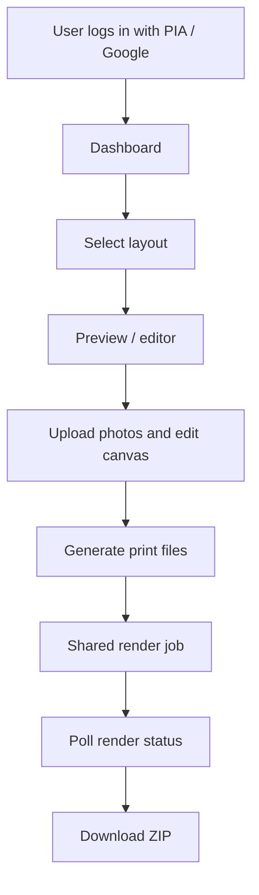
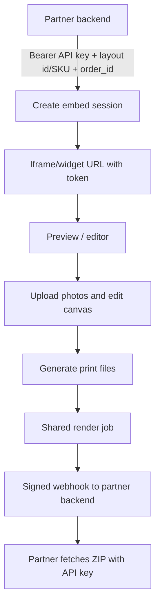
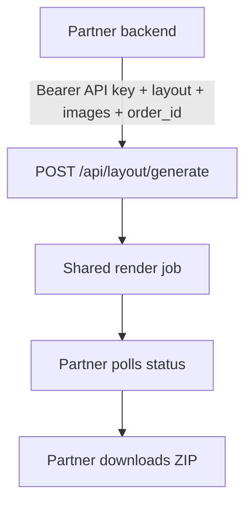
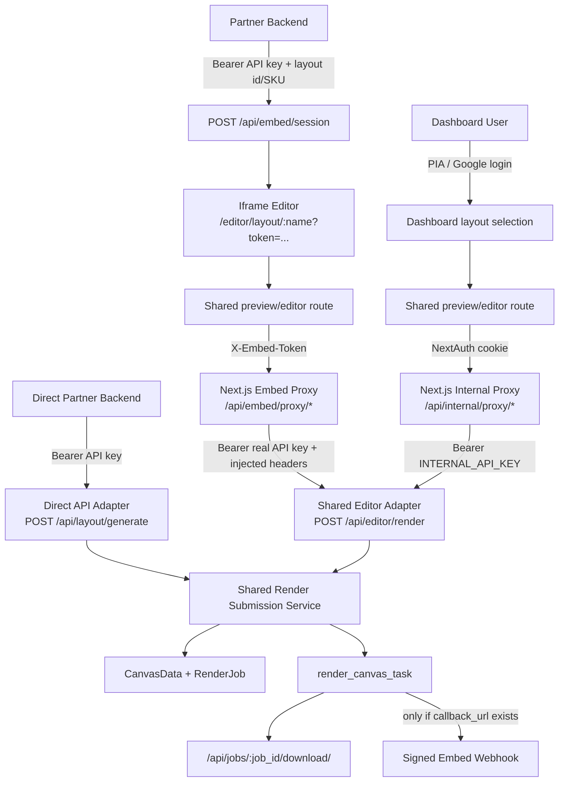

# PRD: Separate Direct Partner API and Iframe Embed API

## Summary

Product Editor must support two external usage modes:

1. Dashboard users log in, select a layout, preview/edit it, generate print files, and download the ZIP.
2. Embed/widget callers use a server-side auth key plus a layout id/SKU to launch the same preview/editor, generate print files, and receive/fetch the same ZIP.

Both modes must produce the same output for the same layout, assets, transforms, overlays, calendar data, and render options. The goal of this project is to make the public API surfaces explicit and separately authenticated, while routing every access mode through one shared preview/edit/render/download contract internally.

This avoids accidental coupling, removes dead legacy sync code, reduces duplicated render-job creation logic, and makes future API changes safer.

## Core Product Invariant

For the same layout id, uploaded images, frame transforms, overlays, calendar entries, background colors, export format, and include-uploads option:

- Dashboard access and embed/widget access must render byte-equivalent print outputs, except for expected metadata differences such as job id, timestamps, ZIP filename, and download URL host.
- Dashboard access and embed/widget access must use the same editor state model.
- Dashboard access and embed/widget access must use the same server-side render pipeline.
- Dashboard access and embed/widget access must use the same download artifact contract.
- Authentication and delivery differ by access mode, but rendering behavior must not.

This PRD is strict about this invariant. Any implementation that leaves separate render behavior per access mode is incomplete.

## Problem

The current codebase has three overlapping concepts:

- `GenerateLayoutView` at `POST /api/layout/generate` for direct API callers.
- `EditorRenderView` at `POST /api/editor/render` for editor/dashboard/embed submissions using chunked uploads.
- Embed proxy routes under `/api/embed/proxy/[...path]` that resolve `X-Embed-Token` to a real API key and inject `X-Order-ID`, `X-Callback-URL`, and `X-Include-Uploads`.

This creates ambiguity:

- Some direct partner API code looks dead when only tracing the iframe flow.
- Some embed-only webhook behavior lives inside general render concepts.
- `GenerateLayoutView` contains an old synchronous helper that is no longer reachable.
- Render job creation, `CanvasData` upsert, queue selection, and Celery dispatch logic are duplicated across views.
- Auth differs by surface, but the internal render pipeline is not represented as a single service boundary.

## Goals

- Keep dashboard, direct partner API, and iframe embed/widget API as separate public access/auth contracts.
- Preserve different authentication models:
  - Direct API: real API key via `Authorization: Bearer <api_key>`.
  - Embed API: short-lived `X-Embed-Token` in browser requests, resolved server-side by the Next.js embed proxy.
  - Dashboard/internal UI: NextAuth session to Next.js internal proxy, which injects server-side `INTERNAL_API_KEY`.
- Make dashboard and embed/widget users land on the same preview/editor experience.
- Make all render submissions converge into one backend render orchestration service.
- Make all download links resolve to the same job ZIP contract.
- Remove unreachable sync render code.
- Make webhook delivery clearly embed-session-only.
- Keep existing partner integrations working during migration.
- Improve test coverage around route permissions and auth boundaries.

## Non-Goals

- Do not remove `POST /api/layout/generate`; it remains the direct partner API.
- Do not expose real API keys to iframe/browser code.
- Do not add embed proxy access to ops/admin routes.
- Do not change the Celery rendering engine output contract.
- Do not redesign the editor UI.
- Do not change existing HMAC webhook payload shape unless explicitly versioned.

## Required User Journeys

### Journey A: Dashboard Login Flow



Expected behavior:

- User authenticates with dashboard auth.
- User selects or opens a layout from the dashboard.
- User previews/edits the same editor route used by embed access.
- Submit/download calls the shared render submission service.
- No webhook is sent.
- Browser downloads the completed ZIP.

### Journey B: Embed/Widget Flow



Expected behavior:

- Partner backend authenticates with real API key.
- Partner passes layout id or SKU before launching the widget.
- Browser iframe receives only a short-lived token, never the real API key.
- Iframe previews/edits the same editor experience used by dashboard access.
- Submit calls the shared render submission service through the embed proxy.
- Completion sends an HMAC-signed webhook if `callback_url` exists.
- Partner backend fetches the completed ZIP with its real API key.

### Journey C: Direct Partner API Flow



Expected behavior:

- Direct API remains server-to-server.
- It does not launch the browser editor.
- It must still route through the same render submission service.
- Output must match the shared server renderer.

## Current Public Surfaces

| Surface | Caller | Auth | Current Route | Notes |
|---|---|---|---|---|
| Direct partner API | Partner backend | `Authorization: Bearer <api_key>` | `POST /api/layout/generate` | Multipart image upload. Async only in current behavior. |
| Embed session create | Partner backend | `Authorization: Bearer <api_key>` | `POST /api/embed/session` | Creates disposable iframe token and stores `order_id`, `callback_url`, `include_uploads`. |
| Embed iframe runtime | Customer browser iframe | `X-Embed-Token` to Next.js proxy | `/api/embed/proxy/*` | Proxy resolves token to API key server-side. |
| Dashboard/editor direct UI | Logged-in Printo user | NextAuth cookie to Next.js proxy | `/api/internal/proxy/*` | Proxy injects `INTERNAL_API_KEY`. |
| Render status/download | Direct or proxied | API key after proxy resolution | `/api/render-status/*`, `/api/jobs/*/download/` | Shared terminal status and ZIP retrieval. |

## Current App Compliance Check

The current app mostly follows the desired access model, but not strictly enough internally.

Already aligned:

- Dashboard and embed/editor flows both use the same editor page: `/editor/layout/[name]`.
- Dashboard and embed submit both call `executeServerRender()` in the frontend.
- `executeServerRender()` submits to `/api/editor/render`.
- Embed calls `/api/editor/render` through `/api/embed/proxy/editor/render`.
- Embed proxy injects `X-Order-ID`, `X-Callback-URL`, and `X-Include-Uploads`.
- `EditorRenderView` snapshots `render_state` and queues `render_canvas_task`.
- Webhooks are gated by `CanvasData.callback_url`.
- Download goes through `/api/jobs/<job_id>/download/`.

Not yet strict / needs work:

- `GenerateLayoutView` and `EditorRenderView` still each build render jobs themselves instead of calling one shared render submission service.
- `GenerateLayoutView._handle_sync()` remains present even though current `post()` routes only to async.
- Direct partner API and embed/widget API are documented with some legacy wording, which makes ownership unclear.
- Next.js internal proxy and embed proxy duplicate mechanical forwarding logic.
- Tests do not yet prove output equivalence across dashboard and embed access modes.
- Tests do not yet prove that auth differs while render output stays the same.

## Target Architecture

Public surfaces remain separate, but views become thin auth/contract adapters.



## API Boundary Rules

### Direct Partner API

Route: `POST /api/layout/generate`

Auth:

- Must require `Authorization: Bearer <api_key>`.
- Must use `IsAuthenticatedWithAPIKey` and `CanGenerateLayouts`.
- Must never accept or dispatch webhook callbacks from request body.

Request contract:

- Multipart form upload.
- Required `order_id`.
- Required `layout`.
- Required `images`.
- Optional `fit_mode`.
- Optional `export_format`.

Behavior:

- Always async.
- Saves uploaded files.
- Submits a render job through the shared render service.
- Returns `202` with `job_id`, `status_url`, `queue`, and estimated wait.
- Caller polls `/api/render-status/<job_id>/` and downloads `/api/jobs/<job_id>/download/`.

### Iframe Embed API

Routes:

- `POST /api/embed/session`
- `/editor/layout/{layout_name}?token=<uuid>`
- `/api/embed/proxy/*`

Auth:

- Session creation uses real API key server-to-server.
- Browser iframe uses only `X-Embed-Token`.
- Embed proxy validates token via internal-only validation endpoint.
- Django receives the real API key only from the trusted proxy.

Headers injected by embed proxy:

- `Authorization: Bearer <api_key>`
- `X-Order-ID`
- `X-Callback-URL`
- `X-Include-Uploads`

Behavior:

- Resolves the layout id/SKU before or during widget launch.
- Editor uploads files via chunked upload through embed proxy.
- Editor submits `POST /api/embed/proxy/editor/render`.
- Backend submits a render job through the shared render service.
- Iframe sends `postMessage({ type: 'pe:render_job', jobId, orderID })` for parent UX only.
- Final file delivery happens via signed webhook only when `callback_url` exists.
- Partner backend fetches the ZIP using the real API key.

### Dashboard/Internal API

Routes:

- `/api/internal/proxy/*`

Auth:

- Browser holds only NextAuth session cookie.
- Next.js proxy checks session and `session.error`.
- Next.js proxy injects `INTERNAL_API_KEY`.
- Ops routes require `session.is_ops_team` before proxying.

Behavior:

- Dashboard selects a layout, opens the same editor route, and uses the same `/api/editor/render` adapter as embed after proxy auth.
- No webhook is sent.
- Browser polls and downloads directly.

## Output Equivalence Requirements

The implementation must add tests or smoke checks proving:

- Same layout + same uploaded image + same transform from dashboard and embed creates matching rendered PNG/PDF content.
- Same overlay payload from dashboard and embed creates matching rendered output.
- Same calendar payload from dashboard and embed creates matching rendered output.
- Same `include_uploads` setting creates matching ZIP folder contents.
- Different auth modes do not alter render behavior.
- Only delivery differs:
  - Dashboard gets direct browser download.
  - Embed gets `postMessage` for UX plus signed webhook for backend delivery.
  - Direct partner API polls and downloads server-to-server.

## Shared Render Submission Service

Introduce a backend service module, for example:

`backend/django/api/services/render_submission.py`

Responsibilities:

- Validate common render inputs.
- Resolve layout id/name consistently.
- Resolve/upload file paths into a position-explicit `image_paths` list.
- Create or update `CanvasData`.
- Snapshot `render_state`.
- Create `RenderJob`.
- Dispatch `render_canvas_task` inside `transaction.on_commit`.
- Return a consistent response object.

Suggested service functions:

```python
submit_direct_layout_render(
    *,
    api_key,
    order_id,
    layout_name,
    uploaded_files,
    fit_mode,
    export_format,
) -> RenderSubmissionResult

submit_editor_render(
    *,
    api_key,
    order_id,
    layout_name,
    canvases_payload,
    export_format,
    callback_url=None,
    include_uploads=True,
) -> RenderSubmissionResult
```

Both functions should call a lower-level helper:

```python
create_render_job(
    *,
    api_key,
    order_id,
    layout_name,
    image_paths,
    render_state,
    fit_mode,
    export_format,
    callback_url,
    include_uploads,
    queue_name="standard",
) -> RenderSubmissionResult
```

This keeps input adapters separate while ensuring one DB/job/queue flow.

## Required Changes

### Backend

- Add `api/services/render_submission.py`.
- Move `CanvasData.objects.update_or_create`, `RenderJob.objects.create`, and Celery dispatch into the service.
- Update `GenerateLayoutView._handle_async()` to call the shared direct API submission function.
- Update `EditorRenderView.post()` to call the shared editor submission function.
- Make both dashboard and embed submissions use identical `render_state` schema.
- Ensure layout resolution is consistent for layout name, layout id, or SKU.
- Remove unreachable `GenerateLayoutView._handle_sync()`.
- Remove or simplify `with_timeout()` if no other code uses it.
- Keep `POST /api/layout/generate` route active.
- Keep `POST /api/editor/render` route active.
- Ensure `callback_url` can only enter render jobs from `X-Callback-URL`, not request body.
- Ensure direct API submissions always set `callback_url=None`.
- Keep webhook tasks gated on `CanvasData.callback_url`.
- Consider renaming docstrings from "legacy direct API" to "direct partner API" where appropriate.

### Frontend / Next.js Proxies

- Keep `/api/embed/proxy/[...path]` and `/api/internal/proxy/[...path]` separate.
- Keep dashboard and embed/widget on the same editor route and shared editor state model.
- Extract shared proxy helpers for:
  - upstream URL construction,
  - safe forwarded headers,
  - content-type preservation,
  - streamed response passthrough,
  - `204` / `304` null-body handling.
- Do not share auth logic between proxies.
- Keep embed allowlist explicit and deny-by-default.
- Keep ops/admin routes out of the embed proxy allowlist.
- Preserve `X-Order-ID`, `X-Callback-URL`, and `X-Include-Uploads` injection in embed proxy only.

### Documentation

- Update `docs/INTEGRATION.md` to show two public contracts:
  - Dashboard/Internal UI Flow.
  - Direct Partner API.
  - Iframe Embed API.
- Update `docs/PRD.md` to replace "legacy direct API" wording with "direct partner API".
- Update README route table if it still implies sync rendering.
- Add an auth matrix showing which caller can reach which route.
- Document that webhooks are embed-session-only.

### Tests

Backend tests:

- Dashboard-style `/api/editor/render` creates the same render-state shape as embed-style `/api/editor/render`.
- Embed-style `/api/editor/render` creates the same output paths/ZIP contract as dashboard-style `/api/editor/render`.
- Direct API `POST /api/layout/generate` with API key returns `202`.
- Direct API without `order_id` returns `400`.
- Direct API request body `callback_url` is ignored or rejected according to final chosen contract.
- Embed `POST /api/editor/render` with injected `X-Callback-URL` persists callback URL.
- Direct/dashboard `POST /api/editor/render` without callback header persists `callback_url=None`.
- Shared render service creates `CanvasData`, `RenderJob`, and dispatches task on commit.
- `_handle_sync` removal does not break route behavior.

Proxy tests:

- Embed proxy allows only customer-facing prefixes.
- Embed proxy rejects `/ops/*`.
- Embed proxy injects `X-Order-ID`, `X-Callback-URL`, and `X-Include-Uploads`.
- Internal proxy gates `/ops/*` by `session.is_ops_team`.
- Internal proxy does not accept embed tokens.

Smoke tests:

- Extend `scripts/smoke-test-embed.sh` to verify:
  - session creation,
  - editor render submission through embed proxy,
  - status polling,
  - download route reachable,
  - ops route rejected.
- Add or update a direct partner API smoke test for `/api/layout/generate`.
- Add an equivalence smoke test that submits the same simple one-image layout through dashboard/internal proxy and embed proxy and compares rendered file dimensions/content hash after normalizing expected metadata.

### Cleanup

- Remove stale unused imports and props identified by ESLint in editor components.
- Keep `zip-utils.ts`; it is still used for imposition downloads.
- Keep `GenerateLayoutView`; only remove the unreachable sync helper.
- Keep `SecureExportDownloadView` only if `/api/exports/<path>` is still needed. If retained, change it to stream via `FileResponse` instead of reading the whole file into memory.

## Auth Matrix

| Route | Direct Partner API Key | Embed Token In Browser | NextAuth Dashboard | Internal Proxy Secret | Notes |
|---|---:|---:|---:|---:|---|
| `POST /api/layout/generate` | Yes | No | No direct browser use | No | Direct server-to-server API. |
| `POST /api/embed/session` | Yes | No | No | No | Creates iframe session token. |
| `GET /api/embed/session/validate` | No | No | No | Yes | Internal proxy only. |
| `/api/embed/proxy/*` | No | Yes | No | Proxy uses secret internally | Customer-facing iframe runtime. |
| `/api/internal/proxy/*` | No | No | Yes | Uses `INTERNAL_API_KEY` upstream | Dashboard/editor users. |
| `POST /api/editor/render` | Via proxy or direct API key | Via embed proxy only | Via internal proxy only | No | Shared adapter into render service. |
| `GET /api/render-status/*` | Yes | Via embed proxy | Via internal proxy | No | Ownership enforced by API key. |
| `GET /api/jobs/*/download/` | Yes | Via embed proxy or partner backend | Via internal proxy/browser flow | No | Partner backend fetches webhook URL with real API key. |
| `/api/ops/*` | Ops API key only | No | Ops NextAuth via internal proxy only | No | Never allow through embed proxy. |

## Migration Plan

### Phase 1: Service Extraction

- Add shared render submission service.
- Move DB/job/Celery orchestration out of views.
- Keep route contracts unchanged.
- Add service-level tests.

### Phase 2: Remove Unreachable Sync Code

- Delete `GenerateLayoutView._handle_sync()`.
- Delete `with_timeout()` if unused.
- Update docs that mention sync generation.

### Phase 3: Proxy Helper Cleanup

- Extract shared low-level proxy utilities.
- Keep auth-specific proxy handlers separate.
- Add tests for embed allowlist and internal ops guard.

### Phase 4: Documentation and Partner Contract Cleanup

- Update `README.md`, `docs/INTEGRATION.md`, and `docs/PRD.md`.
- Rename "legacy direct API" references to "direct partner API".
- Publish examples for both API styles.

### Phase 5: Optional Deprecation Controls

- If direct `/api/layout/generate` should eventually be retired, add a versioned replacement first.
- Emit deprecation headers only after partner migration is confirmed.
- Do not remove the route silently.

## Acceptance Criteria

- Dashboard login -> layout selection -> preview/editor -> generate -> download works end to end.
- Embed/widget API key + layout id/SKU -> preview/editor -> generate -> webhook/download works end to end.
- Both access modes use the same preview/editor state model.
- Both access modes use the same render submission service.
- Both access modes produce the same print output for the same inputs.
- Direct partner API still works with real API key and returns async job metadata.
- Embed iframe flow still works without exposing real API key to browser.
- Dashboard flow still works through internal proxy.
- All render submissions create jobs through the shared service.
- Webhooks only fire for embed sessions with `callback_url`.
- Embed proxy remains deny-by-default and rejects ops/admin paths.
- No sync render helper remains reachable or present.
- Tests cover direct, embed, and dashboard auth boundaries.
- Docs clearly separate public API contracts.

## Risks

- Partner integrations may depend on undocumented direct API behavior. Mitigation: keep route and payload stable in Phase 1.
- Proxy helper extraction could accidentally weaken auth separation. Mitigation: share only mechanical helpers, never auth/session/token resolution.
- Callback URL handling could regress webhook delivery. Mitigation: tests must assert callback URL is sourced only from embed proxy headers.
- Removing sync helper could surprise a hidden caller only if `post()` had a hidden branch. Current code always routes to async after `order_id` validation.

## Open Questions

- Should direct partner API keep multipart-only input, or should it gain a JSON + upload-id variant later?
- Should `POST /api/editor/render` be publicly documented for direct API callers, or remain an editor/proxy adapter?
- Should direct API body-level `callback_url` be explicitly rejected with `400`, or silently ignored for backward compatibility?
- Should `SecureExportDownloadView` remain part of the public contract, or should all downloads consolidate on `/api/jobs/<job_id>/download/`?
