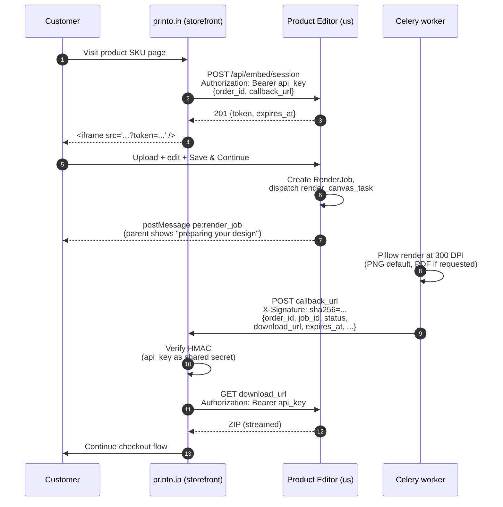
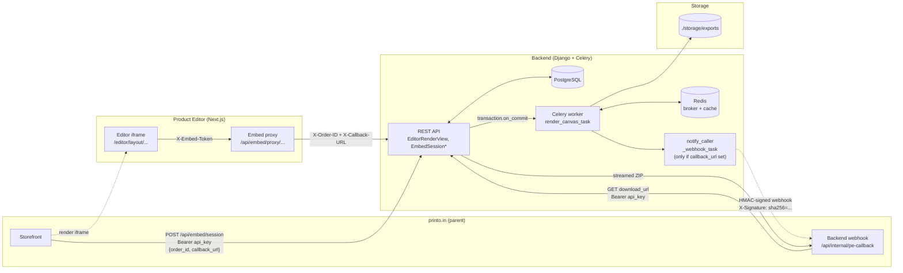

# PRD: Product Editor — End-to-End Production Automation
## Printo.in Product & Tech Alignment Document

---

| Field | Details |
|---|---|
| **Document Owner** | Kanna |
| **Product Manager** | Kanna |
| **Business Lead** | Viji |
| **Production Lead** | Mohan |
| **Final Approver** | Manish |
| **Date** | Aug 14, 2026 |
| **Status** | *In Progress — calendar product shipped; API audit trail + GC/disk observability closed; split mock/print/uploads download URLs live. Storefront webhook consumer still pending on printo.in's side — that is the last thing between "built" and "automated".* |
| **Version** | v1.13 |
| **Product URL** | product-editor.printo.in |

---

## Version History

| Version | Date | Author | Summary of Changes |
|---|---|---|---|
| v1.0 | Mar 20, 2026 | Kanna | Initial draft — problem statement, business impact, and proposed solution outline |
| v1.1 | Mar 27, 2026 | Kanna | Added embed flow details (A1/A2), canvas preview, and direct-to-production push concept |
| v1.2 | Apr 1, 2026 | Kanna | Added CMYK soft-proof pipeline, ISOcoated_v2 ICC profile, and colour-accuracy section |
| v1.3 | Apr 4, 2026 | Kanna | Added Inkmonk.com to upload sources; renamed Ops Manager (A2) and Catalog Manager (B3); updated TAT cascading effect wording |
| **v1.4** | **Apr 5, 2026** | **Kanna** | **Marked B2 Async Queue as ✅ Complete; added quantity enforcement (under/over-upload, auto-fill); documented all 11 implementation fixes; added two new success metrics; updated action item #6 to Done** |
| **v1.5** | **Apr 11, 2026** | **Kanna** | **Security hardening complete: API key bundle leak closed (internal server-side proxy); session token refresh flow; 18 additional implementation fixes across auth, rendering, GC, and frontend. TypeScript build clean (0 errors). Django system check clean (0 issues).** |
| **v1.6** | **Apr 21, 2026** | **Kanna** | **Server-side upload + render flow complete: chunked multi-file upload API, per-frame transform pipeline, Celery render at 300 DPI, embed postMessage (`pe:render_job`), direct-path polling + ZIP download. Threshold: ≤ 20 canvases → client-side; > 20 → server-side. Smart downscaling (2× pre-shrink) and PNG optimize added to engine.** |
| **v1.7** | **Apr 27, 2026** | **Kanna** | **All known P0/P1 backlog items shipped: B1 canvas-state file persistence (IndexedDB), B3 SKU→layout endpoint, B4 ESLint flat-config migration, B5 stale `.next/` cache scripts. Operations hardening: backend/frontend healthchecks, multi-stage backend Dockerfile (~250 MB smaller), Pillow memory hygiene + `worker_max_tasks_per_child=50`, DB CONN_MAX_AGE 60→600s, garbage-collector time limits, `DEBUG` default flipped off, single-source upload size, django-csp in report-only mode. Login flow hardening: PIA outage vs bad-credential separation, 10s timeout, server-side `proxy.ts` auth gate, per-IP rate limiter (5/60s), explicit `redirect` callback, all `(session as any)` casts removed.** |
| **v1.8** | **May 5, 2026** | **Kanna** | **Phase A+B+C runtime efficiency pass shipped (12+10 items): Django GZipMiddleware, Traefik gzip + HTTP/2, polling backoff, mask-resize hoist, fileUrlCache → WeakMap, Next.js standalone output, IDB-backed smartcrop cache, Postgres tuning (shared_buffers/work_mem/slow-query log), streaming ZIP downloads, IntersectionObserver lazy `` for the canvas grid, Pillow render fast-paths (BOX downscale, transpose for 90/180/270°, no-op crop skip, MAX_IMAGE_PIXELS guard), partial GC index, lazy-loaded Fabric.js previews, dropped `fabric-guideline-plugin` dep, font preconnect, BuildKit cache mounts, explicit Celery `visibility_timeout`, batched `/api/editor/init` endpoint. **Removed CMYK + soft-proof + ICC pipeline entirely** — output is now PNG (default) or PDF; deleted `layout_engine/cmyk.py`, `icc_profiles/`, `_generate_soft_proof_for_surface`, `engine.generate_soft_proof()`; dropped `CanvasData.soft_proof` field via migration `0007`; `export_format` choices constrained to `('png', 'pdf')`. PDF support is API-level for now; UI toggle is a future change. **Embed callback flow** — `EmbedSession.callback_url` is now the single source of truth; embed proxy injects `X-Callback-URL` header; `push_to_production_estimator_task` POSTs HMAC-signed webhook payload with `download_url` + `expires_at` to the caller. Body-level `callback_url` removed from both `GenerateLayoutView` and `EditorRenderView`. **Threshold removed** — every Submit/Download goes through `executeServerRender`; client-side ZIP path retired. **Download modal exposed to all roles** (was ops-only). Embed Submit button renamed "Save & Continue".** |
| **v1.9** | **May 5, 2026** | **Kanna** | **Standalone-generator scope confirmed: removed internal OMS push.** `push_to_production_estimator_task` deleted; replaced with `notify_caller_webhook_task` that ONLY fires the HMAC-signed embed webhook (and only when `canvas.callback_url` is set — dashboard renders enqueue zero downstream tasks). `OMS_PRODUCTION_ESTIMATOR_URL` removed from settings, env, and all docs. **Edge proxy migrated from Traefik → nginx 1.27** (proxy.bind-mount footgun on `acme.json` was producing prod 404; nginx config is single-source-of-truth at `proxy/nginx/nginx.conf`; CF Origin Cert workflow documented). **Three production-blocking bugs fixed** during the migration: `EditorRenderView` missing `CanvasData/RenderJob` import (500 on every embed render); `ChunkedUploadChunkView` rejected real browser uploads with 415 because no parser accepted `image/png` Content-Type; embed proxy's canvas-state PUT/POST returned 502 because Node fetch detached the ArrayBuffer body across redirects (fixed with Blob). **All 18 react-hooks warnings cleared and rules promoted to `error`** — real bugs fixed (refs-during-render, set-state-in-effect, variable-before-declared, Date.now during render); intentional dep-array exclusions kept with per-line eslint-disable + reasoning. **`./deploy.sh backend` now rebuilds workers + beat too** (they share the Dockerfile but get tagged separately, so the previous `backend` mode left workers on stale code). New `workers` mode for memory-leak recovery. |
| **v1.10** | **May 6, 2026** | **Kanna** | **Second runtime/UX hardening pass.** Editor / canvas correctness: (a) **Drag clipPath fix** — frame-image `clipPath` was anchored in image-local coords and drifted with the image during `object:moving`, so the visible "window" moved with the image instead of staying fixed in the frame; `updateRelativeClipPath` now runs on every move/scale/rotate event. (b) **Cover-mode white-space fix** — smartcrop returned an offset based purely on subject location with no awareness of the frame's available pan room. When the constraining axis had zero overflow, the raw offset shoved the image past the frame edge and exposed white. Offsets are now clamped to ±(scaled_dim − frame_dim)/2 per axis. (c) **Imposition modal — custom W×H inputs** — selecting CUSTOM previously left users stuck at whatever `widthIn`/`heightIn` was last in state (no UI to set them). Added inch inputs gated on `preset === 'custom'`. Modal styling tightened: `rounded-[40px]` shell → `rounded-2xl`, `font-black` everywhere → `font-semibold`/`font-medium`, padding/gap `p-8`/`space-y-8` → `p-6`/`space-y-5`. Smart-auto-repeat copy now shows the actual custom dimensions. **Performance:** (d) **Smartcrop IDB cache wired through 3 missing call sites** in `page.tsx` (`generateCanvases`, `generateCanvasesForLayout`, fit-mode change handler) — cache existed but was bypassed for the editor mount path. (e) **Editor parallel-batch BATCH_SIZE 5 → 8** in `generateCanvases` — cuts metadata + smartcrop wall time roughly in half on 100+-photo uploads, peak memory still well below OOM zone on typical tablets. (f) **Defensive `img.copy()` removed from `_smart_downscale`** — the source RGBA was already a fresh per-frame allocation; the prior copy was a wasted ~50 MB memcpy per 12 MP frame (tens of GB across a 200-canvas batch). (g) **Hot-path debug logs gated behind `if (_DEV)`** in `FabricEditor.tsx` — `log()` was a no-op in prod but JS still evaluated arguments (JSON.stringify of layout, per-frame forEach with toFixed/template-literal building, object-literal allocation). Wrapped 9 hot-path call sites incl. canvas-build summary, in-place update header, paper/bleed/safe-zone updates, frame-image-calc, getPaperPath. **Ops/infra:** (h) **Redis DB split** — Django cache moved to db 1, Celery broker stays on db 0; same instance, separate logical DBs so cache eviction (`allkeys-lru`) cannot drop in-flight task messages under cache pressure. (i) **Docker log rotation** — top-level `x-default-logging` anchor caps every container's json-file logs at 50 MB × 3 rotations (~150 MB ceiling per service); previously unbounded. (j) **Ops layouts list cache** — `LayoutManagementView.get` mirrors `ListLayoutsView` (Django cache 2 min + `Cache-Control: private, max-age=60, stale-while-revalidate=120`); invalidated on PUT/POST. (k) **Service Worker** at `/sw.js` — cache-first for `/_next/static/*` and `/static/*` (both content-hashed, safe to keep forever); registered from `<ServiceWorkerRegistration />` in root layout, production-only, after `window.load`. **Verified** on prod: `db0=13 broker keys, db1=1 cache key`; `LogConfig.max-file=3, max-size=50m` on backend container; SW shows "activated and is running" with multiple clients in DevTools. |
| **v1.11** | **May 13, 2026** | **Kanna** | **Server-side auto-orientation via MediaPipe Pose Landmarker.** Customers regularly uploaded photos whose subject was stored sideways in the bytes (camera held horizontally, scans of printed photos, WhatsApp-stripped EXIF) — the v1.10 aspect-ratio heuristic couldn't help these because the JPEG itself "looked" portrait. New: inline `POST /api/orientation/detect` runs BlazePose on a temp copy of the uploaded file, derives the body-up vector from nose + shoulder midpoints, snaps to the nearest cardinal with a 30° dead-zone, returns `{rotation, confidence, source}` synchronously. Frontend memoises per file fingerprint and falls back to the aspect heuristic on 204 (no pose) / 503 (mode off) / network error. **Env-controlled** via `AUTO_ORIENTATION_MODE` (`mediapipe` → BlazePose Lite for ≤2-core boxes; `hybrid` → BlazePose Full for ≥4-core; `off` → disable). Changing modes only needs `docker compose restart backend`. **Docker**: added `libgl1 + libglib2.0-0` to runner stage (mediapipe's bundled opencv links against libGL). `mediapipe==0.10.18` adds ~200 MB to backend image; one-time. **`GET /api/config`** new endpoint exposes the active mode to the frontend. **Verified on prod with the actual customer files** that surfaced the bug: baby photo (stored sideways) returns `rotation=270, confidence=0.9999`; family photo (already upright) returns 0; food photo returns 204 (frontend falls back). Also: NextAuth refresh-storm fix (60 s proactive refresh buffer + in-process singleflight on `refreshToken`), aspect-ratio rotation rule for near-square Retro polaroid frames, and doc consolidation (24 → 17 .md files; INTEGRATION.md promoted to repo root). |
| **v1.12** | **Jun 2026** | **Kanna** | **Server-side overlay rendering — the foundation phase of the calendar PRD, and a fix with far wider reach than the calendar itself.** Until this shipped, `layout_engine/engine.py` composited photos into frames and applied the paper mask, and did **nothing else** — every TextOverlay / ShapeOverlay / ImageOverlay the customer could add in the editor was **preview-only**: visible in the dashboard thumbnail, silently absent from the printed PNG/PDF. `_composite_canvas` now accepts `overlays` + `uploaded_files` and calls `services/overlay_renderer.py::render_overlays` after frame compositing and before the layout mask, so overlays appear in the 300 DPI output. Single bundled font (`services/fonts_assets/Inter-Variable.ttf`, 859 KB, Apache 2.0 / SIL OFL — the variable axis serves every weight from one file) via `services/fonts.py::get_font`; no font picker by design. |
| **v1.13** | **Jul 2026** | **Kanna** | **Calendar product type.** A calendar layout is a normal multi-surface layout plus `productType: "calendar"` and a `monthRange + calendars[] + calendar` style block. `LayoutEngine.generate()` detects it and calls `services/calendar_layout.py::materialize_surfaces()` to expand ONE authored template into 12 per-month surfaces (auto-derived `displayLabel`, `year`, `month`, `holidays`, `activePalette`); each routes through the normal `_composite_canvas` path into `services/calendar_renderer.py::render_calendar()`. **Poster aggregation:** `monthRange.count == 1` merges all 12 into a single physical page. **Output filenames come from `displayLabel`** (`January 2026.png` …). **Partial-failure handling:** 1-of-12 failing cleans up the partial outputs and raises a tagged error naming the surface. Per-day entries are ONE flat product-wide `{ iso_date: [CellOverride] }` map — anchored to globally-unique ISO dates so photo-count changes and English↔Financial flips can't lose or misplace them. **Photos cap at 12:** month *i* composites photo canvas *(i mod N)*, so 1 photo cycles to all 12 and 12 map one-per-month (an earlier build emitted 12·N files). Ops authoring UI at `/editor/layouts/calendar/[name]`. Customer fail-safes: Feb-29-in-a-non-leap-year banner (entries kept, not deleted), image-expired re-upload prompt, calendar-type flip orphan warning. TS↔Python grid parity pinned by tests on both sides (`pnpm test:parity`). 12-surface render measured at **~1.8 s** against a ≤90 s target. Also in this window: **colour management** (`services/image_loader.py` is now the single choke point for opening customer photos — EXIF orientation + ICC→sRGB via lcms2, so Display-P3 iPhone photos stop shifting in print) and **server-side HEIC decode** (`services/heic.py`, pillow-heif/libheif 1.19) because modern iOS 18 gain-map HEICs are undecodable in Chrome — `heic2any` predates the format and Chrome/Firefox ship no HEIC codec at all. |
| **v1.13.x** | **Aug 2026** | **Kanna** | **Observability, audit, and delivery-shape work — mostly closing traps where the *absence* of a signal read as good news.** (a) **API audit trail** (migration `0014`): `APIRequest` had existed since the initial commit with **nothing ever writing to it**, so `APIRequest.objects.count()` returned 0 for every key forever — which during a leaked-key investigation reads as proof a credential was never used, and is really proof nothing was recorded. `api/middleware.py::APIRequestLoggingMiddleware` now writes one row per non-exempt call; `api_key` became nullable `SET_NULL` (CASCADE erased history on key rotation) plus a denormalised `auth_source`. Swept on `API_AUDIT_RETENTION_DAYS` (90) — deliberately longer than file retention, since the trail must outlive the data it describes. (b) **GC staleness + live disk block** on `GET /api/celery/monitor/`: you cannot infer "did the GC run?" from the database — the sweep flags rows `is_deleted=True` then hard-deletes those same tombstones later in the *same* pass, so the count reads 0 whether it ran an hour ago or never. `services/gc_status.py` records each sweep to `storage/gc_last_run.json` (bind-mounted, so it survives container recreation — the exact thing that lost the evidence during the incident). Disk `used_percent`/`free_gb`/`pressure` are read at request time, not lifted from the last sweep: at the moment it matters most — nothing sweeping — the sweep's own copy is stale or absent. Prod had hit 89% unnoticed twice. (c) **Orphaned export directories**: every GC sweep but one starts from a DB row, so none could reclaim a file whose row was gone. Jobs killed mid-render never reached `status='completed'`, were skipped, then their `CanvasData` expired and the cascade took the only pointer — 62 directories / 54 MB stranded. That status filter is gone, and `services/orphan_exports.py` enumerates the filesystem, requiring **five** independent conditions before touching anything. Gated by `GC_ORPHAN_SWEEP`, default `dry_run`, because it is the one sweep that deletes on absence of evidence. (d) **Split download URLs**: the webhook now also carries `print_download_url` / `mock_download_url` / `uploads_download_url` — the same job packaged one part per archive for storefronts that store mock and print in separate fields — served by `?content=` on the one endpoint with nothing duplicated on disk. `download_url` (combined) is unchanged, so existing callers need no migration. (e) **Ops privilege model change** (PR #24): the internal proxy's `is_ops_team` gate on `ops/*` was removed by product decision, opening template management to any authenticated staff session. Django's `IsOpsTeam` **cannot** substitute — everything through that proxy arrives as the one ops-flagged `INTERNAL_API_KEY` service account, so the backend sees a single privileged identity regardless of who is logged in. The DPDP purge endpoint was re-gated in `route.ts` via `src/lib/ops-guard.ts`, matching on path *shape* rather than an `ops/orders/` prefix. |

---

## 1. Executive Summary

Printo's internal production workflow for personalised photo products or single surface printable products currently requires **~1 hour per order** for store pickup and express delivery orders, and **2–3 hours per order** for standard delivery for print file preparations. Store pickup and express delivery receive first priority because they carry same-day or 4–6 hour delivery SLAs. Standard delivery orders are batched and shipped via courier by 3 PM daily.

The bottleneck is not image generation or print execution — it is the manual design preflight review that sits between a customer uploading files and production receiving the job. Every order today must pass through the design preflight team, who manually check file quality, verify that the number of uploaded files matches the ordered quantity, and flag mismatches, cx uploaded images quality issue back to the customer. When the customer is slow to respond, the order stalls — leading to delayed closures and, in the worst cases, cancellations.

**The Product Editor aims to eliminate this entire manual checkpoint. The target is under 5 minutes from file upload to production-ready output for a single order** — fully automated, zero human intervention. The customer uploads files, sees an accurate preview before checkout, and post-checkout the job is pushed directly to the estimator for production, the user just prints the file and move for post press then quality check and dispatches it.

This document defines the current-state problem, quantifies its business impact, describes the proposed automation solution, and lays out the decision framework for alignment.

---

## 2. Problem Statement

### 2.1 Current Production Workflow (As-Is)

Today, every personalised product order follows this sequential flow:

| # | Step | Actor | Method |
|---|---|---|---|
| 1 | Customer uploads design files | Customer | **Printo.in** and Inkmonk.com website |
| 2 | Design preflight team reviews files for print-readiness | Preflight team | Manual review |
| 3 | Preflight checks file count against ordered quantity | Preflight team | Manual count |
| 4 | If file issue or count mismatch → contact customer for correction | Preflight team | Email / phone |
| 5 | Wait for customer response (unbounded delay) | Customer | Passive wait |
| 6 | Files cleared → pushed to production estimator | Preflight team | Manual handoff |
| 7 | Production + dispatch | Production | Print workflow |

### 2.2 Observed Problems

- Store pickup and express delivery orders take ~1 hour each to clear preflight, despite having same-day / 4–6 hour delivery SLAs. Every minute of delay directly threatens the delivery promise.
- Standard delivery orders take 2–3 hours in preflight. Since the courier cutoff is 3 PM daily, late-cleared orders miss the dispatch window entirely and are delayed by a full day.
- File count mismatches (e.g., customer ordered 10 fridge magnets but uploaded 8 images), Cx expects digital preview or Cx upload image is of poor quality which causes the order to be placed on hold pending to customer response. Response times range from hours to days as it depends on cx response.
- Delayed preflight pushes orders into a backlog that compounds across the day, creating a cascading effect on TAT completing of that order and other subsequent orders.
- In the worst case, customers who are unreachable or frustrated by the back-and-forth simply cancel the order — resulting in lost revenue and a negative brand experience.
- The preflight team is a fixed-capacity bottleneck. As order volume grows, the team cannot scale linearly, making the manual process unsustainable.

### 2.3 Root Cause

The root cause is the manual design preflight checkpoint between customer upload and production. This checkpoint exists because the legacy system had no way for the customer to preview the final product or for the system to automatically validate file quality and quantity. Every order, regardless of complexity, passes through the same manual gate.

### 2.4 TAT Breakdown (Current vs Target)

| Order Type | Current TAT | Target TAT | Notes |
|---|---|---|---|
| Store Pickup | ~1 hour | < 5 min | Same-day SLA; highest priority |
| Express Delivery | ~1 hour | < 5 min | 4–6 hour delivery SLA |
| Standard Delivery | 2–3 hours | < 5 min | Courier cutoff 3 PM daily |

---

## 3. Business Impact

### 3.1 Customer Experience

- Customers placing store pickup or express delivery orders expect near-instant confirmation that their order is in production. A 1-hour delay between upload and production start erodes trust in the "express" promise.
- For standard delivery, the 3 PM courier cutoff means any order that clears preflight after 3 PM is automatically delayed by a full business day. Customers see longer delivery dates than necessary.
- File mismatch hold-ups create a frustrating back-and-forth experience. Customers who uploaded the wrong count do not understand why their order is stuck.
- Cancellations due to delayed preflight directly damage repeat purchase likelihood and brand perception.

### 3.2 Revenue & Conversion

- Every order that misses the 3 PM courier cutoff costs Printo a day of delivery speed — speed that competitors like Vistaprint and Printstop already advertise.
- Cancelled orders due to preflight delays are direct revenue loss. Even a 2–3% cancellation rate on a high-volume personalised products line represents significant monthly revenue impact.
- The preflight team's capacity ceiling means that during peak periods (festivals, corporate event seasons), order processing slows further, compounding missed shipments.

### 3.3 Operational Risk

- The preflight team is a single point of failure. If the team is understaffed (leave, attrition), the entire order pipeline stalls.
- Manual file validation is inherently inconsistent. Two different preflight operators may make different judgement calls on the same file, leading to quality inconsistency.
- As Printo scales order volume, the current process cannot keep pace without proportional headcount increases, making the unit economics of personalised products worse over time.

---

## 4. Proposed Solution

The Product Editor replaces the entire manual preflight checkpoint with an automated, customer-facing preview and validation system. The solution operates across two tracks: the immediate automation (what exists today) and the full end-to-end flow (the target state).

### 4.1 Solution Track A — Automated Preview & Validation (Built)

#### A1 — Customer-Facing Preview Before Checkout

- Customer uploads images into the Product Editor canvas, which is embedded directly in the Printo.in product page or order flow.
- The editor auto-generates a print-ready preview using the correct layout template for the product SKU. The customer sees exactly what will be printed — including frame positioning, bleed, and paper mask.
- File count validation is automatic: if the customer uploads fewer images than the layout requires, the editor visually shows empty frames and prompts the customer to fill remaining slots (auto-fill by cycling existing images, or pick-to-fill from uploaded images). If more are uploaded than the order quantity, a confirmation modal lets the customer proceed or trim.
- **Low-resolution detection** warns the customer before checkout when a photo would print below ~150 effective DPI at its placed size — a pill on the affected card plus a notice in the pre-submit modal. It is deliberately **non-blocking**: it informs, it never refuses the order. This is the check that replaced manual preflight's "is this file good enough to print?" judgement, and the estimate mirrors the placement maths in both renderers exactly (`src/lib/dpi-utils.ts`).
- **Empty-surface and duplicate-fill warnings** (`src/lib/submit-guards.ts`) catch the other two mistakes preflight used to catch by eye — a blank side on a two-sided product, and the same photo repeated where the customer probably didn't mean it. Quantity auto-fill is exempt, since repetition there is intentional. Also warn-and-proceed.
- *(Superseded: earlier versions of this PRD promised a CMYK / RGB colour-space warning at this step. The ICC-calibrated CMYK soft-proof pipeline was removed in v1.8 and there is no such warning. Colour is handled invisibly instead — `services/image_loader.py` colour-manages every uploaded photo ICC→sRGB on load, so Display-P3 iPhone photos and AdobeRGB/CMYK-tagged JPEGs stop shifting in print without the customer needing to know what a colour profile is.)*
- No preflight operator is involved. The customer self-validates the output by approving the visual preview before proceeding to checkout.

#### A2 — Direct-to-Production File Delivery (Post-Checkout)

- Once the customer completes checkout, the approved canvas data (images + layout + overlays) is rendered server-side at 300 DPI and the rendered files are delivered to printo.in's storefront via two complementary channels:
  1. **Embed webhook (primary):** the storefront sets `EmbedSession.callback_url` at session creation; on render completion the Product Editor POSTs an HMAC-SHA256-signed payload (`order_id`, `job_id`, `status`, `download_url`, `expires_at`, `file_count`, …) to that URL. The storefront verifies the signature and fetches the ZIP using the same api_key as Bearer auth. As of Aug 2026 the payload also carries `print_download_url` / `mock_download_url` / `uploads_download_url` — the same job packaged one part per archive, for storefronts that store mock and print artefacts in separate fields; `download_url` (the combined archive) is unchanged. Implementation guide for the storefront team: [`INTEGRATION.md`](INTEGRATION.md).
  2. **Direct download (fallback):** dashboard / direct-API callers poll `GET /api/render-status/<job_id>/` and fetch the ZIP from `GET /api/jobs/<job_id>/download/` themselves.
- **No internal OMS push.** The Product Editor is a standalone print-file generator. The previous `push_to_production_estimator_task` (POST to `OMS_PRODUCTION_ESTIMATOR_URL`) was retired in v1.9 — the embed webhook gives the storefront everything it needs to attach files to the order, and the storefront talks to OMS via its own existing integration.
- No manual handoff step. The production team receives a print-ready file that has already been validated by the customer's own preview approval.
- Output is 300 DPI PNG by default, with PDF as an alternate format selected per render request via `export_format`. (The earlier ICC-calibrated CMYK soft-proof pipeline was retired in v1.8 — RGB→CMYK→RGB roundtrip is no longer part of the product.)
- The target latency from checkout to production-ready is under 5 minutes for a single order — down from the current 1–3 hours.

##### A2.1 — Embed Integration Architecture (v1.8)

The diagram below shows the complete end-to-end flow when printo.in's storefront embeds the Product Editor. All communication between systems is documented; the customer's browser only ever talks to the editor iframe.

### 4.2 Solution Track B — Remaining Gaps for Full Automation

#### B1 — Canvas State Persistence ✅ Implemented

- **Status: Complete as of April 27, 2026.**
- **What was built:** Two-layer persistence — server-side `editor_state` JSON for transforms/overlays/layout metadata (auto-save debounced 2 s, auto-restore on layout ready), and client-side IndexedDB store keyed by `(orderId, fileId)` for the original File blobs.
- The frontend strips `originalFile` from the JSON payload (Files don't serialise) but assigns each File a UUID `fileId` and persists the raw blob to IndexedDB. On page reload, the auto-restore effect rehydrates `originalFile` from IndexedDB using the `fileId` carried in the canvas state.
- Net effect: refreshing the page restores the full editing context — previews, transforms, AND the original Files needed to re-render at full resolution.
- Quota note: IndexedDB is per-origin (~50–60% of free disk on desktop). At 200 photos × 5 MB the customer needs ~1 GB of free space; we don't shard or compress. Browser eviction under quota pressure means very large jobs are best submitted in one session.
- Priority: P0 — **resolved.**

**Files:**

| File | Role |
|---|---|
| `frontend/nextjs/src/lib/file-store.ts` | IndexedDB helpers (`saveFile`, `getFile`, `getFilesForOrder`, `deleteOrder`) |
| `frontend/nextjs/src/app/editor/layout/[name]/types.ts` | Added `fileId?: string` to `FrameState` and `ImageOverlay` |
| `frontend/nextjs/src/app/editor/layout/[name]/page.tsx` | Self-stabilising effect persists Files; auto-restore rehydrates from IDB |

#### B2 — Async Image Generation Queue ✅ Implemented

- **Status: Complete as of April 5, 2026.**
- Synchronous image generation was holding a Gunicorn worker thread for the full duration of rendering. Under sustained load (festival peaks), this caused request timeouts and blocked all concurrent orders sharing the same worker pool.
- **What was built:** A Celery + Redis async queue that decouples image generation entirely from the HTTP request cycle. Post-checkout, the API responds immediately with a job ID and status URL; rendering happens in a dedicated worker pool in the background.

**Key implementation details:**

| Component | Detail |
|---|---|
| Task queue | Celery with Redis broker (`redis://redis:6379/0`) |
| Priority worker | Dedicated worker listening only to the `priority` queue. Currently dormant since soft-proof was retired in v1.8 — kept for future express-render workloads |
| Standard worker | Dedicated worker listening only to the `standard` queue — serves regular PNG/TIFF exports; horizontally scalable |
| Worker concurrency | 2 slots per worker container (512 MB limit → ~256 MB per task slot; safe for large-image renders) |
| Retry logic | Up to 3 retries with exponential backoff (2s, 4s, 8s); `MemoryError` and soft time limit exhaustion skip retries immediately |
| Caller webhook | `notify_caller_webhook_task` runs as a separate Celery task after render completion (only when `canvas.callback_url` is set — the embed flow). Never blocks the render worker slot; HMAC-SHA256 signed POST; retries up to 5× with exponential backoff. |
| Callback URL | `EmbedSession.callback_url` is the single source of truth (set at session creation, propagated via `X-Callback-URL` header through the embed proxy). Direct/dashboard callers don't enqueue the webhook task at all — they poll `/api/render-status/<job_id>/` and fetch the ZIP themselves. |
| Order resubmit | `order_id` upsert (`update_or_create`) — operator retries and customer re-uploads no longer crash with a unique-constraint error |
| Queue isolation | `celery-beat` container no longer runs DB migrations on startup (only the web/Gunicorn container does), eliminating concurrent migration race conditions |
| Status polling | `GET /api/render-status/{job_id}/` with Redis cache (3s TTL for queued, 300s for completed/failed); returns estimated wait time corrected for worker concurrency |
| Garbage collection | Daily 02:00 UTC task cleans expired export files; files belonging to manual-review orders are skipped even past expiry |
| Concurrent render isolation | Per-request and per-job UUID subdirectories under `EXPORTS_DIR` prevent simultaneous renders of the same layout from overwriting each other's output files |
| GC directory cleanup | GC removes empty per-job subdirectories after file deletion to prevent unbounded directory accumulation on disk |

- Priority: P0 — **resolved.** System now handles >50 concurrent orders without Gunicorn worker exhaustion. Scale further by running `docker-compose up --scale celery-worker-standard=N`.

#### Security & Auth Hardening ✅ Complete

- **Status: Complete as of April 11, 2026.**
- All work below is live in the codebase. No outstanding security gaps.

**What was fixed:**

| Area | Issue | Fix |
|---|---|---|
| API key bundle leak | `NEXT_PUBLIC_DIRECT_API_KEY` was baked into the client JS bundle — extractable from any browser DevTools | All dashboard/editor calls now route through `/api/internal/proxy` (server-side, gated by NextAuth session cookie). `INTERNAL_API_KEY` is a server-only env var. |
| Privilege escalation | Internal proxy forwards with an ops-level API key; non-ops users could have hit ops mutations | Proxy re-checks `session.is_ops_team` for all `ops/*` paths before forwarding |
| PIA token refresh | Session appeared valid after token expiry; Django returned 401 silently | `pia-auth.ts` JWT callback now calls PIA refresh endpoint on expiry; `RefreshAccessTokenError` propagated to session and checked in every auth guard |
| Dashboard auth gate | `/dashboard` was publicly accessible; no session check | `useSession` + `router.push('/login')` guard added; fetch deferred until session is confirmed |
| Path traversal | `upload_id` used in `os.path.join()` without validation | UUID v4 regex guard on both `ChunkedUploadChunkView` and `ChunkedUploadCompleteView` |
| `getImageMetadata` Promise hang | No `reject` handler — Promise hung forever on file read error or decode failure | Added `reader.onerror` and `img.onerror` handlers; both call `reject(new Error(...))` |
| API key display | `APIKey.__str__` showed first 20 chars in logs/admin — leaked key material | Changed to last 4 chars mask: `(...xxxx)` |
| `last_used_at` DB churn | Every API request triggered a DB write | Throttled to once per 5 minutes per key |
| `Retry-After` header | 429 responses included `retry_after` in JSON body only — non-standard | Added `Retry-After` HTTP header to match RFC 7231 |
| Duplicate DB index | `RenderJob.celery_task_id` had both `unique=True` and an explicit `Meta.indexes` entry | Removed the redundant index definition |
| `substr` deprecated | 6 uses of `.substr(2, 9)` across 2 files | Replaced with `.slice(2, 11)` |
| `isRedirectError` import | `next/navigation` no longer exports `isRedirectError` in Next.js 16 | Moved import to `next/dist/client/components/redirect-error` |
| Stale `.next/dev/types` in tsconfig | `tsconfig.json` included `.next/dev/types/**/*.ts` — stale Turbopack dev cache caused false TS errors | Removed that glob; added `.next/dev` to exclude |
| `production_config.py` dead code | Module not imported anywhere; contained 3-way file-size conflict and missing ProxyAuthenticationMiddleware | Added dead-code warning header documenting all drift; safe to delete |
| `start_production.py` import check | `package.replace('-', '_')` wrong for `djangorestframework` → `rest_framework`, `django-cors-headers` → `corsheaders` | Replaced with explicit `{dist_name: import_name}` map |
| Embed proxy cache unbounded | Token cache had no size cap; could grow under sustained unique-token traffic | Added `CACHE_MAX_ENTRIES = 10_000` cap with insertion-order eviction |
| Upload proxy JSON parse crash | `res.json()` threw on non-JSON gateway errors (502 HTML, 504 empty) | Switched to `res.text()` + guarded JSON parse with envelope fallback |
| Dead imports | `SecureExportDownloadView` in `urls.py`, `User` in `create_api_key.py` | Removed |

#### B3 — SKU-to-Layout Mapping ✅ Implemented → ❌ **REMOVED 2026-09-04**

- **Status: Infrastructure complete as of April 27, 2026. Mapping data still needs to be populated by Catalog/Ops team.**
- **What was built:** A JSON-on-disk mapping at `storage/sku_layouts.json` plus three endpoints. Public read (so printo.in can resolve SKU before creating an embed session); ops-team-only write.
- Cache headers: `public, max-age=300, stale-while-revalidate=600` so the storefront can hammer the resolution endpoint without backend load.
- Validation: PUT rejects mappings to non-existent layouts before persisting, so the file never holds a broken pointer. GET returns 410 Gone if a previously-mapped layout has been deleted from disk.
- **Superseded 2026-09-04.** The endpoints and `storage/sku_layouts.json` were deleted without ever being populated. printo.in resolves an ordered SKU to a layout on its own side and passes the resolved layout name into `POST /api/embed/session`, so a second mapping in this service was one more thing to keep in sync. The table below records what existed; none of it is live. Both smoke tests now assert `/api/sku-layouts/` returns 404.
- Priority: P1 — **resolved (infra); awaiting data population.**

**Endpoints:**

| Method | Path | Auth | Purpose |
|---|---|---|---|
| GET | `/api/sku-layouts/` | Public | Returns full `{ sku → layout_name }` mapping |
| GET | `/api/sku-layouts/<sku>/` | Public | Returns `{ sku, layout_name }` or 404 / 410 |
| PUT | `/api/sku-layouts/` | PIA + `is_ops_team` | Replaces the mapping (validated against layouts on disk) |

#### B4 — Server-Side Upload + Render for Large Batches ✅ Implemented

- **Status: Complete as of April 21, 2026; threshold removed in v1.8 (May 5, 2026).**
- Client-side canvas rendering (Fabric.js → PNG) was prohibitively slow and memory-intensive for orders with > 20 canvases (100–200 photos). The browser had to decode each photo, paint it on a canvas, and export a high-res PNG — sequentially — causing timeouts, blank frames in the ZIP, and browser crashes on low-RAM devices.
- **What was built:** A server-side render pipeline. As of v1.8 it runs for **every** Submit/Download regardless of canvas count — the previous "≤ 20 canvases → render in browser" optimisation was removed in favour of a single unified contract. The browser uploads files (chunked) and submits a render job; Celery workers produce 300 DPI PNGs (default) or PDFs using Pillow.

##### B4.1 — System component view

**Architecture:**

| Component | Detail |
|---|---|
| Render threshold | **Removed in v1.8.** Every Submit/Download in either dashboard or embed mode goes through `executeServerRender()` and the Celery pipeline. |
| Chunked upload | `POST /upload/init` → `PUT /upload/{id}/chunk?index=N` (2 MB chunks) → `POST /upload/{id}/complete`; 4 files in parallel; 50 MB per-file limit; UUID path-traversal guard on chunk + complete |
| Render submission | `POST /api/editor/render` — accepts layout name, order_id, canvases[] with per-frame upload_id + transform data; returns `{ job_id, status_url }` (HTTP 202) |
| Per-frame transforms | Every frame stores `offset_x, offset_y` (canvas-space pan), `scale` (zoom multiplier), `rotation` (degrees), `fit_mode` (cover/contain) in `CanvasData.editor_state` JSON; `render_canvas_task` extracts these and passes to the engine |
| Engine improvements | `_smart_downscale()` pre-shrinks source image to 2× frame target before compositing (12 MP photo → 400 px frame: 12 M → 0.64 M working pixels, ~95% memory reduction); PNG `optimize=True` (10–30% smaller output) |
| Embed path | After submission, frontend fires `window.parent.postMessage({ type: 'pe:render_job', jobId, orderID })` — no download UI; parent site polls status independently |
| Direct/admin path | Frontend polls `GET /api/render-status/{job_id}/` every 4 s; on completion fetches ZIP via `GET /api/jobs/{job_id}/download/` through the proxy |
| Order ID security | External caller provides `order_id` at session creation (`POST /api/embed/session`); stored in `EmbedSession.order_id`; embed proxy injects as `X-Order-ID` header — never in iframe URL |

**Data model changes (migration 0006):**

| Change | Detail |
|---|---|
| `EmbedSession.order_id` | `CharField(max_length=100, blank=True, db_index=True)` — stores caller's job ID |
| `UploadedFile.upload_session_id` | Already existed from migration 0003; used to map upload UUIDs to server file paths |
| `CanvasData.editor_state` | Already existed from migration 0003; now populated with full per-frame transform data from the editor |

**postMessage contract:**

| Message type | When | Payload |
|---|---|---|
| `pe:render_job` | > 20 canvases, embed, after job submitted | `{ type: 'pe:render_job', jobId: string, orderID: string }` |
| `PRODUCT_EDITOR_COMPLETE` | ≤ 20 canvases, embed, after client render | `{ type: 'PRODUCT_EDITOR_COMPLETE', canvases: [{index, dataUrl}] }` |

**Files changed:**

| File | Change |
|---|---|
| `backend/django/api/models.py` | `EmbedSession.order_id` field added |
| `backend/django/api/migrations/0006_embedsession_order_id.py` | Migration |
| `backend/django/api/views.py` | `EmbedSessionView` stores `order_id`; `EmbedSessionValidateView` returns it; new `EditorRenderView` |
| `backend/django/api/urls.py` | `editor/render` route registered |
| `backend/django/api/tasks.py` | `_extract_frame_transforms()` helper; `render_canvas_task` passes transforms to engine |
| `backend/django/layout_engine/engine.py` | `_smart_downscale()`, per-frame transform application, PNG `optimize=True` |
| `frontend/nextjs/src/lib/upload-utils.ts` | New: chunked upload utilities |
| `frontend/nextjs/src/app/api/embed/proxy/[...path]/route.ts` | Caches `orderId` in session; injects `X-Order-ID` header |
| `frontend/nextjs/src/app/editor/layout/[name]/page.tsx` | `executeServerRender()`, threshold routing, `serverRenderLabel` progress state |

#### B5 — Operations & Reliability Hardening ✅ Complete

- **Status: Complete as of April 27, 2026.**
- Pass over the running stack focused on production reliability, deploy hygiene, memory behaviour, and the `Known Issues` backlog (B4, B5 resolved).

**What was fixed:**

| Area | Issue | Fix |
|---|---|---|
| `DEBUG` default | `DEBUG = os.getenv("DEBUG", "1") == "1"` defaulted to ON; missing env var would expose stack traces in prod | Flipped to default `"0"` — production-safe even when env var absent |
| Pillow memory leak | `_generate_for_surface` kept canvas / intermediate Image objects alive across iterations; PIL file handles never released | Added `import gc`; switched source loads to `with Image.open(...) as src`; explicit `.close()` + `del` + `gc.collect()` after each canvas; mask images also closed |
| Worker churn | `worker_max_tasks_per_child = 10` recycled workers too aggressively given new memory hygiene | Bumped to 50; documented dependency on engine.py cleanup |
| GC task hang | `garbage_collector_task` had no time limit — a hung sweep could block a worker indefinitely | Added `soft_time_limit=3300`, `time_limit=3600` |
| DB CONN_MAX_AGE | Default 60 s caused constant reconnects under Gunicorn + Celery fan-out | Raised to 600 s; documented `0` if PgBouncer fronts |
| Multi-source upload size | `MAX_UPLOAD_FILE_SIZE` (settings, 10 MB), `MAX_FILE_SIZE_MB` (validators, 50 MB), and a hardcoded `50 * 1024 * 1024` in `ChunkedUploadInitView` were three different sources | Single env-driven source `MAX_UPLOAD_FILE_SIZE_MB` (default 50); `validators.py` and `views.py` both read from `settings` |
| Backend Dockerfile bloat | `build-essential` + `libpq-dev` shipped in final image (~250 MB unnecessary) | Multi-stage: builder compiles wheels into a venv, runner copies venv + `libpq5` only |
| No healthchecks | Backend + frontend services had no `healthcheck` directive; `frontend depends_on backend` couldn't wait for actual readiness | Added `python -c urlopen('/api/health')` healthcheck to backend; `wget --spider /` on frontend; frontend now `depends_on: backend: { condition: service_healthy }` |
| `LETSENCRYPT_EMAIL` undocumented | Referenced by the Traefik resolver but missing from `.env.example` | Added to `.env.example`. *Superseded in v1.9 by the nginx + Cloudflare Origin Certificate migration — the var is no longer used.* |
| Dead `production_config.py` | Self-documented as dead; conflicting size limits and missing middleware vs active settings.py | Deleted (zero references in tree) |
| CSP misconfigured | `SECURE_CONTENT_SECURITY_POLICY` dict was set in settings but Django doesn't read it — comment acknowledged it had no effect | Installed `django-csp==3.8`; added `csp` to INSTALLED_APPS, `csp.middleware.CSPMiddleware` after SecurityMiddleware; CSP_DEFAULT_SRC + script/style/img/font/connect/frame-ancestors configured; ships in **report-only** via `CSP_REPORT_ONLY=True` env so violations are logged before enforcing |
| Sync render timeout | `with_timeout(seconds=300)` on `_handle_sync` was 5 min — large jobs that fit in async (10 min) failed on legacy sync path | Bumped to 600 s to match Celery `render_canvas_task` hard limit |
| TS strictness | `strict: false` with only `strictNullChecks` on; `noImplicitAny` would surface ~200 casts so flipping `strict: true` is too disruptive in one shot | Enabled progressive flags: `strictFunctionTypes`, `strictBindCallApply`, `alwaysStrict`, `noImplicitThis`, `useUnknownInCatchVariables`, `noFallthroughCasesInSwitch`, `forceConsistentCasingInFileNames`. One real bug surfaced + fixed in `CanvasEditorSidebar.tsx` (`getFileUrl` prop contravariance) |
| `pnpm lint` broken | Next.js 16 removed `next lint`; legacy `.eslintrc.json` + ESLint 9 + eslint-config-next 16 incompatible | Migrated to `eslint.config.mjs` flat config; `pnpm lint` runs `eslint src` directly; new react-hooks v7 strict rules surfaced as warnings (18 pre-existing — to be triaged) |
| Stale `.next/` cache footgun | If routes 404 in dev, the fix is `rm -rf .next` and restart — no scripted way | Added `pnpm clean` and `pnpm dev:clean` scripts |

#### B6 — Login Flow Hardening ✅ Complete

- **Status: Complete as of April 27, 2026.**
- Pass focused on the `/login` → PIA → session round-trip after the recent v1.5/v1.6 auth work; closed several UX and defence-in-depth gaps.

**What was fixed:**

| Area | Issue | Fix |
|---|---|---|
| PIA outage looked like bad creds | `authorize()` swallowed all errors and returned `null` → user saw "Invalid credentials. Please try again." during a PIA 5xx or network outage | Distinguished outcomes: 4xx → `null` (bad creds); 5xx → `PiaServiceUnavailableError`; timeout/network → `PiaTimeoutError`. `loginAction` switches on `error.code` and renders distinct messages |
| No PIA fetch timeout | `fetch(${piaUrl}/auth/)` had no `AbortSignal` — a hanging PIA blocks login indefinitely | Added `AbortSignal.timeout(10_000)` on both `/auth/` and `/auth/token/refresh/` |
| Auth gate at page-level only | Every protected page reimplemented `useEffect → router.push('/login')`; brief flash of protected UI before redirect | New `src/proxy.ts` (Next.js 16 successor to `middleware.ts`) wraps NextAuth's `auth()` to gate `/dashboard/*` and `/editor/layouts/*` server-side; bounces logged-in users away from `/login`. `/editor/layout/[name]` deliberately excluded — handles dual session/embed-token mode itself |
| `(session as any)` casts | 5+ sites cast away the augmented type to read `.error` and `.is_ops_team` | Removed all casts; relies on the type augmentation in `src/types/next-auth.d.ts` |
| Implicit `redirect` callback | NextAuth's default open-redirect protection works but isn't visible in code | Explicit `redirect` callback in `pia-auth.ts`: relative paths join to baseUrl, absolute URLs only allowed on same origin, malformed → baseUrl |
| No login rate limit | Reliant entirely on PIA's upstream limiter | Per-IP fixed-window limiter in `loginAction`: 5 attempts / 60 s, in-memory `Map`, IP from `X-Forwarded-For`. Single-process — swap to Redis if frontend scales horizontally |

**Files:**

| File | Role |
|---|---|
| `frontend/nextjs/src/pia-auth.ts` | `CredentialsSignin` subclasses, timeouts, explicit `redirect` callback |
| `frontend/nextjs/src/proxy.ts` | New — server-side auth gate via NextAuth `auth()` wrapper |
| `frontend/nextjs/src/app/actions/auth.ts` | Per-IP rate limiter, error-code-aware messaging |
| `frontend/nextjs/src/app/dashboard/page.tsx`, `editor/layouts/page.tsx`, `editor/layout/[name]/page.tsx`, `api/internal/proxy/[...path]/route.ts` | `(session as any)` casts removed |

---

#### B7 — What is actually still missing (Aug 14, 2026)

Every gap B1–B6 identified in this PRD is closed, and the Product Editor now
does more than this document originally scoped (calendar product type, server-side
overlay rendering, colour management, HEIC decode, auto-orientation, an API audit
trail). **The remaining gap is not in this codebase.**

| Gap | Where it lives | Consequence while open |
|---|---|---|
| **Webhook consumer** | printo.in storefront backend | Print files are generated, signed, and offered — and nothing collects them. The manual handoff this PRD exists to delete is still in the loop. Implementation guide: [`INTEGRATION.md`](INTEGRATION.md). |
| ~~**SKU → layout data**~~ | ~~`storage/sku_layouts.json`~~ | **No longer a blocker (2026-09-04).** Resolution moved to printo.in, which passes the resolved layout name when creating the embed session. Endpoint removed. |
| **Production sign-off** | Mohan / production | Rollout can't be scheduled without a fallback path for a print-quality issue that preflight would have caught. |

The honest read: the engineering side of Track B is done and the automation
outcome is still blocked on two integration items and one approval. Detail and
ownership in §8.0.

---

## 5. Current vs Automated Flow Comparison

| Dimension | Current (Manual Preflight) | Automated (Product Editor) |
|---|---|---|
| File validation | Manual review by preflight team | Automatic — visual preview validates layout |
| Qty mismatch | Preflight contacts customer; order held | Editor shows empty frames; customer self-corrects before checkout |
| Time to production | 1–3 hours per order | < 5 minutes per order |
| Scalability | Linear with headcount | Scales with server capacity (horizontal) |
| Error rate | Inconsistent across operators | Deterministic — same input always produces same output |
| Customer experience | No preview; blind trust | Full preview before payment |
| Colour accuracy | No pre-checkout colour check | RGB-space CMYK detection warns customers before checkout |
| Order hold risk | High — cx response delay | Eliminated — no post-checkout hold |
| Cancellation risk | Moderate — frustrated cx cancel | Minimal — cx approved before paying |
| Peak load handling | Fixed preflight team capacity | Async queue — horizontally scalable worker pool |
| Large batch (100–200 photos) | N/A — manual | Server-side Celery render at 300 DPI; browser unblocked |
| Render quality (large batch) | N/A | Consistent 300 DPI Pillow output regardless of device |

---

## 6. Recommended Path Forward

### Phase 1 — Immediate (0–2 weeks)

- Deploy Product Editor embed mode on printo.in for the top 5 personalised product SKUs (fridge magnets, photo prints, canvas prints, coasters, photo mugs).
- Enable customer-facing preview before checkout. This alone eliminates the file-quality and quantity-mismatch preflight steps.
- Keep the preflight team as a parallel safety net initially — they spot-check a random sample rather than reviewing 100% of orders.

### Phase 2 — Direct-to-Production (2–6 weeks)

- ~~Implement canvas state persistence~~ **✅ Done** (B1 — IndexedDB blob store + `editor_state` JSON; survives page refresh).
- Build the post-checkout integration: printo.in storefront receives the HMAC-signed embed webhook (Product Editor side **✅ done** — `notify_caller_webhook_task`; storefront side pending — implementation guide at [`INTEGRATION.md`](INTEGRATION.md)).
- ~~Implement Celery + Redis async queue for non-blocking image generation.~~ **✅ Done** — async queue with priority/standard worker isolation is live.
- ~~Security hardening~~ **✅ Done** — API key bundle leak closed, session token refresh, auth guards, path traversal protection, and 18 additional fixes all complete. TypeScript and Django build both clean.
- ~~Server-side upload + render for large batches~~ **✅ Done** — Chunked upload API, per-frame transform pipeline, Celery 300 DPI Pillow render, embed `pe:render_job` postMessage, direct admin ZIP download. Threshold: ≤ 20 canvases → client-side; > 20 → server-side. Smart downscaling and PNG optimization included.
- Target: 100% of orders for enabled SKUs go directly to production with zero preflight involvement.

### Phase 3 — Full Catalogue Rollout (1–3 months)

- Extend SKU-to-layout mapping across the full personalised product catalogue.
- Retire the preflight team from the personalised products workflow entirely (reassign to quality auditing or new product onboarding).
- Implement S3/GCS cloud storage for horizontal scaling.

---

## 7. Decision & Alignment Framework

The following approvals are required before implementation proceeds:

| Stakeholder | Decision Required | Input Needed From Them |
|---|---|---|
| Kanna | Assess technical readiness of Product Editor for production embed; recommend rollout plan and effort estimate | Tech feasibility assessment, embed integration scope, infrastructure readiness review |
| Viji | Confirm which product SKUs to enable first; validate business case with conversion data from current preflight delays | SKU prioritisation, revenue impact data for delayed/cancelled orders, Catalog Manager integration scope |
| Mohan | Confirm production team readiness to receive orders directly from the automated system without preflight review | Production SLA per product category, quality check requirements, fallback process if automated output has issues |
| Manish | Final approval to proceed with phased rollout; sign off on preflight team transition plan | Consolidated recommendations from Kanna, Viji, and Mohan |

---

## 8. Next Steps & Action Items

### 8.0 Still open — the short list (as of Aug 14, 2026)

Everything genuinely outstanding, so nobody has to read 30 mostly-done rows to
find it. Ordered by what blocks the product outcome.

| Priority | Action | Owner | Blocks |
|---|---|---|---|
| **1** | **printo.in storefront must consume the webhook** — accept `POST /api/internal/pe-callback`, verify the `X-Signature` HMAC against the api_key, fetch `mock_download_url` + `print_download_url` (or the combined `download_url`) with the api_key as Bearer auth, attach to the order. Guide: [`INTEGRATION.md`](INTEGRATION.md). | printo.in backend | **The entire automation outcome.** The Product Editor side has been done since May 5; until this lands, files are generated and never collected, so the manual preflight step this PRD exists to remove is still in the loop. |
| ~~**2**~~ | ~~Populate `storage/sku_layouts.json`~~ — **dropped 2026-09-04.** printo.in resolves SKU → layout itself and passes the layout name into the embed session; the endpoint and file were removed. | ~~Viji / Catalog Ops~~ | Closed — no longer needed. |
| **3** | **Production readiness sign-off** — can production accept automated output without preflight review, and what is the fallback if a print-quality issue slips through? | Mohan | Rollout decision (§7). |
| 4 | **Arm the orphan-export sweep** — read a few nights of `garbage_collector.stats.orphan_exports` from `GET /api/celery/monitor/`, then set `GC_ORPHAN_SWEEP=delete`. Currently `dry_run`, so stranded customer photos outlive their retention window. | Kanna | DPDP hygiene, disk. |
| 5 | **Flip CSP to enforcing** — `CSP_REPORT_ONLY=False` once the policy is validated against the editor (Fabric.js needs `'unsafe-eval'`) and the embed iframe (`frame-ancestors`). | Kanna | Security posture. |
| 6 | **Sweep expired `EmbedSession` rows** — no GC pass deletes them after the 2 h token expiry; order-linked rows grow unbounded. | Kanna | DPDP hygiene ([`DATA_LIFECYCLE.md`](DATA_LIFECYCLE.md)). |
| 7 | **Login rate limiter → Redis** — the in-memory `Map` in `src/app/actions/auth.ts` is per-process; required before the frontend container is scaled horizontally. | Kanna / DevOps | HA scale-out only. |
| 8 | **API surface separation** — remove the unreachable sync helper in `GenerateLayoutView` and route both submission paths through one shared render service. Plan: [`API_SURFACE_SEPARATION_PRD.md`](API_SURFACE_SEPARATION_PRD.md). Not started. | Kanna | Nothing user-facing; prevents future drift between access modes. |
| 9 | **Clean ~56 ESLint `no-unused-vars` warnings** and unify the `LayoutDef` shape (10 `(layoutDef as any)?.surfaces?.[0]` casts in the editor page), then re-enable `@typescript-eslint/no-explicit-any` as `error`. | Kanna | Code health. |
| — | **Deferred:** Web Worker for off-thread smartcrop (`OffscreenCanvas` + `ImageBitmap`). Revisit only if users report editor freeze on large batches. | Kanna | — |

### 8.1 Full history

Retained for the record. Items are **not** re-verified on every PRD revision —
treat §8.0 above as the live list and this as an audit trail of what was
committed to and when.

| # | Action | Owner | Due By | Status |
|---|---|---|---|---|
| 1 | Validate embed integration on printo.in staging for top 5 SKUs | Kanna | Apr 11, 2026 | Open |
| 2 | Confirm SKU-to-layout mapping for fridge magnets, photo prints, canvas prints, coasters, mugs | Viji / Kanna | May 5, 2026 | **Closed 2026-09-04** — mapping now lives in printo.in |
| 3 | Production team readiness assessment — can they accept automated output without preflight? | Mohan | Apr 14, 2026 | Open |
| 4 | Implement canvas state persistence (backend JSON save + IndexedDB file persistence) | Kanna | Apr 18, 2026 | **✅ Done (Apr 27)** |
| 5 | Build post-checkout → printo.in storefront webhook (HMAC-signed) | Kanna (✅ Product Editor side) / printo.in storefront team (pending — see [INTEGRATION.md](INTEGRATION.md)) | Apr 25, 2026 | Product Editor side **✅ Done (May 5)**; storefront side **pending** |
| 6 | Celery + Redis async queue deployment | Kanna / DevOps | Apr 30, 2026 | **✅ Done** |
| 7 | Security hardening — API key leak, auth refresh, path traversal, 18 additional fixes | Kanna | Apr 11, 2026 | **✅ Done** |
| 8 | Set `INTERNAL_API_KEY` server env var + remove `NEXT_PUBLIC_DIRECT_API_KEY` from all envs + rotate key | DevOps | Apr 14, 2026 | **✅ Done** — the `NEXT_PUBLIC_DIRECT_API_KEY` build-arg is gone and the internal proxy 500s without `INTERNAL_API_KEY`. `INTERNAL_API_KEY` is now an independent value (no longer required to equal `DIRECT_API_KEY`) and `entrypoint.sh` seeds a dedicated `is_ops_team=True` "INTERNAL" row from it on every web boot. If it still holds the old value equal to `DIRECT_API_KEY`, the seed logs a warning and skips rather than failing the boot — traffic keeps resolving via the `DIRECT` row, so rotation is not urgent. |
| 9 | Consolidate all inputs and schedule CEO alignment meeting | Kanna | May 2, 2026 | Pending |
| 10 | Manish to review and approve rollout plan | Manish | May 5, 2026 | Pending |
| 11 | Server-side upload + render for > 20 canvases (chunked upload API, Celery 300 DPI render, embed postMessage, direct download) | Kanna | Apr 21, 2026 | **✅ Done** |
| 12 | Run `docker-compose exec backend python manage.py migrate` to apply migration 0006 | DevOps | Before next deploy | **✅ Obsolete** — long applied; latest is `0014_audit_trail`. No longer a manual step either: the backend container self-migrates on boot, so `docker-compose up -d` fully deploys already-built images. Always migrate from the `backend` container, never a worker or beat container. |
| 13 | Update parent site (printo.in) to listen for `pe:render_job` postMessage type and poll render-status | Frontend (printo.in) | May 5, 2026 | Open — **but note the scope narrowed:** `pe:render_job` is for "your design is being prepared" UX only. File delivery is the webhook's job (see §8.0 item 1), not postMessage. The storefront frontend does not need to poll. |
| 14 | Operations & reliability hardening (B5) — healthchecks, multi-stage Dockerfile, Pillow GC, CSP, ESLint flat config, `.next` clean scripts, single-source upload size, DEBUG default | Kanna | Apr 27, 2026 | **✅ Done** |
| 15 | Login flow hardening (B6) — PIA outage detection, fetch timeouts, server-side auth gate, rate limiter, explicit redirect callback, type-cast cleanup | Kanna | Apr 27, 2026 | **✅ Done** |
| 16 | SKU-to-layout mapping endpoint + `storage/sku_layouts.json` (B3 infra) | Kanna | Apr 27, 2026 | **✅ Done — then removed 2026-09-04** (resolution moved to printo.in) |
| 17 | Populate `storage/sku_layouts.json` with real Printo SKU codes | Viji / Catalog Ops | May 12, 2026 | **Closed 2026-09-04 — not needed** (endpoint removed) |
| 18 | Monitor CSP report-only violations in DevTools / logs, then flip `CSP_REPORT_ONLY=False` to enforce | Kanna | May 15, 2026 | Open |
| 19 | Triage 18 react-hooks v7 lint warnings (`react-hooks/{exhaustive-deps,purity,set-state-in-effect,refs,immutability}`); promote rules to `error` once clean | Kanna | May 5, 2026 | **✅ Done (May 5)** |
| 20 | Replace per-IP login rate limiter (in-memory) with Redis-backed limiter if frontend scales horizontally | Kanna / DevOps | Before HA scale-out | Open |
| 21 | Editor drag clipPath bug — image-local clipPath drifting with image during `object:moving` | Kanna | May 6, 2026 | **✅ Done (May 6)** |
| 22 | Cover-mode white-space fix — clamp smartcrop offset to frame's actual pan room per axis | Kanna | May 6, 2026 | **✅ Done (May 6)** |
| 23 | Imposition modal — add custom Width × Height inputs (gated on `preset === 'custom'`); restyle to modern density | Kanna | May 6, 2026 | **✅ Done (May 6)** |
| 24 | Wire smartcrop IDB cache through 3 missing call sites in `page.tsx` | Kanna | May 6, 2026 | **✅ Done (May 6)** |
| 25 | Editor `BATCH_SIZE` 5 → 8 + defensive `img.copy()` removal in engine `_smart_downscale` | Kanna | May 6, 2026 | **✅ Done (May 6)** |
| 26 | Gate hot-path debug logs behind `if (_DEV)` in `FabricEditor.tsx` | Kanna | May 6, 2026 | **✅ Done (May 6)** |
| 27 | Redis DB split (cache → db 1, broker → db 0) + Docker log rotation (`x-default-logging` 50 MB × 3) | Kanna / DevOps | May 6, 2026 | **✅ Done (May 6)** |
| 28 | Ops layouts list cache — `LayoutManagementView.get` server cache + `Cache-Control` | Kanna | May 6, 2026 | **✅ Done (May 6)** |
| 29 | Service Worker (`public/sw.js`) — cache-first for `/_next/static/*` and `/static/*` | Kanna | May 6, 2026 | **✅ Done (May 6)** |
| 30 | Web Worker for off-thread smartcrop (deferred — `OffscreenCanvas` + `ImageBitmap`); revisit if users complain about editor freeze on big batches | Kanna | TBD | Deferred |

### 8.2 v1.7 Deployment Checklist *(historical — May 2026)*

> **Do not follow this for a current deploy.** It is the one-time checklist for
> the v1.7 release, kept because steps 2 and 4 explain *why* the cert and CSP
> settings are the way they are. For a deploy today: push to `main`, then run
> `./deploy.sh` on the prod server (it git-pulls `main` itself, rebuilds,
> migrates before swapping containers, and health-checks). The current standing
> deploy notes live in `CLAUDE.md` → "Deployment (`deploy.sh`)". Step 7 below is
> **actively wrong now** — see the note in that row.

Required steps when running `./deploy.sh` for the v1.7 release. None require code changes from the operator — just env-var hygiene and a clean rebuild.

| Step | Action | Why |
|---|---|---|
| 1 | Pull `main` or the v1.7 tag on the server | Picks up the multi-stage Dockerfile and `requirements.txt` change |
| 2 | Generate / paste Cloudflare Origin Certificate | CF dashboard → SSL/TLS → Origin Server → Create Certificate. Paste body into `proxy/nginx/certs/origin.crt` and key into `proxy/nginx/certs/origin.key` (chmod 600). Set CF SSL/TLS mode to "Full (strict)". Skip → `deploy.sh` generates a self-signed bootstrap cert that requires CF "Full" (not strict). |
| 3 | (Optional) Add `MAX_UPLOAD_FILE_SIZE_MB=50` to `.env` | New single-source env var. Default is 50 if absent — only set if you want a different ceiling |
| 4 | (Optional) Add `CSP_REPORT_ONLY=True` to `.env` | Default is `True` (report-only). Leave it — flip to `False` only after monitoring violations |
| 5 | (Optional) Add `DB_CONN_MAX_AGE=600` to `.env` | New default — the setting raised it from 60 to 600 s. Override only if PgBouncer is in front (then set `0`) |
| 6 | Rebuild backend image | Picks up `django-csp==3.8` install and the new multi-stage Dockerfile (final image ~250 MB smaller). `deploy.sh` already does `docker-compose build` |
| 7 | Run `docker-compose exec backend python manage.py migrate` | ⚠️ **Stale — was true in May 2026 only.** `0006_embedsession_order_id` is long superseded; the latest is **`0014_audit_trail`**. It is also no longer a manual step: the backend container self-migrates on boot. Two of the later migrations carry ordering constraints worth knowing — `0012` backfills file expiry using **the retention value in force at migration time**, so deploy it *before* lowering `EXPORT_RETENTION_DAYS`; `0013` fixes a NOT-NULL `image_paths` INSERT that was 500-ing the first autosave for every new order. |
| 8 | Verify healthchecks come up green | `docker-compose ps` should show `(healthy)` next to `backend` and `frontend`. Backend probe hits `/api/health`; frontend probe hits `/` via wget |
| 9 | Smoke-test login on prod | Try a bad password (should still say "Invalid credentials"); try with PIA reachable (should succeed). The new error-code distinction is visible only when PIA is actually down |
| 10 | (No action) `proxy.ts` replaces `middleware.ts` automatically | Build output shows `ƒ Proxy (Middleware)` — same runtime behavior |

---

## 9. Open Questions

- Should the Product Editor embed completely replace the existing file upload flow on printo.in, or run in parallel (A/B test)?
- What is the fallback process if the automated output has a print-quality issue that preflight would have caught? Does production reject and notify, or does a post-print QC catch it?
- For products with variable quantity (e.g., customer orders 50 business cards but uploads 1 design), how should the editor handle the 1-to-many mapping?
- ~~Is the production estimator API ready to accept the postMessage payload format that the Product Editor emits, or does an adapter need to be built?~~ — **Resolved (v1.9):** Product Editor no longer pushes to OMS directly. It POSTs an HMAC-signed webhook to the printo.in storefront's `callback_url`; the storefront then talks to OMS via its own existing integration. Implementation guide for the storefront in [`INTEGRATION.md`](INTEGRATION.md).
- What SLA does production commit to for orders received via the automated pipeline vs the manual pipeline? Should they be identical?
- ~~Can the Catalog Manager be extended to store the SKU-to-layout mapping, or does this need a new system?~~ **Answered 2026-09-04:** neither — printo.in holds the mapping.

---

## 10. Success Metrics (Post-Automation)

| Metric | Baseline (Current) | Target (Post-Fix) | How to Measure |
|---|---|---|---|
| Upload-to-production TAT (store pickup/express) | ~1 hour | < 5 min | `RenderJob.completed_at - RenderJob.created_at` + storefront-side OMS attach timestamp |
| Upload-to-production TAT (standard delivery) | 2–3 hours | < 5 min | Same as above |
| Orders held due to file mismatch | TBD (estimate 10–15%) | < 1% | Storefront-side hold report (the Product Editor doesn't see "holds" — it just delivers files; storefront flags issues) |
| Order cancellation rate (preflight-related) | TBD | < 0.5% | Zoho Desk + storefront cancellation logs |
| Preflight team hours per day on personalised products | TBD (full-time) | 0 hours (spot-check only) | Team capacity tracker |
| Orders meeting 3 PM courier cutoff | TBD | > 98% | Dispatch log |
| Concurrent orders processed without timeout | ~50 (Gunicorn limit) | 200+ (async queue, scalable) | Render job success rate |
| Render job success rate (no timeout/failure) | N/A | > 99.5% | RenderJob status log |
| Large-batch (> 20 canvases) browser memory at render time | 1–4 GB (client render) | < 50 MB (upload only) | Browser DevTools memory snapshot |
| Large-batch server render time (100 canvases, 300 DPI) | N/A — not supported client-side | < 5 min (Celery, 2 workers) | `RenderJob.started_at` → `completed_at` |
| Canvas state recovery after page refresh | 0% (Files lost; user re-uploads) | 100% within IDB quota | Manual QA: load order, refresh, submit |
| Login attempts allowed per IP per minute | Unlimited (PIA-side only) | 5 (Next.js limiter) | `loginAction` log + manual probe |
| Failed login due to PIA outage shown as "Invalid credentials" | Always (silent catch) | Never — distinct PiaServiceUnavailable / PiaTimeout messages | Synthetic outage probe |
| Backend image size (post-build) | ~750 MB (single-stage) | ~500 MB (multi-stage) | `docker images` |
| Pillow worker memory drift after 50 tasks | Unbounded (workers OOM) | Stable (gc.collect + Image.close) | `docker stats` over render burst |
| Cover-mode preview accuracy (white space inside frame) | ~10–20% of canvases on portrait-frame layouts | 0% (smartcrop offset clamped per axis) | Visual QA on 5×7 / 4×6 portrait layouts |
| Editor mount wall time, 100-photo batch | ~12 s (BATCH_SIZE=5 + uncached smartcrop) | ~4–6 s (BATCH_SIZE=8 + cached smartcrop) | Browser DevTools Performance trace |
| `_smart_downscale` memory bandwidth, 200-canvas render | ~96 GB total memcpy (defensive `img.copy()`) | 0 GB (in-place mutation) | Profiler / `docker stats` peak RSS |
| Container log disk usage, 30 days | Unbounded (default json-file driver) | ≤150 MB per service (50 MB × 3) | `du -sh /var/lib/docker/containers/<id>` |
| Static asset cold-load on warm visit (editor route) | ~500 ms TTFB (CDN round-trip) | ≤50 ms (Service Worker cache hit) | DevTools → Network → "Size: (ServiceWorker)" |
| Cache eviction risk for in-flight Celery tasks | Real (`allkeys-lru` on shared db 0) | Zero (cache on db 1, broker on db 0) | `redis-cli INFO keyspace` shows split |
| `JSON.stringify(layout)` calls per editor effect tick | 3+ (debug logs always evaluated args) | 0 in prod (`if (_DEV)` gate) | Source review + `grep` |

---

*— End of Document —*
*For queries contact Kanna | Printo*
