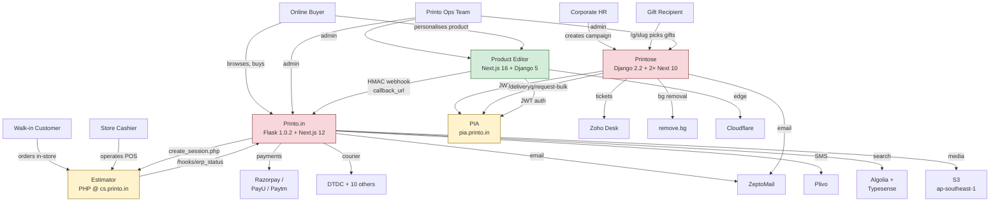
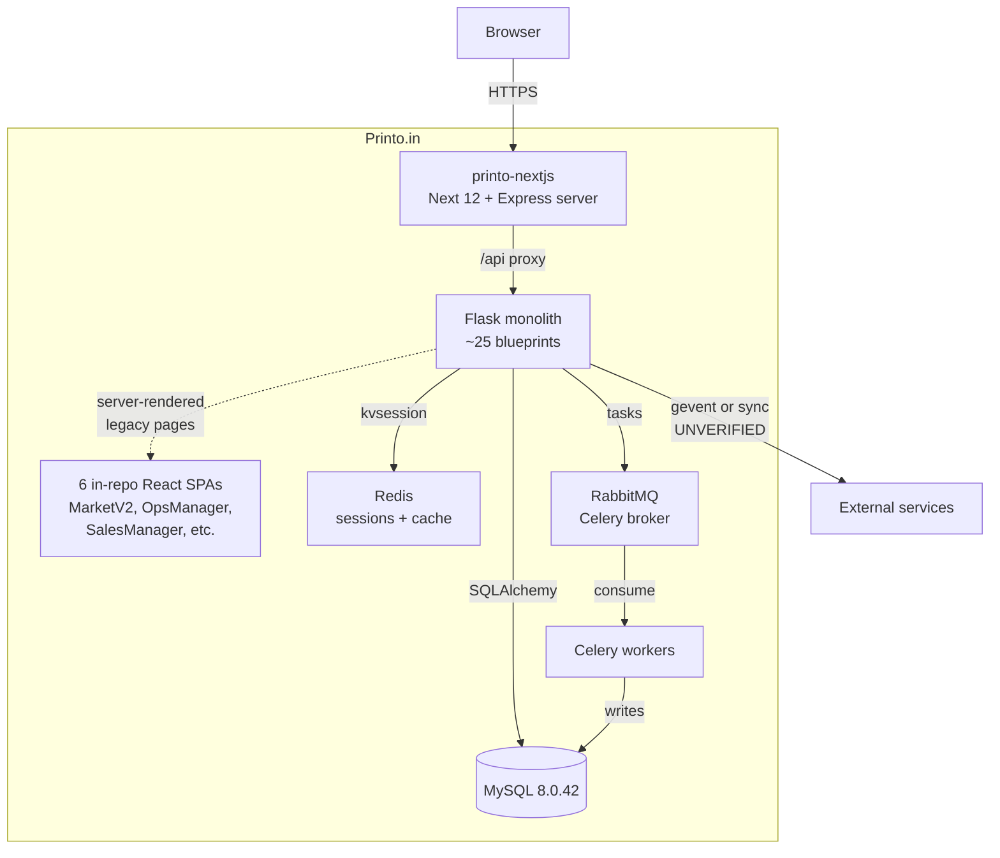
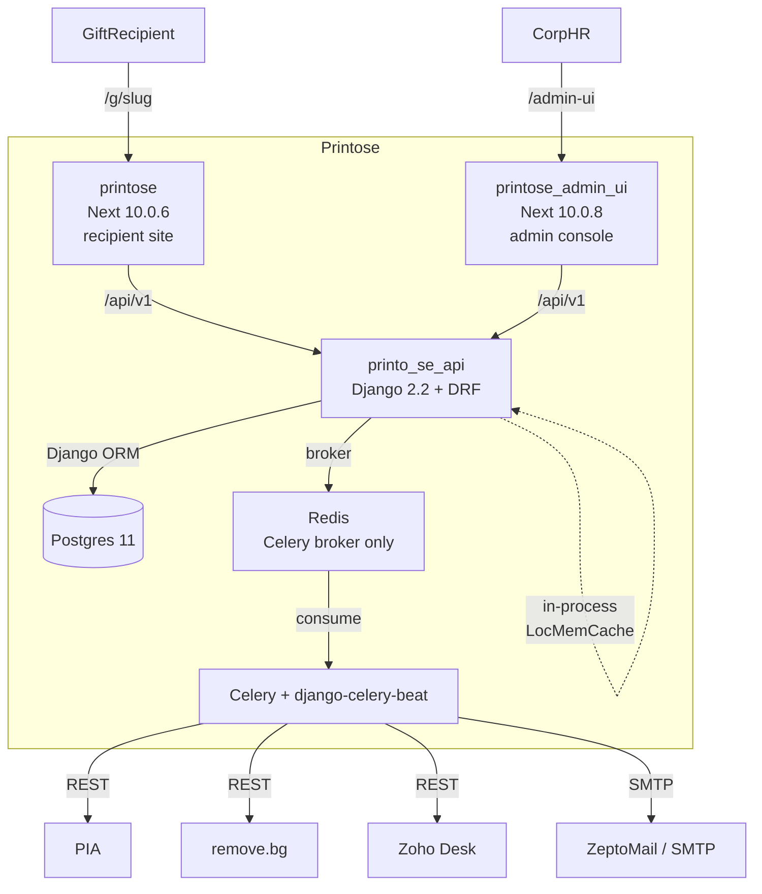
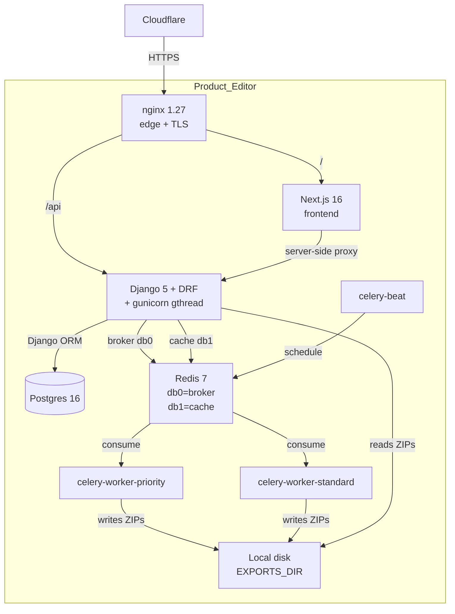
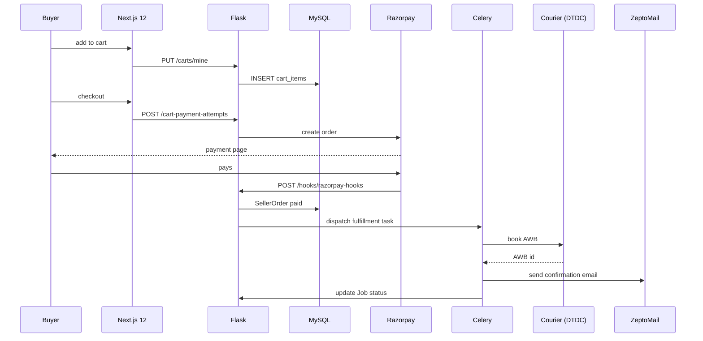
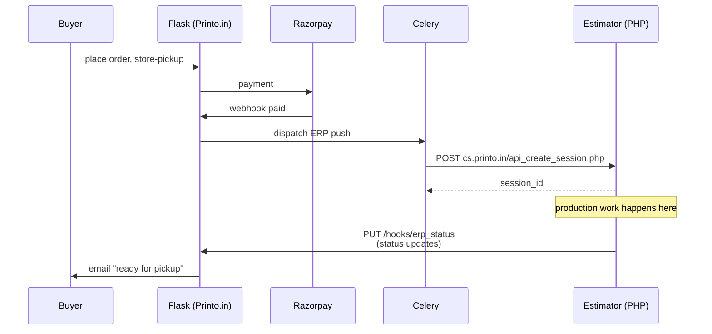
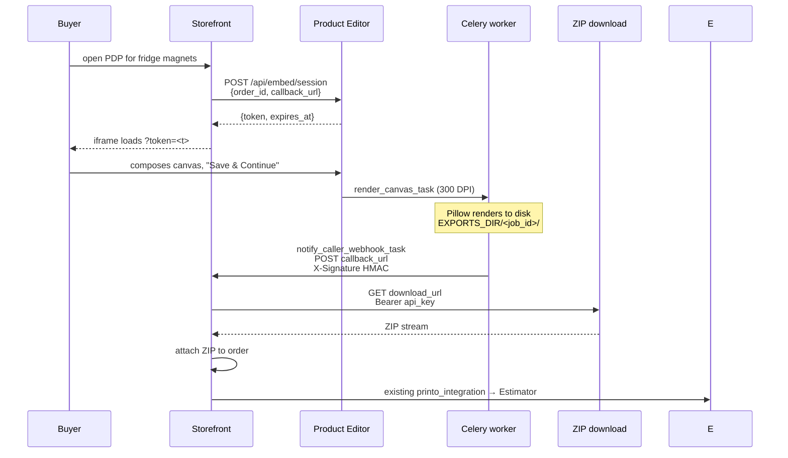
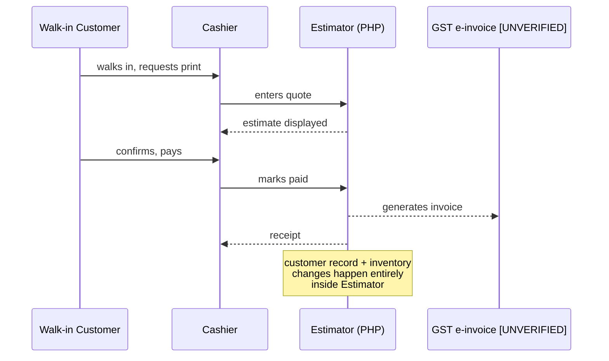
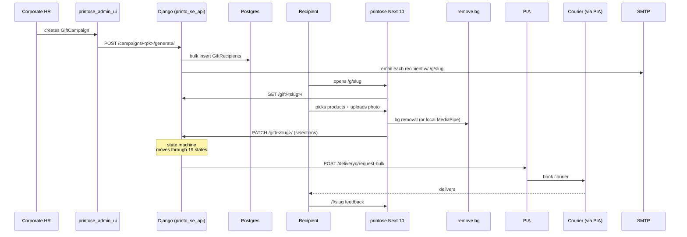

# Diagrams — Current State

All diagrams are Mermaid; copy-paste into any Mermaid renderer (Notion, GitHub, mermaid.live).

## 4.1 — C4 Context



## 4.2 — Container diagram: Printo.in



## 4.3 — Container diagram: Printose



## 4.4 — Container diagram: Product Editor



## 4.5 — Sequence: home-delivery order on Printo.in



## 4.6 — Sequence: store-pickup order (cross-system)



## 4.7 — Sequence: personalised-product order via embed (Product Editor)



## 4.8 — Sequence: walk-in retail order



> ⚠️ **This sequence is partially `[UNVERIFIED]`** because the Estimator source was not in scope. Confirming it requires reading the `cs.printo.in` PHP code.

## 4.9 — Sequence: corporate gifting (Printose)



## 4.10 — Combined ER (cross-system duplication)

Highlights only what's duplicated/fragmented across systems. Intra-system schemas are in `11-appendix-data-model.md`.

```mermaid
erDiagram
  PI_PlatformUser {
    int id PK
    string email
    string phone
    string name
    bool is_buyer
    bool is_seller
    bool is_ops
  }
  PSE_User {
    int id PK
    string email
    string name
    M2M departments
  }
  PE_PIASession {
    string accessToken
    string refreshToken
    string employeeId
    string name
    bool isOpsTeam
  }
  Est_Customer {
    UNVERIFIED
  }

  PI_PlatformUser ||..o{ PSE_User : "no FK,<br/>matched by email if at all"
  PI_PlatformUser ||..o{ PE_PIASession : "no FK"
  PSE_User ||..o{ PE_PIASession : "no FK"
  PI_PlatformUser ||..o{ Est_Customer : "no FK,<br/>UNVERIFIED match"

  PI_Product {
    int id PK
    string name
    string slug
    decimal base_price
  }
  PSE_Product {
    int id PK
    string name
    decimal price
    json options_tree
  }
  Est_Product {
    UNVERIFIED
  }

  PI_Product ||..o{ PSE_Product : "no sync"
  PI_Product ||..o{ Est_Product : "no sync"

  PI_Job {
    int id PK
    int customer_id
    int product_id
    string status
  }
  PI_SellerOrder {
    int id PK
    int cart_id
    int seller_id
  }
  PSE_GiftRecipient {
    int id PK
    string slug
    int campaign_id
    string state
  }
  Est_Order {
    UNVERIFIED
  }

  PI_Job ||..o{ PI_SellerOrder : "in-system FK"
  PI_Job ||..o{ Est_Order : "PHP API only,<br/>no FK"
  PSE_GiftRecipient ||..o{ Est_Order : "DORMANT<br/>(commented out)"
```

**Key takeaway:** the three concept families — **customer, product, order** — exist in 3-4 disconnected stores with no foreign keys, no IDs that match, and no synchronisation mechanism. This is the single largest architectural debt.

## 4.11 — External dependency graph

```mermaid
graph LR
  subgraph Printo
    PI[Printo.in]
    PSE[Printose]
    PE[Product Editor]
    Est[Estimator PHP]
    PIA[PIA]
  end

  subgraph Payments
    Razorpay
    PayU
    Paytm
    Epaylater
  end

  subgraph Logistics
    DTDC
    Delhivery
    Shiprocket
    Aftership
    Dunzo
    Porter
    Aramex
    Clickpost
    Pickrr
    Shipmile
    Shyplite
    Trackingmore
  end

  subgraph Notifications
    ZeptoMail
    Plivo
    OneSignal
    SMTP[SMTP relay]
    RemoveBg[remove.bg]
  end

  subgraph CRM_ERP
    ZohoDesk[Zoho Desk]
    ZohoFlow[Zoho Flow]
  end

  subgraph Search
    Algolia
    Typesense
  end

  subgraph Cloud
    AWS_SG[AWS Singapore<br/>S3 / EC2]
    Cloudinary
    CF[Cloudflare]
  end

  subgraph APM
    Sentry
    NewRelic
    ElasticAPM[Elastic APM]
    Mixpanel
    Heap
    CleverTap
    GA[Google Analytics]
  end

  PI --> Razorpay & PayU & Paytm & Epaylater
  PI --> DTDC & Delhivery & Shiprocket & Aftership & Dunzo & Porter & Aramex & Clickpost & Pickrr & Shipmile & Shyplite & Trackingmore
  PI --> ZeptoMail & Plivo & OneSignal
  PI --> Algolia & Typesense
  PI --> AWS_SG & Cloudinary
  PI --> Sentry & NewRelic & ElasticAPM & Mixpanel & Heap & CleverTap & GA
  PI --> ZohoFlow

  PSE --> ZeptoMail & SMTP & RemoveBg
  PSE --> AWS_SG
  PSE --> ZohoDesk

  PE --> CF
```



**Observation:** Printo.in is connected to **30+ external services**. Printose is leaner (5–6). Product Editor is the leanest (essentially just Cloudflare and PIA).
