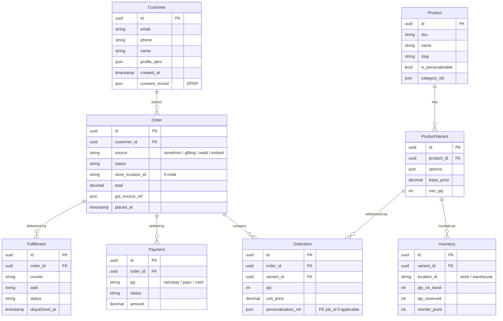

# Target Architecture

## Principles

1. **Headless commerce** — the storefront is one consumer of an API; the POS is another; product-editor is another.
2. **API-first, but event-driven cross-channel sync** — point-to-point HTTP integrations are deprecated; new integrations publish/subscribe.
3. **Single source of truth per domain** — one Customer service, one Product service, one Order service, one Inventory service. Legacy stores become read-replicas during migration, then write-only mirrors, then dropped.
4. **BFF per channel** — web (Next.js), mobile (`[UNVERIFIED]` whether one exists), POS, embed iframes each get their own thin BFF that fans out to domain services.
5. **DPDP / data residency by default** — Mumbai region for all PII; consent + deletion APIs first-class.
6. **Build-vs-buy bias toward buy** for non-differentiating layers (identity, search, payments, logistics aggregation, observability). Build for what makes Printo *Printo* (the editor, the gifting flow, the pricing model).

## Recommended stack

For each layer: **Primary pick** + alternative. Justification in 1–2 lines.

### Commerce engine

| Pick | Why |
|---|---|
| **Saleor** (primary) | Open source, GraphQL-first, modern Python (FastAPI under the hood). Active India users. Self-hostable in Mumbai. Avoids per-GMV revenue share. |
| Medusa.js (alt) | Node.js if the team prefers; smaller ecosystem in IN. |
| ~~Shopify Plus~~ | Excluded — high revenue share at Printo's scale; restrictive on custom checkout (Printo has heavy custom checkout). |
| ~~commercetools~~ | Excluded — enterprise pricing not justified at current scale. |

### Retail POS

| Pick | Why |
|---|---|
| **Shopify POS Lite + custom estimator UI** (primary) | Hardware integrations (printer, cash drawer, card reader) solved. Inventory + customer + order all native. Custom estimator UI for Printo's quoting flow plugs in via Shopify App. ~6 months saved vs. building a POS. ~₹2.5K/store/month. |
| Posist / GoFrugal (alt) | India-native; restaurant DNA shows; Printo would over-customise. |
| Lightspeed Retail (alt) | Strong on retail; weaker on India payments + GST. |
| ~~Custom POS on Saleor~~ | Excluded — Saleor doesn't have hardware integrations baked in; building these would erase the time savings. |

### Web frontend

| Pick | Why |
|---|---|
| **Next.js 15 + App Router** (primary) | SSR/ISR for SEO-heavy product pages. React 19. Already proven in Product Editor. Move legacy `printo-nextjs` from Next 12 + custom Express to Next 15 + native middleware. |
| Remix (alt) | Strong nested-routes story; smaller IN community. |

### Mobile

`[UNVERIFIED]` whether Printo has a mobile app today. If/when it does:

| Pick | Why |
|---|---|
| **React Native + Expo** | Shares TypeScript + business-logic with web; Printo team's React skill carries over. |
| Flutter (alt) | Better-looking out of the box but a separate Dart codebase. |

### Identity

| Pick | Why |
|---|---|
| **Auth0 (Mumbai region) + custom claims** | Mumbai PoP for data residency. Social login + phone OTP + SSO + B2B Organisations all turnkey. Replaces both Printo.in's Flask-Login and Printose's simplejwt. |
| Clerk (alt) | Cheaper at low scale; less B2B-friendly. |
| Keycloak (self-hosted alt) | Free, but ops cost real. Use only if SaaS cost becomes prohibitive at scale (>100K MAU). |
| ~~Cognito~~ | Excluded — UX is rough, India-region story weaker than Auth0. |

### Search

| Pick | Why |
|---|---|
| **Typesense (self-hosted, Mumbai)** | Already in flight at Printo.in. Open source. Cheaper than Algolia at scale. |
| Algolia (alt) | Phase out as Typesense matures (already happening). |
| Meilisearch (alt) | Smaller ecosystem; Typesense has better IN traction. |

### CMS + DAM

| Pick | Why |
|---|---|
| **Sanity (CMS) + Cloudinary (DAM)** | Sanity's structured-content model fits Printo's diverse content (blogs, landing pages, product copy, ops docs). Cloudinary already partially used (`webapp/inkmonkweb/imagelib/req.txt:6`). |
| Strapi (CMS alt) | Self-hosted; ops cost. |
| Contentful (CMS alt) | More expensive at Printo's scale. |

### Payments

| Pick | Why |
|---|---|
| **Razorpay (primary)** | Already integrated; UPI + cards + EMI + Pay Later + B2B. India-native. |
| **PayU (secondary fallback)** | Already integrated. Keep as redundancy for Razorpay outages. |
| Phase out Paytm + Epaylater | Lower volume; consolidate to two PGs to reduce reconciliation work. |

### Logistics

| Pick | Why |
|---|---|
| **Shiprocket** (primary aggregator) | India's largest aggregator, covers DTDC + Delhivery + Bluedart + 20+ couriers in one API. Reduces 11 integrations to 1. |
| Direct Delhivery as fallback | Keep one direct courier integration as redundancy if Shiprocket has an outage. |
| ~~Maintain all 11 direct integrations~~ | Excluded — engineering tax not justified |

### Notifications

| Pick | Why |
|---|---|
| **MSG91 (SMS + transactional email)** | India-native, DLT-compliant for SMS, cheaper than Plivo at scale. |
| **Gupshup (WhatsApp Business API)** | India market leader for WhatsApp; required as customer expectation for order tracking. |
| **AWS SES (Mumbai)** | Bulk transactional email; 10× cheaper than ZeptoMail at volume. |
| **OneSignal** | Keep as-is — already in use, web push is a small slice of total notifications. |

### Data + analytics

| Pick | Why |
|---|---|
| **RudderStack (CDP)** | Open-source-core; can self-host in Mumbai for DPDP. Replaces 4 disparate trackers (Mixpanel + Heap + CleverTap + GA all wired in `tasks.py:31-37`). |
| **BigQuery** (warehouse) | Generous free tier; standard SQL; integrates cleanly with RudderStack. |
| **Metabase** (BI / dashboards) | Self-hosted, free, low ops cost. |
| Snowflake (warehouse alt) | Stronger enterprise features; cost not justified at current scale. |

### Event bus

| Pick | Why |
|---|---|
| **AWS SNS + SQS** (primary) | Already on AWS; minimal ops. Pub/sub via SNS, durable per-consumer queues via SQS. |
| Redpanda (Kafka-compatible, alt) | Kafka semantics with no ZooKeeper; if SNS+SQS becomes too coarse for high-throughput streams. |
| ~~RabbitMQ for cross-system~~ | Excluded — Printo.in already has RMQ for Celery; using it cross-system creates a runtime dependency on the Flask monolith. |

### Observability

| Pick | Why |
|---|---|
| **OpenTelemetry SDKs in every service + Grafana stack** (Tempo for traces, Loki for logs, Mimir for metrics) | OSS, vendor-neutral. Replaces three APMs (Sentry + NewRelic + Elastic-APM) in Printo.in with one stack. |
| Datadog (alt) | Easier to operate, expensive at scale. |
| Keep Sentry for client-side errors only | Sentry's frontend SDK is best-in-class. |

### Cloud + region

| Pick | Why |
|---|---|
| **AWS Mumbai (`ap-south-1`)** for all PII | DPDP Act 2023 cross-border transfer rules; current Singapore bucket is a regulatory risk |
| AWS Singapore for non-PII (e.g. public CDN-fronted product images) | Already there; migration cost not justified for non-PII |

### CI/CD

| Pick | Why |
|---|---|
| **GitHub Actions** (already used by Printo.in) | Standardise across all repos including Printose (which is on GitLab CI). One toolchain to learn, reuse workflows. |
| **ArgoCD** for k8s deployments (when applicable) | GitOps; reduces SSH-based deploys (Printose's current model is `ssh + git pull + systemctl restart`, which is a footgun). |

### Feature flags

| Pick | Why |
|---|---|
| **GrowthBook (self-hosted)** | OSS, cheap to operate, works with any stack. Already implied in `PRD.md` references. |
| LaunchDarkly (alt) | Better tooling, expensive. |

### Image processing

| Pick | Why |
|---|---|
| **Keep Pillow in Product Editor** | Already tuned (smart downscale, BOX resampling, mask hoist, transpose fast-path) and 300 DPI quality is proven. |
| **Cloudinary for storefront product imagery** | On-the-fly transforms, India CDN. |
| **MediaPipe / TensorFlow.js for browser-side** | Keep Printose's selfie segmentation; offload from `remove.bg` where possible to cut SaaS spend. |

## Unified data model (target)

One **Customer**, one **Product** + variants, one **Order** + items, one **Inventory** ledger. Channel attributes (`source: storefront | gifting | retail | embed`) replace cross-system duplication.

**Channel-specific data** (e.g. gifting `slug`, embed `editor_state`) lives in **per-channel adapter tables** that FK to the unified `Order` / `OrderItem`. The unified core stays clean.

## What this saves

| Today | Target |
|---|---|
| 3-4 customer tables | 1 Customer service |
| 3-4 product tables | 1 Product + Variant service |
| Inventory in Estimator only | 1 Inventory service, real-time on PDP |
| 11 courier integrations | 1 (Shiprocket) + 1 fallback |
| 4+ analytics SDKs | 1 (RudderStack) |
| 3 APMs | 1 (OTel + Grafana) |
| 4 payment gateways | 2 (Razorpay + PayU) |
| Estimator PHP + Flask + Django + Express + Next | Saleor + Next 15 + Shopify POS + Product Editor |
| Singapore S3 (PII) | Mumbai S3 |
| Hardcoded JWT secret | Auth0 (Mumbai) |
| Point-to-point HTTP | SNS+SQS event bus |

## What stays as-is

- **Product Editor** stays independent. Already on Next.js 16 + Django 5; already integrates cleanly via embed + HMAC webhook. Already in the target shape.
- **PIA** stays as the auth + delivery dispatcher upstream. Audit and modernise separately.
- **Razorpay + Cloudflare + AWS** all stay.

## Engineering principles for new code

1. **Stateless services, externalised state.** All state in Postgres / S3 / Redis; services are horizontally scalable.
2. **Migrations are reviewed gates.** No `git pull && migrate && systemctl restart`. All schema changes go through PR + CI test runs.
3. **Secrets via SSM Parameter Store / AWS Secrets Manager**. Zero hardcodes. Repo grep for `secret`, `api_key`, `password` returns no hits.
4. **Tests are CI gates.** No deploy without green tests. Coverage thresholds enforced.
5. **OpenTelemetry baked in from day 1** for every new service.
6. **Type-safe contracts** across service boundaries — OpenAPI / GraphQL schema generation, no hand-written DTOs.
7. **`output: 'standalone'` Dockerfiles** (Product Editor pattern) — slim images, fast cold starts.
8. **Observability dashboards land with the feature.** New endpoint without a dashboard panel = not done.

## Cost ballpark

(Order-of-magnitude only. Numbers in INR/month, assuming ~100K MAU + 50K orders/month.)

| Layer | Today (estimated) | Target | Delta |
|---|---|---|---|
| Identity (Flask-Login + simplejwt + PIA self-built) | dev hours only | Auth0 ~₹50K | +₹50K |
| Analytics (Mixpanel + Heap + CleverTap + GA combined) | ~₹2L | RudderStack self-host ~₹30K + BigQuery ~₹20K | -₹1.5L |
| APM (Sentry + NewRelic + Elastic-APM) | ~₹1L | OTel + Grafana self-host ~₹10K + Sentry FE only ~₹15K | -₹75K |
| Email (ZeptoMail) | ~₹40K | AWS SES Mumbai ~₹5K | -₹35K |
| POS (build cost amortised) | engineering time | Shopify POS ~₹2.5K × 30 stores = ~₹75K | net even |
| Logistics aggregator | engineering time | Shiprocket pass-through (per-shipment fee) | similar |
| **Total SaaS spend** | ~₹3-4L/mo | ~₹2-2.5L/mo | **-25–35%** |

Plus 12 months of saved engineering rework (rough estimate: 3 senior engineers × 12 months = ~₹1.5–2cr in opportunity cost).
