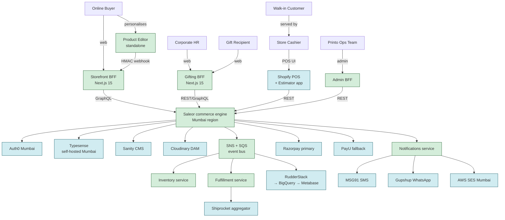
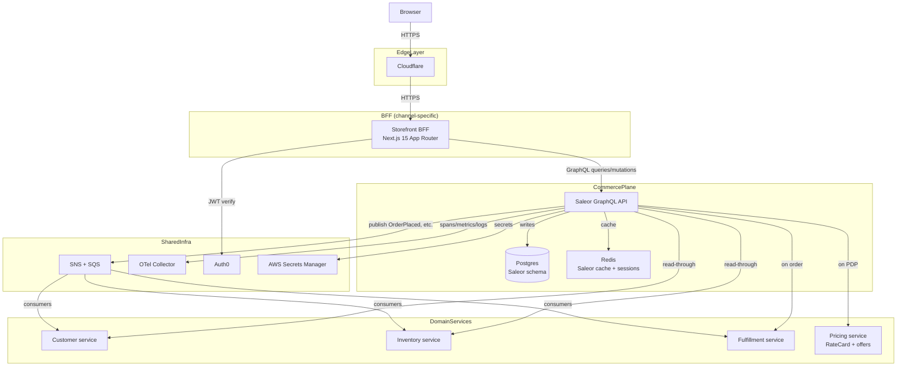
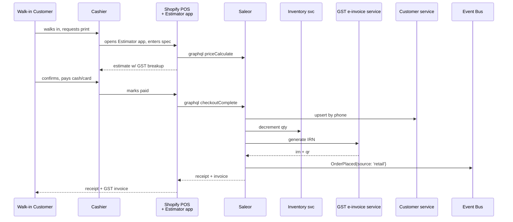
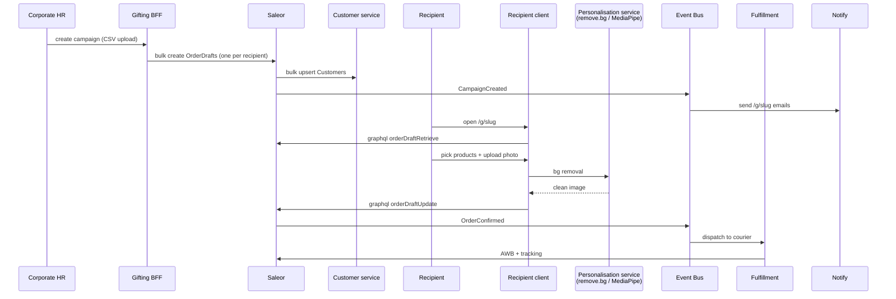
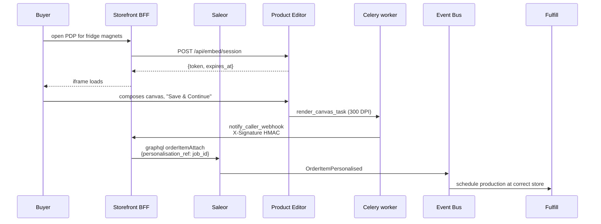
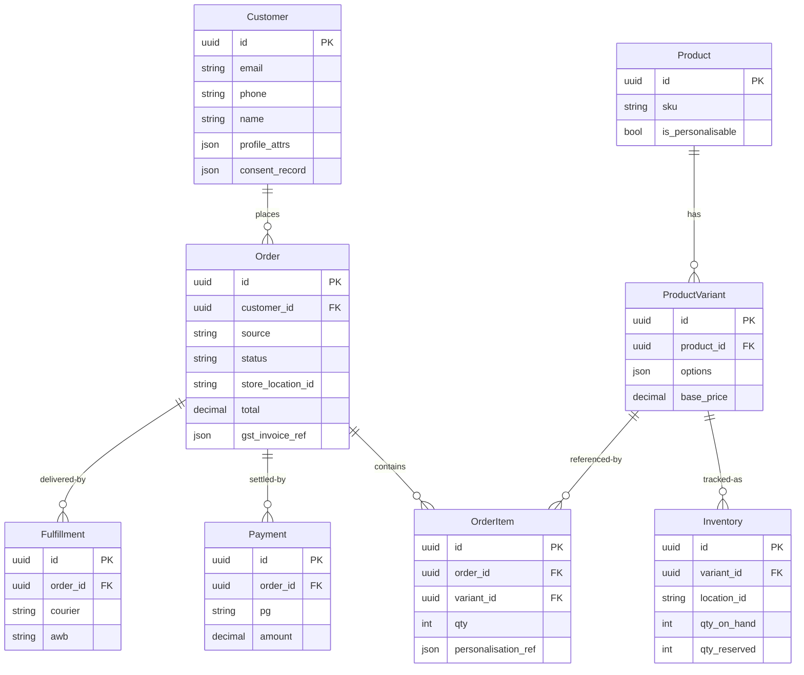

# Diagrams — Target State

## 7.1 — Target C4 context



## 7.2 — Target container diagram (single-channel detail: Storefront)



## 7.3 — Sequence: store-pickup order (target)

```mermaid
sequenceDiagram
  participant U as Buyer
  participant SF as Storefront BFF
  participant S as Saleor
  participant Inv as Inventory svc
  participant R as Razorpay
  participant EB as Event Bus
  participant POS as Shopify POS @ Store
  participant Notify

  U->>SF: place order (store-pickup)
  SF->>S: graphql checkoutCreate
  S->>Inv: reserve qty
  Inv-->>S: reservation_id
  SF->>R: payment
  R->>S: webhook paid
  S->>EB: publish OrderPlaced{store_id, items, ...}
  EB->>POS: subscriber notifies store
  EB->>Notify: subscriber sends "ready for pickup" prep
  POS->>POS: prints pickup slip; prepares
  POS->>EB: publish OrderReadyForPickup
  EB->>Notify: send SMS + WhatsApp to buyer
  Notify->>U: "Your order is ready"
  U->>POS: walks in, picks up
  POS->>S: graphql orderFulfill
  S->>EB: OrderFulfilled
```

**Compare to current trace B in `04-diagrams-current.md`:** no point-to-point Estimator HTTP call; failure modes are recoverable via SQS dead-letter queues; observability is end-to-end via OTel.

## 7.4 — Sequence: walk-in retail (target)



## 7.5 — Sequence: corporate gifting (target — Printose modernised)



**Differences from current:** no separate Postgres or Django; no separate UI repo on Next 10; the "campaign" + "recipient" concept lives in Saleor as `OrderDraft` extensions.

## 7.6 — Sequence: personalised product via Product Editor (target — minimal change)



**Product Editor is unchanged** — its current contract (HMAC webhook + download URL) maps cleanly into the target.

## 7.7 — Target ER (unified)

See `06-target-architecture.md` §"Unified data model" for the ER diagram. Reproduced here for completeness:


