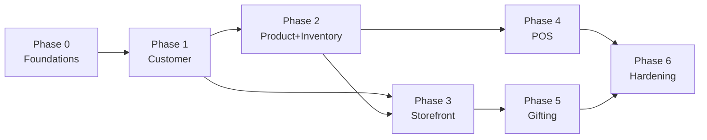

# Migration Roadmap

**Approach:** strangler-fig — wrap the legacy systems behind an API gateway, extract one bounded context at a time, run dual-mode for validation, then decommission.

**Total runway:** 12–18 months. **Engineering capacity assumption:** 3 senior + 4 mid + 2 junior = 9 engineers, plus DevOps (assumed 1.5 FTE).

**Effort scale:** S = 1–2 engineer-weeks · M = 1 engineer-month · L = 3+ engineer-months.

## Phase 0 — Foundations (weeks 0–4)

**Goal:** make every system observable, secret-clean, and reproducibly deployable. **Zero customer-visible change.**

| Deliverable | Effort | Owner | Risk | Rollback |
|---|---|---|---|---|
| **Rotate Printose `SECRET_KEY`** out of `apiserver/settings.py:24` into env / SSM Parameter Store | S | Backend | Low | Revert env, restart |
| **Audit all 5 repos for hardcoded secrets** (grep `secret`, `api_key`, `password`, `token`); produce a leak inventory | S | Security | Low | N/A (read-only) |
| **Move Zoho webhook tokens** out of Printo.in `static/clients/DesignResourceManager/.../*.js:132` into a server-side proxy | S | Frontend | Low | Revert deploy |
| **Confirm Printose prod overrides for `DEBUG` / `ALLOWED_HOSTS`**; if prod actually has `DEBUG=True`, fix immediately | S | DevOps | Low | N/A (config) |
| **Cap Docker logs on Printo.in + Printose** using the v1.10 `x-default-logging` pattern (50 MB × 3) | S | DevOps | Low | Revert compose |
| **Split Printo.in Redis** into broker (db 0) and cache (db 1) — same v1.10 pattern | S | Backend | Low | Revert config |
| **Stand up OTel collector + Grafana stack** in a non-customer-facing position; export dashboards | M | DevOps | Low | Tear down |
| **Add OTel SDK to Product Editor** (already a healthy template) — proves the pipeline | S | Backend | Low | Disable instrumentation |
| **Add OTel SDK to Printose API** — minimal change | S | Backend | Low | Disable |
| **Generate a DPDP data-map** across all 5 systems — table-by-table inventory of PII | M | Security + Backend | Low (read-only) | N/A |
| **Migrate S3 PII bucket** from Singapore (`ap-southeast-1`) to Mumbai (`ap-south-1`) — hot-mirror, then cutover | M | DevOps | Medium — requires CDN URL changes | Re-point bucket alias |
| **Bring Printose CI** to par: add tests pass-gate; switch from `ssh + git pull` to Docker push + ArgoCD deploy | M | DevOps + Backend | Medium | Rollback to old GitLab CI |

**Success metrics for Phase 0:**
- Secret-leak inventory shows zero hardcoded secrets in committed code (excluding test fixtures).
- All container json-file logs capped.
- DPDP data-map signed off by legal.
- OTel traces flowing for at least one end-to-end critical path (e.g. embed render flow).
- All PII-bearing S3 objects in Mumbai region.

## Phase 1 — Foundation: Customer service extraction (months 2–4)

**Goal:** unified customer record across all five systems. The first bounded context to extract.

**Why customer first:** smallest schema, highest cross-system value (CLV/LTV unlocks marketing decisions), and required dependency for every later phase.

| Deliverable | Effort | Owner | Risk | Rollback |
|---|---|---|---|---|
| Stand up **Auth0 Mumbai tenant**; SSO + Google + phone OTP enabled | S | Identity | Low | Pause migration; legacy auth still works |
| Build **Customer service** (Node or Python, your call) — owns `Customer` table, exposes REST + GraphQL | M | Customer-service team | Medium | Service offline → legacy code paths still work |
| **Backfill** Customer service from `Printo.in.PlatformUser`, `Printose.User`, PIA — match by phone + email; emit conflict log | M | Backend | Medium | Truncate Customer service DB; redo |
| **Dual-write** wrappers in Printo.in and Printose: every user-mutating endpoint also POSTs to Customer service (async via SQS) | M | Backend | Medium | Disable wrapper, legacy continues |
| **Auth0 federation** — Auth0 becomes the source of identity; legacy Flask-Login / simplejwt federate to Auth0 via JWT | M | Identity + Backend | High | Auth0 downtime breaks login → keep legacy fallback for 90 days |
| **Customer 360 dashboard** in Metabase, sourced from Customer service | S | Data | Low | N/A |

**Success metrics:**
- 95%+ of new sessions on all 3 channels go through Auth0.
- Customer service has 100% of PII reconciled across legacy systems.
- Cross-channel CLV report works in Metabase.

## Phase 2 — Product catalog + Inventory (months 4–7)

**Goal:** unified product + variant + inventory across online and retail.

| Deliverable | Effort | Owner | Risk | Rollback |
|---|---|---|---|---|
| Build **Product service** owning `Product` + `ProductVariant`; exposes REST | M | Catalog team | Medium | Legacy catalog still works |
| **Backfill Product service** from Printo.in `CustomizableProduct` + `Product`, Printose `Product`. Estimator catalog `[UNVERIFIED]` source — likely DB dump from Estimator. | M | Catalog | Medium | Truncate, redo |
| Build **Inventory service** owning `qty_on_hand` + `qty_reserved` per variant per location | M | Catalog | High — touches money | Read-only mode initially |
| **Dual-source on PDP**: Printo.in `printo-nextjs` reads from Inventory service alongside legacy; flag-driven cutover | S | Frontend | Low (flag-protected) | Flip flag |
| **Inventory write-path from Estimator**: when Estimator fulfills a walk-in order, publish `InventoryDecremented` event; Inventory service consumes | M | Backend + Estimator team | Medium — requires Estimator change | Revert event publisher |
| **Real-time stock display on PDP** (replaces today's blind ordering) | S | Frontend | Low | Hide UI element |
| **Reorder alerts** based on `reorder_point` field | S | Catalog | Low | Disable cron |

**Success metrics:**
- Stockout rate on PDP drops by 50%+.
- Inventory drift between online and retail measured weekly < 2%.
- Product changes happen in one place, reflected on all channels within 60s (event lag).

## Phase 3 — New storefront on Saleor (months 5–10, parallel with Phase 2)

**Goal:** retire Flask 1.0.2 monolith. Modern Next.js 15 storefront on Saleor commerce engine.

| Deliverable | Effort | Owner | Risk | Rollback |
|---|---|---|---|---|
| Stand up **Saleor self-hosted** (Mumbai); plug in Auth0, Customer service, Product service, Inventory service, Shiprocket, Razorpay | L | Storefront team | Medium | Saleor offline; legacy continues |
| **Map Printo.in's catalog to Saleor's schema**; importer script | M | Storefront | Medium | Retry import |
| **Build new storefront on Next.js 15 + App Router** (Server Components, no custom Express server). Reuse design system from current `printo-nextjs` | L | Frontend | Medium | Behind a feature flag |
| **Razorpay + PayU plug-in** for Saleor (existing OSS plug-ins or build) | S | Storefront | Low | Disable in checkout |
| **Shiprocket plug-in** for Saleor — replaces 11 courier integrations | M | Storefront | Medium | Fall back to direct couriers (requires keeping Delhivery) |
| **GrowthBook flag-driven traffic split** — 5% → 25% → 50% → 100% over 8 weeks | S | DevOps | Low | Flip flag back |
| **Embed iframe in new storefront** — Product Editor's `EmbedSession` API works unchanged; just point new storefront at it | S | Storefront | Low | Disable embed; show static PDP |
| **Decommission Flask monolith** — keep behind a domain freeze for 30 days as "break glass", then retire | S | DevOps | High — point of no return | Re-enable Flask DNS |

**Success metrics:**
- New storefront serves 100% of buyer traffic.
- Lighthouse perf score ≥ 90 on PDP, ≥ 85 on listing pages.
- Conversion rate ≥ legacy storefront (key business gate).
- Flask monolith decommissioned.

## Phase 4 — POS modernisation (months 8–12, parallel)

**Goal:** retire Estimator PHP. Pilot Shopify POS at one store, expand to all.

| Deliverable | Effort | Owner | Risk | Rollback |
|---|---|---|---|---|
| **Shopify POS hardware procurement** (iPad + card reader + receipt printer + cash drawer) for pilot store | S | Ops | Low | Return hardware |
| **Custom Estimator app** on Shopify POS — quoting + spec entry; calls Saleor's pricing API | L | POS team | High | Fall back to old Estimator |
| **GST e-invoice integration** in Saleor (or via SaaS like ClearTax) — IRN generation, QR | M | Backend | Medium — regulatory | Manual IRN as fallback |
| **Customer service integration**: walk-in customer record auto-creates by phone | S | Backend | Low | Skip enrollment, anonymous order |
| **Inventory service integration**: in-store sale decrements stock real-time | S | POS team | Low (Phase 2 dependency) | Manual sync |
| **Single-store pilot** for 6 weeks; A/B against existing Estimator | M | Ops + POS | Medium | Revert pilot store to old Estimator |
| **Roll out to remaining stores** in waves of 5 | L | Ops + POS | Medium | Stage-by-stage rollback |
| **Decommission Estimator PHP** — domain freeze + retirement | S | DevOps | High | Restore from backup (point of no return) |

**Success metrics:**
- Walk-in checkout time ≤ Estimator (key UX gate).
- Inventory drift between POS and online < 0.5%.
- GST e-invoice IRN generation success rate ≥ 99.5%.
- Estimator PHP decommissioned.

## Phase 5 — Gifting modernisation + decommission Printose (months 11–15)

**Goal:** corporate gifting flow lives natively in Saleor + a thin Gifting BFF; retire Django 2.2 + dual Next 10 apps.

| Deliverable | Effort | Owner | Risk | Rollback |
|---|---|---|---|---|
| **Map Printose `GiftCampaign` + `GiftRecipient` to Saleor `OrderDraft` extensions** | M | Gifting team | Medium | Keep Printose live |
| **Build Gifting BFF** on Next.js 15 — recipient flow at `/g/<slug>`, feedback at `/f/<slug>` | M | Gifting | Low | Behind flag |
| **Migrate the 19-state machine** from Printose `gifting/models.py:284` to event-driven workflow on the event bus | M | Gifting | Medium | Per-state fallback to legacy |
| **Photo upload + bg removal**: keep `remove.bg` + MediaPipe on the new BFF; reuse Printose code | S | Gifting | Low | N/A |
| **Wallet/Transaction/Invoice domain** — extract as `Wallet` service consuming `OrderConfirmed` events | M | Gifting | Low | Read-only initially |
| **Cutover gifting traffic** — flag-driven 10% → 100% over 4 weeks | S | DevOps | Low | Flip flag |
| **Decommission Printose** (3 repos) | S | DevOps | High — point of no return | Restore from backup |

**Success metrics:**
- Recipient flow conversion ≥ legacy.
- All 3 Printose repos decommissioned.
- Wallet ledger reconciliation works in real-time.

## Phase 6 — Hardening + sunset (months 14–18)

| Deliverable | Effort | Owner |
|---|---|---|
| **Decommission RabbitMQ** — last consumer was Printo.in Celery; replaced by SQS for cross-system events; in-process Celery brokers stay on Redis per system | S | DevOps |
| **Consolidate APMs** — drop NewRelic + Elastic-APM, keep Sentry (frontend) + OTel + Grafana (backend) | S | DevOps |
| **Algolia decom** — Typesense self-hosted is the single search engine | S | Backend |
| **Drop Paytm + Epaylater** payment gateways — keep Razorpay + PayU | S | Backend |
| **Mobile app planning** (if greenlit) — React Native + Expo, sharing TypeScript with web | L | Mobile (TBD) |
| **DPDP / GDPR self-service portal** — customer data export, deletion requests, consent management | M | Compliance |
| **Performance baseline + SLO definition** — set p95/p99 targets, alert wiring | M | SRE |

## Where SaaS saves months

| SaaS pick | Build effort saved | Annual cost |
|---|---|---|
| **Shopify POS** vs custom POS | ~6 months × 3 engineers = ~₹45L | ~₹2.5K/store/month × 30 stores × 12 = ~₹9L/yr |
| **Auth0** vs roll-your-own JWT + federation | ~3 months × 2 engineers = ~₹15L | ~₹6L/yr |
| **Shiprocket** vs maintaining 11 courier integrations | ongoing — ~1 engineer-month/yr saved | per-shipment fee |
| **Saleor (OSS)** vs continuing on Flask 1.x | ~12 months of EOL upgrade pain avoided | self-host cost only |
| **GrowthBook (OSS)** vs LaunchDarkly | LaunchDarkly is ~₹5L/yr for our scale | self-host cost only |
| **RudderStack (OSS)** vs Mixpanel + Heap + CleverTap | per-event cost saved at scale | self-host cost only |

## Phase dependency graph

Phases 2 + 3 + 4 can run **in parallel** once Phase 1 lands. The constraint is engineering capacity, not technical dependencies.

## Risks & mitigations across the roadmap

| Risk | Mitigation |
|---|---|
| Estimator source not in scope; Phase 4 depends on understanding it | Locate the source repo as a Phase 0 deliverable; plan Phase 4 only after the audit is complete |
| Saleor lacks an India-specific edge case (e.g. RuPay, EMI) | Prototype the edge cases in Phase 0 weeks 3–4; if any blocker, evaluate Vendure or Medusa as alts |
| Cutover from Flask to Saleor exposes silent SEO drops | Pre-build redirect map for every legacy URL; monitor SERP daily during cutover |
| Inventory service outage breaks PDP | PDP falls back to "approximate stock" badge; queue-based eventually-consistent decrement |
| GST e-invoice service outage at peak | Buffer IRN generation in SQS with DLQ + manual retry job |
| Auth0 outage breaks all logins | 90-day window of legacy-fallback before Auth0 is the only auth |
| Shopify POS hardware issues at pilot store | Keep Estimator as parallel option for first 6 weeks; trained cashier can switch |

## Don't do (anti-roadmap)

- ❌ **Big-bang rewrite of Flask monolith.** Strangler over rewrite, every time.
- ❌ **Build a custom POS.** Shopify POS exists; spend the saved time on differentiating features.
- ❌ **Build a homegrown identity service.** Auth0 / Clerk solved this 5 years ago.
- ❌ **Maintain 11 courier integrations.** Aggregator (Shiprocket) is the right abstraction.
- ❌ **Add a fourth APM.** Consolidate to OTel + Grafana + Sentry (frontend).
- ❌ **Roll your own event bus.** SNS+SQS is enough until proven otherwise.
- ❌ **Continue committing secrets to repos.** Hardcoded `SECRET_KEY` is the single most urgent fix.
