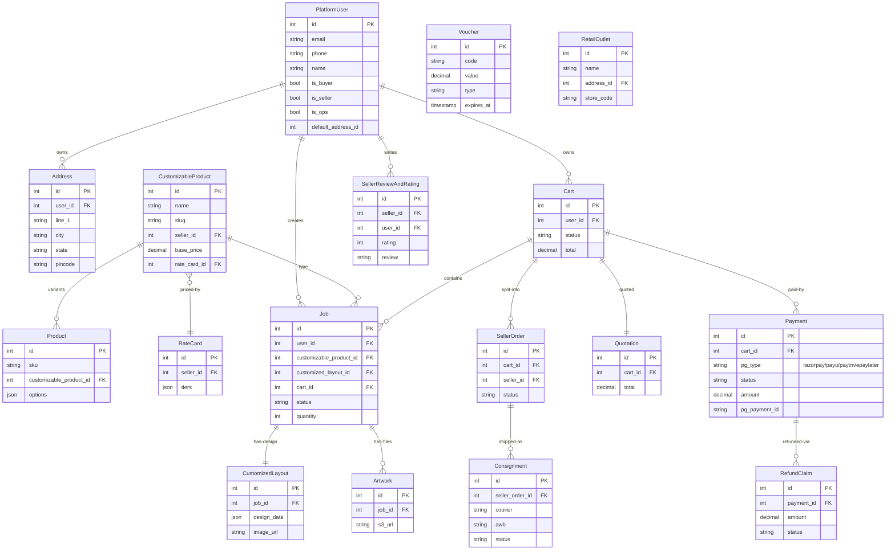
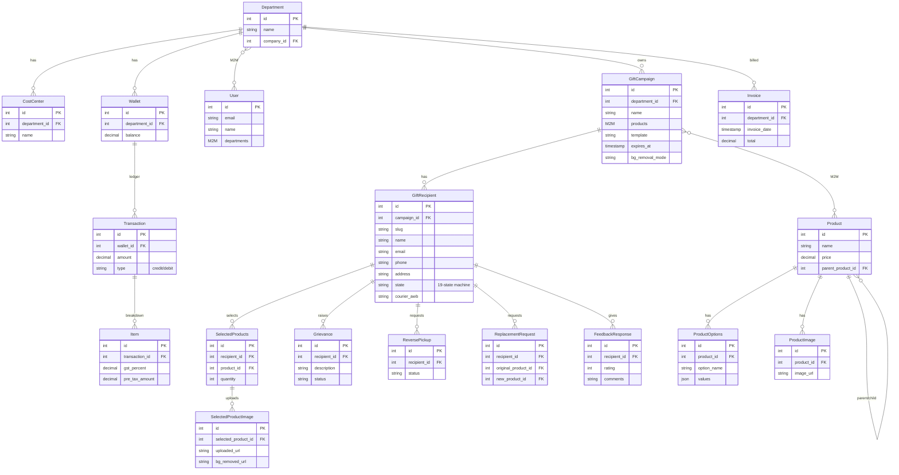
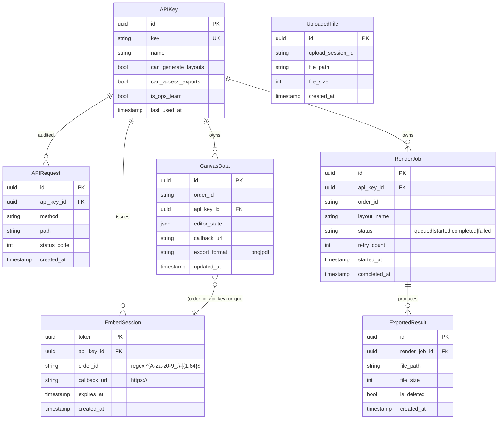

# Appendix — Data Model

Per-system data model. See `04-diagrams-current.md` § 4.10 for the cross-system duplication picture.

## A. Printo.in (MySQL 8)

~203 SQLAlchemy model files in `webapp/inkmonkweb/models/`. Below: the central tables, sized by importance + LOC.

**Notable design:**
- `PlatformUser` mixes buyers + sellers + ops in one table. Auth tier decided by boolean flags.
- `Job` is the "printable line item" — heaviest model in the codebase at 1,981 LOC.
- `Payment.pg_type` multiplexes 4 PGs in one column — works but dangerous (no FK to a PG-specific config table).
- `RetailOutlet` exists but appears underused. Inventory is **not modelled** in Printo.in — lives in Estimator.

## B. Printose (Postgres 11)

~152 migrations in `gifting/`. Central models in `apiserver/gifting/models.py`:

**Notable design:**
- `GiftRecipient` is the unit of fulfillment, not `Order`. State machine has 19 states (`gifting/models.py:284`).
- Heavy business logic in `Model.save()` overrides — `GiftRecipient.save` is 60+ lines, `Transaction.save` mutates `Wallet.balance` directly.
- Recipient slug-based URL means `/g/<slug>` is a public endpoint — anyone with the slug can read the campaign + product list. Acceptable for the gifting use case but worth knowing.

## C. Product Editor (Postgres 16)

7 Django models in `backend/django/api/models.py`. Already documented in `CLAUDE.md`; reproduced here for completeness.

**Notable design:**
- `CanvasData.unique_together = ('order_id', 'api_key')` — tenant isolation by API key.
- `EmbedSession.order_id` is regex-validated server-side; flows into headers, logs, file paths.
- `RenderJob` retries up to 3× via `self.retry()` (not `autoretry_for`).
- `ExportedResult.is_deleted` partial index supports the daily GC sweep.

## D. Estimator (`cs.printo.in`)

`[UNVERIFIED]` — source not in scope. Educated guesses based on integration calls:

- A `Session` table — created by `api_create_session.php` POSTs.
- `order_ref_id` is the foreign key from upstream callers (Printo.in or Printose).
- A `Customer` table — likely matched by phone for walk-in flows.
- An `Order` / `Quote` table — the actual quote line items.
- A `Product` / catalogue table — Estimator's own catalog.
- An `Inventory` table — the only real inventory ledger in the org.
- A `GSTInvoice` / `IRN` table — likely lives here.

Schema cannot be confirmed without source access. See `09-open-questions.md` #1.

## E. PIA (`pia.printo.in`)

`[UNVERIFIED]` — source not in scope. Inferred:

- A `User` table for the Printo employees who authenticate.
- Role / team mapping (`is_ops_team` flag flows into Product Editor's NextAuth session).
- A `DeliveryQueue` table or similar — `request-bulk/delivery/` writes here.

## Cross-system join keys (today: missing)

| Concept | Printo.in | Printose | Product Editor | Estimator |
|---|---|---|---|---|
| Customer | `PlatformUser.id` (int) + email | `User.id` (int) + email | none (PIA-borrowed) | `[UNVERIFIED]` |
| Product | `CustomizableProduct.id` (int) + slug | `Product.id` (int) | none — layouts are not products | `[UNVERIFIED]` |
| Order | `Job.id` + `Cart.id` + `SellerOrder.id` | `GiftRecipient.id` + slug | `RenderJob.id` (uuid) + `order_id` (string from caller) | `Session.order_ref_id` |
| Inventory | not modelled | not modelled | not modelled | `[UNVERIFIED]` — likely the only ledger |

**No system uses UUIDs uniformly. No system shares an integer ID space with another. The only cross-system identifier is the storefront's `order_id` string, which Product Editor honours via header injection but no other system reads.**

## Target unified model (preview)

See `06-target-architecture.md` §"Unified data model" and `07-diagrams-target.md` § 7.7 for the full target ER. Highlights:

- All entities use UUIDs.
- One `Customer` table replaces 3-4.
- One `Product` + `ProductVariant` replaces 3-4.
- One `Inventory` ledger with location dimension.
- One `Order` with `source` enum (`storefront / gifting / retail / embed`) replaces N tables.
- Channel-specific data (gifting `slug`, embed `editor_state`) lives in **per-channel adapter tables** that FK to the unified core. Core stays clean.
